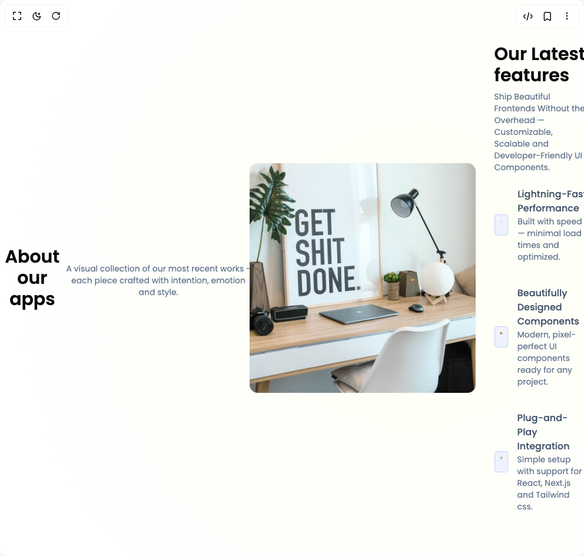

# Build About in BuilderStudio

> Build this component in our Agentic IDE: [BuilderStudio](https://builderstudio.dev).
>
> Join the BuilderStudio community on [Discord](https://discord.gg/QdWeSGCqfe) and [Reddit](https://reddit.com/r/builderstudio).



## Component

- Author group: `prebuiltui`
- Component: `about`
- Variant: `about-us-section-with-gradient-bg`
- Rendered HTML snapshot: [`rendered.html`](rendered.html)

## BuilderStudio prompt

You are implementing a React component based on a component reference.

## Component identity

- Author: prebuiltui
- Component slug: about
- Demo slug: about-us-section-with-gradient-bg
- Title: about
- Description: 

## Goal

Recreate this component in a React + TypeScript + Tailwind CSS project. Preserve the visual layout, spacing, colors, border radius, shadows, interaction behavior, animation behavior, responsive behavior, and dark mode behavior shown in the rendered demo.

## Implementation requirements

- Use React and TypeScript.
- Use Tailwind CSS classes whenever possible.
- Keep the component self-contained unless the source files require helper components.
- If the source uses CSS variables, custom CSS, animations, or keyframes, include them.
- If the source uses external packages, list and use the required packages.
- Preserve accessibility attributes, button semantics, links, keyboard behavior, and ARIA attributes when visible in the source.
- Do not replace the component with a simplified placeholder.
- Return complete production-ready code.

## Dependencies

No reference metadata available.

## Rendered DOM snapshot

This is the rendered demo HTML extracted from the live preview. Use it to verify structure, class names, visible content, and layout.

```html
<div id="root"><div class="w-screen min-h-screen flex justify-center items-center"><div class="w-screen min-h-screen flex justify-center items-center"><style>
                @import url('https://fonts.googleapis.com/css2?family=Poppins:ital,wght@0,100;0,200;0,300;0,400;0,500;0,600;0,700;0,800;0,900;1,100;1,200;1,300;1,400;1,500;1,600;1,700;1,800;1,900&display=swap');
            
                * {
                    font-family: 'Poppins', sans-serif;
                }
            </style><h1 class="text-3xl font-semibold text-center mx-auto">About our apps</h1><p class="text-sm text-slate-500 text-center mt-2 max-w-md mx-auto">A visual collection of our most recent works - each piece crafted with intention, emotion and style.</p><div class="max-w-4xl mx-auto flex flex-col md:flex-row items-center justify-center gap-8 px-4 md:px-0 py-10"><div class="size-[520px] rounded-full absolute blur-[300px] -z-10 bg-[#FBFFE1]"></div><div><h1 class="text-3xl font-semibold">Our Latest features</h1><p class="text-sm text-slate-500 mt-2">Ship Beautiful Frontends Without the Overhead — Customizable, Scalable and Developer-Friendly UI Components.</p><div class="flex flex-col gap-10 mt-6"><div class="flex items-center gap-4"><div class="size-9 p-2 bg-indigo-50 border border-indigo-200 rounded"></div><div><h3 class="text-base font-medium text-slate-600">Lightning-Fast Performance</h3><p class="text-sm text-slate-500">Built with speed — minimal load times and optimized.</p></div></div><div class="flex items-center gap-4"><div class="size-9 p-2 bg-indigo-50 border border-indigo-200 rounded"></div><div><h3 class="text-base font-medium text-slate-600">Beautifully Designed Components</h3><p class="text-sm text-slate-500">Modern, pixel-perfect UI components ready for any project.</p></div></div><div class="flex items-center gap-4"><div class="size-9 p-2 bg-indigo-50 border border-indigo-200 rounded"></div><div><h3 class="text-base font-medium text-slate-600">Plug-and-Play Integration</h3><p class="text-sm text-slate-500">Simple setup with support for React, Next.js and Tailwind css.</p></div></div></div></div></div></div></div></div>
```

## Reference source files

No reference source files were available.
