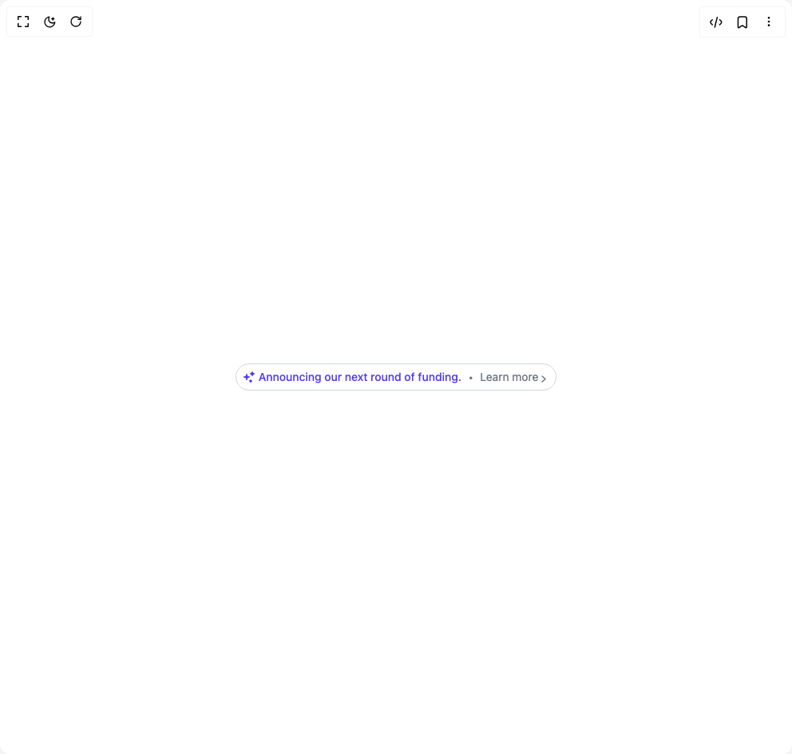

# Build Badge Tag in BuilderStudio

> Build this component in our Agentic IDE: [BuilderStudio](https://builderstudio.dev).
>
> Join the BuilderStudio community on [Discord](https://discord.gg/QdWeSGCqfe) and [Reddit](https://reddit.com/r/builderstudio).



## Component

- Author group: `prebuiltui`
- Component: `badge-tag`
- Variant: `announcement-badge-with-sparkle`
- Rendered HTML snapshot: [`rendered.html`](rendered.html)

## BuilderStudio prompt

You are implementing a React component based on a component reference.

## Component identity

- Author: prebuiltui
- Component slug: badge-tag
- Demo slug: announcement-badge-with-sparkle
- Title: badge-tag
- Description: 

## Goal

Recreate this component in a React + TypeScript + Tailwind CSS project. Preserve the visual layout, spacing, colors, border radius, shadows, interaction behavior, animation behavior, responsive behavior, and dark mode behavior shown in the rendered demo.

## Implementation requirements

- Use React and TypeScript.
- Use Tailwind CSS classes whenever possible.
- Keep the component self-contained unless the source files require helper components.
- If the source uses CSS variables, custom CSS, animations, or keyframes, include them.
- If the source uses external packages, list and use the required packages.
- Preserve accessibility attributes, button semantics, links, keyboard behavior, and ARIA attributes when visible in the source.
- Do not replace the component with a simplified placeholder.
- Return complete production-ready code.

## Dependencies

No reference metadata available.

## Rendered DOM snapshot

This is the rendered demo HTML extracted from the live preview. Use it to verify structure, class names, visible content, and layout.

```html
<div id="root"><div class="w-screen min-h-screen flex justify-center items-center"><div class="w-screen min-h-screen flex justify-center items-center"><div class="flex items-center gap-2 border border-gray-300 rounded-full pl-2 pr-3 py-1 text-sm"><span class="flex items-center gap-1 text-indigo-600 font-medium"><svg width="16" height="16" viewBox="0 0 16 16" fill="none" xmlns="http://www.w3.org/2000/svg"><path fill-rule="evenodd" clip-rule="evenodd" d="M5 4a.75.75 0 0 1 .738.616l.252 1.388A1.25 1.25 0 0 0 6.996 7.01l1.388.252a.75.75 0 0 1 0 1.476l-1.388.252A1.25 1.25 0 0 0 5.99 9.996l-.252 1.388a.75.75 0 0 1-1.476 0L4.01 9.996A1.25 1.25 0 0 0 3.004 8.99l-1.388-.252a.75.75 0 0 1 0-1.476l1.388-.252A1.25 1.25 0 0 0 4.01 6.004l.252-1.388A.75.75 0 0 1 5 4m7-3a.75.75 0 0 1 .721.544l.195.682c.118.415.443.74.858.858l.682.195a.75.75 0 0 1 0 1.442l-.682.195a1.25 1.25 0 0 0-.858.858l-.195.682a.75.75 0 0 1-1.442 0l-.195-.682a1.25 1.25 0 0 0-.858-.858l-.682-.195a.75.75 0 0 1 0-1.442l.682-.195a1.25 1.25 0 0 0 .858-.858l.195-.682A.75.75 0 0 1 12 1m-2 10a.75.75 0 0 1 .728.568.97.97 0 0 0 .704.704.75.75 0 0 1 0 1.456.97.97 0 0 0-.704.704.75.75 0 0 1-1.456 0 .97.97 0 0 0-.704-.704.75.75 0 0 1 0-1.456.97.97 0 0 0 .704-.704A.75.75 0 0 1 10 11" fill="#4F39F6"></path></svg>Announcing our next round of funding.</span><span class="text-gray-500 text-base">•</span><a href="#" class="flex items-center gap-1 text-gray-500">Learn more<svg class="mt-1" width="6" height="9" viewBox="0 0 6 9" fill="none" xmlns="http://www.w3.org/2000/svg"><path d="m1 1 4 3.5L1 8" stroke="currentColor" stroke-width="1.5" stroke-linecap="round" stroke-linejoin="round"></path></svg></a></div></div></div></div>
```

## Reference source files

No reference source files were available.
