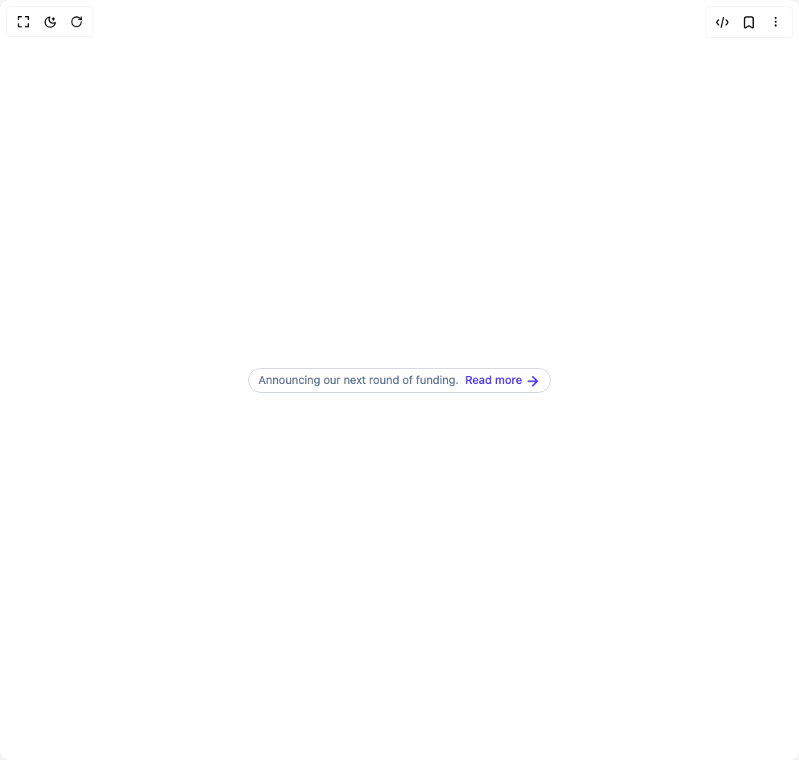

# Build Badge Tag in BuilderStudio

> Build this component in our Agentic IDE: [BuilderStudio](https://builderstudio.dev).
>
> Join the BuilderStudio community on [Discord](https://discord.gg/QdWeSGCqfe) and [Reddit](https://reddit.com/r/builderstudio).



## Component

- Author group: `prebuiltui`
- Component: `badge-tag`
- Variant: `new-announcement-badge-gray`
- Rendered HTML snapshot: [`rendered.html`](rendered.html)

## BuilderStudio prompt

You are implementing a React component based on a component reference.

## Component identity

- Author: prebuiltui
- Component slug: badge-tag
- Demo slug: new-announcement-badge-gray
- Title: badge-tag
- Description: 

## Goal

Recreate this component in a React + TypeScript + Tailwind CSS project. Preserve the visual layout, spacing, colors, border radius, shadows, interaction behavior, animation behavior, responsive behavior, and dark mode behavior shown in the rendered demo.

## Implementation requirements

- Use React and TypeScript.
- Use Tailwind CSS classes whenever possible.
- Keep the component self-contained unless the source files require helper components.
- If the source uses CSS variables, custom CSS, animations, or keyframes, include them.
- If the source uses external packages, list and use the required packages.
- Preserve accessibility attributes, button semantics, links, keyboard behavior, and ARIA attributes when visible in the source.
- Do not replace the component with a simplified placeholder.
- Return complete production-ready code.

## Dependencies

No reference metadata available.

## Rendered DOM snapshot

This is the rendered demo HTML extracted from the live preview. Use it to verify structure, class names, visible content, and layout.

```html
<div id="root"><div class="w-screen min-h-screen flex justify-center items-center"><div class="w-screen min-h-screen flex justify-center items-center"><div class="flex items-center gap-2 border border-gray-300 rounded-full px-3 py-1 text-sm"><p class="text-slate-500">Announcing our next round of funding.</p><a href="#" class="flex items-center gap-1 text-indigo-600 font-medium">Read more<svg class="mt-0.5" width="19" height="19" viewBox="0 0 19 19" fill="none" xmlns="http://www.w3.org/2000/svg"><path d="M3.959 9.5h11.083m0 0L9.501 3.96m5.541 5.54-5.541 5.542" stroke="currentColor" stroke-width="2" stroke-linecap="round" stroke-linejoin="round"></path></svg></a></div></div></div></div>
```

## Reference source files

No reference source files were available.
