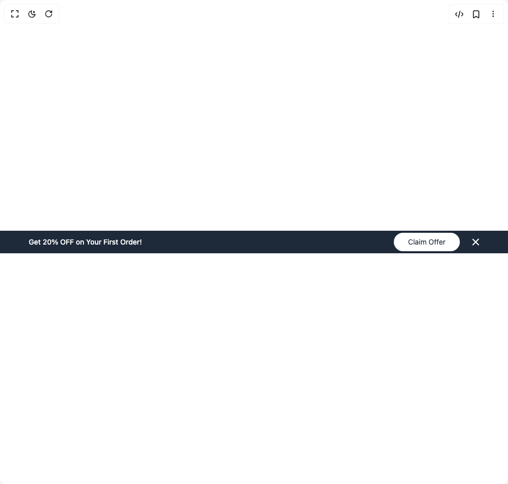

# Build Banner Ui in BuilderStudio

> Build this component in our Agentic IDE: [BuilderStudio](https://builderstudio.dev).
>
> Join the BuilderStudio community on [Discord](https://discord.gg/QdWeSGCqfe) and [Reddit](https://reddit.com/r/builderstudio).



## Component

- Author group: `prebuiltui`
- Component: `banner-ui`
- Variant: `dark-action-banner`
- Rendered HTML snapshot: [`rendered.html`](rendered.html)

## BuilderStudio prompt

You are implementing a React component based on a component reference.

## Component identity

- Author: prebuiltui
- Component slug: banner-ui
- Demo slug: dark-action-banner
- Title: banner-ui
- Description: 

## Goal

Recreate this component in a React + TypeScript + Tailwind CSS project. Preserve the visual layout, spacing, colors, border radius, shadows, interaction behavior, animation behavior, responsive behavior, and dark mode behavior shown in the rendered demo.

## Implementation requirements

- Use React and TypeScript.
- Use Tailwind CSS classes whenever possible.
- Keep the component self-contained unless the source files require helper components.
- If the source uses CSS variables, custom CSS, animations, or keyframes, include them.
- If the source uses external packages, list and use the required packages.
- Preserve accessibility attributes, button semantics, links, keyboard behavior, and ARIA attributes when visible in the source.
- Do not replace the component with a simplified placeholder.
- Return complete production-ready code.

## Dependencies

No reference metadata available.

## Rendered DOM snapshot

This is the rendered demo HTML extracted from the live preview. Use it to verify structure, class names, visible content, and layout.

```html
<div id="root"><div class="w-screen min-h-screen flex justify-center items-center"><div class="w-screen min-h-screen flex justify-center items-center"><div class="w-full flex items-center justify-between px-4 md:px-14 py-1 font-medium text-sm text-white text-center bg-gray-800"><p>Get 20% OFF on Your First Order!</p><div class="flex items-center space-x-6"><button type="button" class="font-normal text-gray-800 bg-white px-7 py-2 rounded-full">Claim Offer</button><button type="button"><svg width="14" height="14" viewBox="0 0 14 14" fill="none" xmlns="http://www.w3.org/2000/svg"><rect y="12.532" width="17.498" height="2.1" rx="1.05" transform="rotate(-45.74 0 12.532)" fill="#fff"></rect><rect x="12.533" y="13.915" width="17.498" height="2.1" rx="1.05" transform="rotate(-135.74 12.533 13.915)" fill="#fff"></rect></svg></button></div></div></div></div></div>
```

## Reference source files

No reference source files were available.
