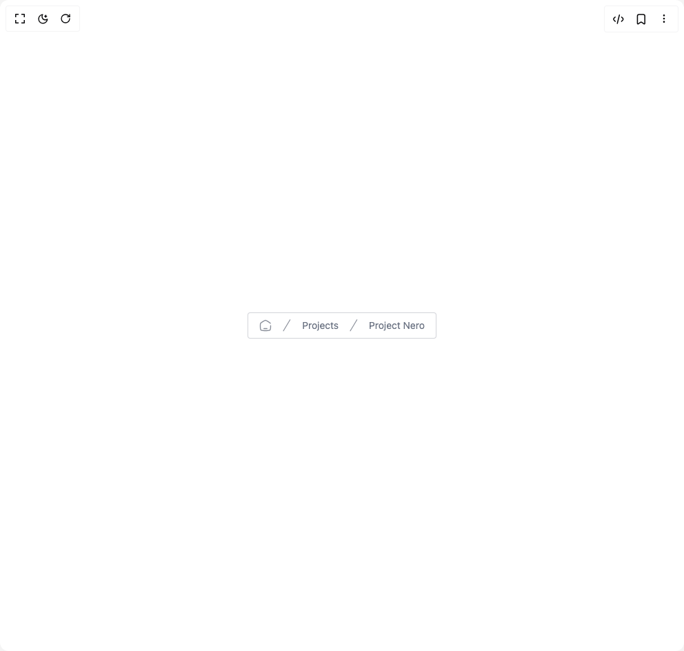

# Build Breadcrumb in BuilderStudio

> Build this component in our Agentic IDE: [BuilderStudio](https://builderstudio.dev).
>
> Join the BuilderStudio community on [Discord](https://discord.gg/QdWeSGCqfe) and [Reddit](https://reddit.com/r/builderstudio).



## Component

- Author group: `prebuiltui`
- Component: `breadcrumb`
- Variant: `normal-breadcrumb`
- Rendered HTML snapshot: [`rendered.html`](rendered.html)

## BuilderStudio prompt

You are implementing a React component based on a component reference.

## Component identity

- Author: prebuiltui
- Component slug: breadcrumb
- Demo slug: normal-breadcrumb
- Title: breadcrumb
- Description: 

## Goal

Recreate this component in a React + TypeScript + Tailwind CSS project. Preserve the visual layout, spacing, colors, border radius, shadows, interaction behavior, animation behavior, responsive behavior, and dark mode behavior shown in the rendered demo.

## Implementation requirements

- Use React and TypeScript.
- Use Tailwind CSS classes whenever possible.
- Keep the component self-contained unless the source files require helper components.
- If the source uses CSS variables, custom CSS, animations, or keyframes, include them.
- If the source uses external packages, list and use the required packages.
- Preserve accessibility attributes, button semantics, links, keyboard behavior, and ARIA attributes when visible in the source.
- Do not replace the component with a simplified placeholder.
- Return complete production-ready code.

## Dependencies

No reference metadata available.

## Rendered DOM snapshot

This is the rendered demo HTML extracted from the live preview. Use it to verify structure, class names, visible content, and layout.

```html
<div id="root"><div class="w-screen min-h-screen flex justify-center items-center"><div class="w-screen min-h-screen flex justify-center items-center"><div class="flex items-center space-x-4 text-sm text-gray-500 bg-white py-2 px-4 border border-gray-500/30 rounded"><button type="button"><svg width="18" height="18" viewBox="0 0 20 20" fill="none" xmlns="http://www.w3.org/2000/svg"><path d="M18.333 10.17v1.267c0 3.251 0 4.876-.977 5.886-.976 1.01-2.547 1.01-5.69 1.01H8.333c-3.143 0-4.714 0-5.69-1.01-.977-1.01-.977-2.635-.977-5.886V10.17c0-1.907 0-2.86.433-3.651.432-.79 1.223-1.281 2.804-2.262l1.666-1.035C8.241 2.185 9.076 1.667 10 1.667s1.76.518 3.43 1.555l1.667 1.035c1.58.98 2.371 1.471 2.804 2.262M12.5 15h-5" stroke="#6B7280" stroke-opacity=".8" stroke-width="1.5" stroke-linecap="round"></path></svg></button><svg width="12" height="20" viewBox="0 0 13 20" fill="none" xmlns="http://www.w3.org/2000/svg"><path d="M11.527 1 1.13 18.429" stroke="#6B7280" stroke-opacity=".8" stroke-width="1.3" stroke-linecap="round" stroke-linejoin="round"></path></svg><p>Projects</p><svg width="12" height="20" viewBox="0 0 13 20" fill="none" xmlns="http://www.w3.org/2000/svg"><path d="M11.527 1 1.13 18.429" stroke="#6B7280" stroke-opacity=".8" stroke-width="1.3" stroke-linecap="round" stroke-linejoin="round"></path></svg><p>Project Nero</p></div></div></div></div>
```

## Reference source files

No reference source files were available.
