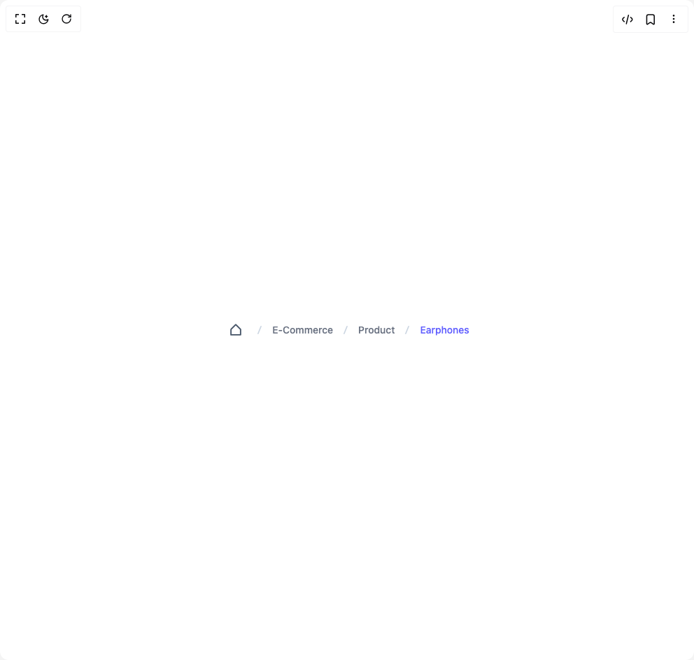

# Build Breadcrumb in BuilderStudio

> Build this component in our Agentic IDE: [BuilderStudio](https://builderstudio.dev).
>
> Join the BuilderStudio community on [Discord](https://discord.gg/QdWeSGCqfe) and [Reddit](https://reddit.com/r/builderstudio).



## Component

- Author group: `prebuiltui`
- Component: `breadcrumb`
- Variant: `slash-breadcrumb`
- Rendered HTML snapshot: [`rendered.html`](rendered.html)

## BuilderStudio prompt

You are implementing a React component based on a component reference.

## Component identity

- Author: prebuiltui
- Component slug: breadcrumb
- Demo slug: slash-breadcrumb
- Title: breadcrumb
- Description: 

## Goal

Recreate this component in a React + TypeScript + Tailwind CSS project. Preserve the visual layout, spacing, colors, border radius, shadows, interaction behavior, animation behavior, responsive behavior, and dark mode behavior shown in the rendered demo.

## Implementation requirements

- Use React and TypeScript.
- Use Tailwind CSS classes whenever possible.
- Keep the component self-contained unless the source files require helper components.
- If the source uses CSS variables, custom CSS, animations, or keyframes, include them.
- If the source uses external packages, list and use the required packages.
- Preserve accessibility attributes, button semantics, links, keyboard behavior, and ARIA attributes when visible in the source.
- Do not replace the component with a simplified placeholder.
- Return complete production-ready code.

## Dependencies

No reference metadata available.

## Rendered DOM snapshot

This is the rendered demo HTML extracted from the live preview. Use it to verify structure, class names, visible content, and layout.

```html
<div id="root"><div class="w-screen min-h-screen flex justify-center items-center"><div class="w-screen min-h-screen flex justify-center items-center"><div class="flex flex-wrap justify-center items-center space-x-2 text-sm text-gray-500 font-medium"><button type="button" aria-label="Home"><svg width="32" height="32" viewBox="0 0 32 32" fill="none" xmlns="http://www.w3.org/2000/svg"><path d="M16 7.609c.352 0 .69.122.96.343l.111.1 6.25 6.25v.001a1.5 1.5 0 0 1 .445 1.071v7.5a.89.89 0 0 1-.891.891H9.125a.89.89 0 0 1-.89-.89v-7.5l.006-.149a1.5 1.5 0 0 1 .337-.813l.1-.11 6.25-6.25c.285-.285.67-.444 1.072-.444Zm5.984 7.876L16 9.5l-5.984 5.985v6.499h11.968z" fill="#475569" stroke="#475569" stroke-width=".094"></path></svg></button><svg width="20" height="20" viewBox="0 0 20 20" fill="none" xmlns="http://www.w3.org/2000/svg"><path d="M6.784 15.68 11.46 4.13h1.75L8.534 15.68z" fill="#CBD5E1"></path></svg><a href="#">E-Commerce</a><svg width="20" height="20" viewBox="0 0 20 20" fill="none" xmlns="http://www.w3.org/2000/svg"><path d="M6.784 15.68 11.46 4.13h1.75L8.534 15.68z" fill="#CBD5E1"></path></svg><a href="#">Product</a><svg width="20" height="20" viewBox="0 0 20 20" fill="none" xmlns="http://www.w3.org/2000/svg"><path d="M6.784 15.68 11.46 4.13h1.75L8.534 15.68z" fill="#CBD5E1"></path></svg><a href="#" class="text-indigo-500">Earphones</a></div></div></div></div>
```

## Reference source files

No reference source files were available.
