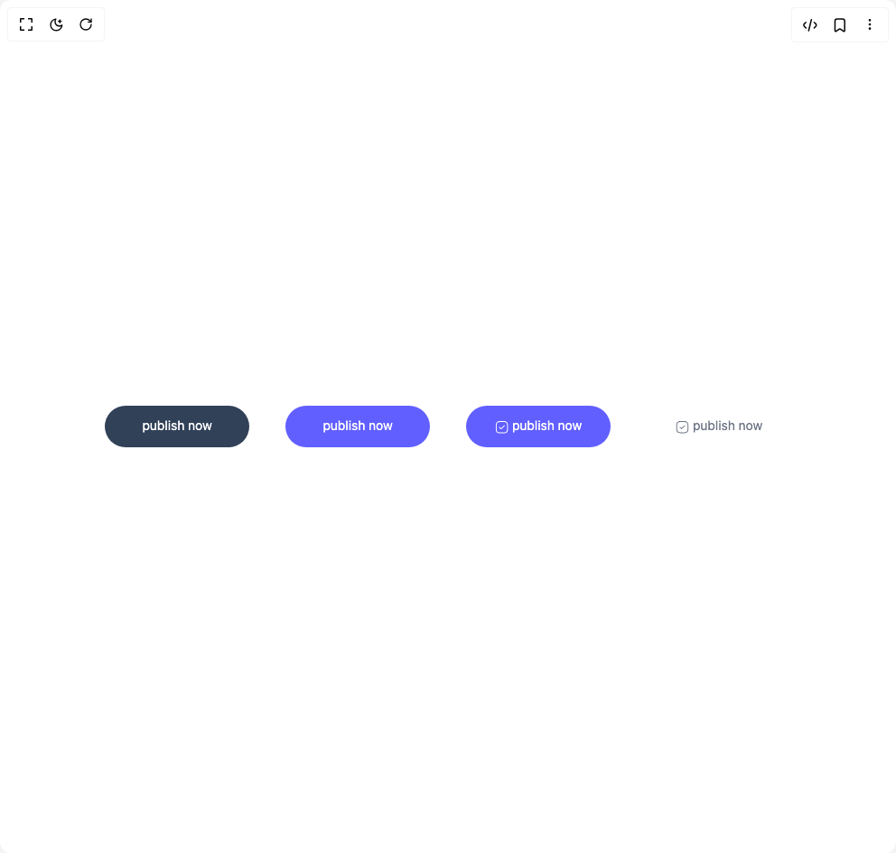

# Build Button Ui in BuilderStudio

> Build this component in our Agentic IDE: [BuilderStudio](https://builderstudio.dev).
>
> Join the BuilderStudio community on [Discord](https://discord.gg/QdWeSGCqfe) and [Reddit](https://reddit.com/r/builderstudio).



## Component

- Author group: `prebuiltui`
- Component: `button-ui`
- Variant: `action-buttons`
- Rendered HTML snapshot: [`rendered.html`](rendered.html)

## BuilderStudio prompt

You are implementing a React component based on a component reference.

## Component identity

- Author: prebuiltui
- Component slug: button-ui
- Demo slug: action-buttons
- Title: button-ui
- Description: 

## Goal

Recreate this component in a React + TypeScript + Tailwind CSS project. Preserve the visual layout, spacing, colors, border radius, shadows, interaction behavior, animation behavior, responsive behavior, and dark mode behavior shown in the rendered demo.

## Implementation requirements

- Use React and TypeScript.
- Use Tailwind CSS classes whenever possible.
- Keep the component self-contained unless the source files require helper components.
- If the source uses CSS variables, custom CSS, animations, or keyframes, include them.
- If the source uses external packages, list and use the required packages.
- Preserve accessibility attributes, button semantics, links, keyboard behavior, and ARIA attributes when visible in the source.
- Do not replace the component with a simplified placeholder.
- Return complete production-ready code.

## Dependencies

No reference metadata available.

## Rendered DOM snapshot

This is the rendered demo HTML extracted from the live preview. Use it to verify structure, class names, visible content, and layout.

```html
<div id="root"><div class="w-screen min-h-screen flex justify-center items-center"><div class="w-screen min-h-screen flex justify-center items-center"><div class="flex flex-wrap items-center justify-center gap-4 md:gap-10"><button type="button" class="w-40 py-3 active:scale-95 transition text-sm text-white rounded-full bg-slate-700"><p class="mb-0.5">publish now</p></button><button type="button" class="w-40 py-3 active:scale-95 transition text-sm text-white rounded-full bg-indigo-500"><p class="mb-0.5">publish now</p></button><button type="button" class="w-40 py-3 active:scale-95 transition text-sm text-white rounded-full bg-indigo-500 flex items-center justify-center gap-1"><svg class="mt-0.5" width="15" height="14" viewBox="0 0 15 14" fill="none" xmlns="http://www.w3.org/2000/svg"><path d="M9.548 13.551H5.799c-3.393 0-4.842-1.449-4.842-4.842V4.961c0-3.393 1.45-4.842 4.842-4.842h3.749c3.392 0 4.842 1.45 4.842 4.842v3.748c0 3.393-1.45 4.842-4.842 4.842M5.799 1.056c-2.88 0-3.905 1.025-3.905 3.905v3.748c0 2.88 1.025 3.905 3.905 3.905h3.749c2.88 0 3.904-1.024 3.904-3.905V4.961c0-2.88-1.024-3.905-3.904-3.905z" fill="#fff"></path><path d="M6.786 9.072a.47.47 0 0 1-.331-.138L4.687 7.166a.47.47 0 0 1 0-.662.47.47 0 0 1 .662 0l1.437 1.437L9.997 4.73a.47.47 0 0 1 .662 0 .47.47 0 0 1 0 .662L7.118 8.934a.47.47 0 0 1-.331.138" fill="#fff"></path></svg><p class="mb-0.5">publish now</p></button><button type="button" class="w-40 py-3 active:scale-95 transition text-sm text-gray-500 rounded-full bg-white flex items-center justify-center gap-1"><svg class="mt-0.5" width="15" height="14" viewBox="0 0 15 14" fill="none" xmlns="http://www.w3.org/2000/svg"><path d="M9.339 13.447H5.59c-3.392 0-4.842-1.45-4.842-4.842V4.856C.748 1.464 2.198.014 5.59.014h3.749c3.392 0 4.842 1.45 4.842 4.842v3.749c0 3.392-1.45 4.842-4.842 4.842M5.59.952c-2.88 0-3.905 1.024-3.905 3.904v3.749c0 2.88 1.025 3.905 3.905 3.905h3.749c2.88 0 3.904-1.025 3.904-3.905V4.856c0-2.88-1.024-3.904-3.904-3.904z" fill="#6B7280"></path><path d="M6.577 8.967a.47.47 0 0 1-.331-.137L4.478 7.062a.47.47 0 0 1 0-.662.47.47 0 0 1 .662 0l1.437 1.437 3.211-3.212a.47.47 0 0 1 .662 0 .47.47 0 0 1 0 .663L6.909 8.83a.47.47 0 0 1-.331.137" fill="#6B7280"></path></svg><p class="mb-0.5">publish now</p></button></div></div></div></div>
```

## Reference source files

No reference source files were available.
