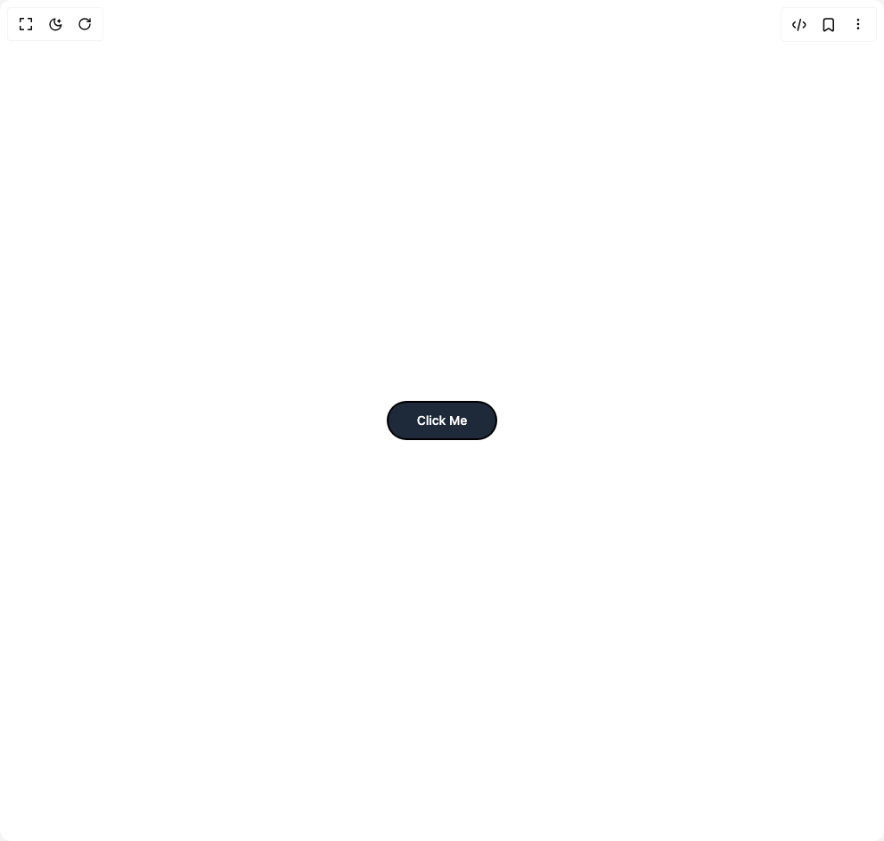

# Build Button Ui in BuilderStudio

> Build this component in our Agentic IDE: [BuilderStudio](https://builderstudio.dev).
>
> Join the BuilderStudio community on [Discord](https://discord.gg/QdWeSGCqfe) and [Reddit](https://reddit.com/r/builderstudio).



## Component

- Author group: `prebuiltui`
- Component: `button-ui`
- Variant: `button-with-border-animation`
- Rendered HTML snapshot: [`rendered.html`](rendered.html)

## BuilderStudio prompt

You are implementing a React component based on a component reference.

## Component identity

- Author: prebuiltui
- Component slug: button-ui
- Demo slug: button-with-border-animation
- Title: button-ui
- Description: 

## Goal

Recreate this component in a React + TypeScript + Tailwind CSS project. Preserve the visual layout, spacing, colors, border radius, shadows, interaction behavior, animation behavior, responsive behavior, and dark mode behavior shown in the rendered demo.

## Implementation requirements

- Use React and TypeScript.
- Use Tailwind CSS classes whenever possible.
- Keep the component self-contained unless the source files require helper components.
- If the source uses CSS variables, custom CSS, animations, or keyframes, include them.
- If the source uses external packages, list and use the required packages.
- Preserve accessibility attributes, button semantics, links, keyboard behavior, and ARIA attributes when visible in the source.
- Do not replace the component with a simplified placeholder.
- Return complete production-ready code.

## Dependencies

No reference metadata available.

## Rendered DOM snapshot

This is the rendered demo HTML extracted from the live preview. Use it to verify structure, class names, visible content, and layout.

```html
<div id="root"><div class="w-screen min-h-screen flex justify-center items-center"><div class="w-screen min-h-screen flex justify-center items-center"><style>
                @keyframes shine {
                    0% {
                        background-position: 0% 50%;
                    }
            
                    50% {
                        background-position: 100% 50%;
                    }
            
                    100% {
                        background-position: 0% 50%;
                    }
                }
            
                .button-bg {
                    background: conic-gradient(from 0deg, #00F5FF, #000, #000, #00F5FF, #000, #000, #000, #00F5FF);
                    background-size: 300% 300%;
                    animation: shine 6s ease-out infinite;
                }
            </style><div class="button-bg rounded-full p-0.5 hover:scale-105 transition duration-300 active:scale-100"><button class="px-8 text-sm py-2.5 text-white rounded-full font-medium bg-gray-800">Click Me</button></div></div></div></div>
```

## Reference source files

No reference source files were available.
