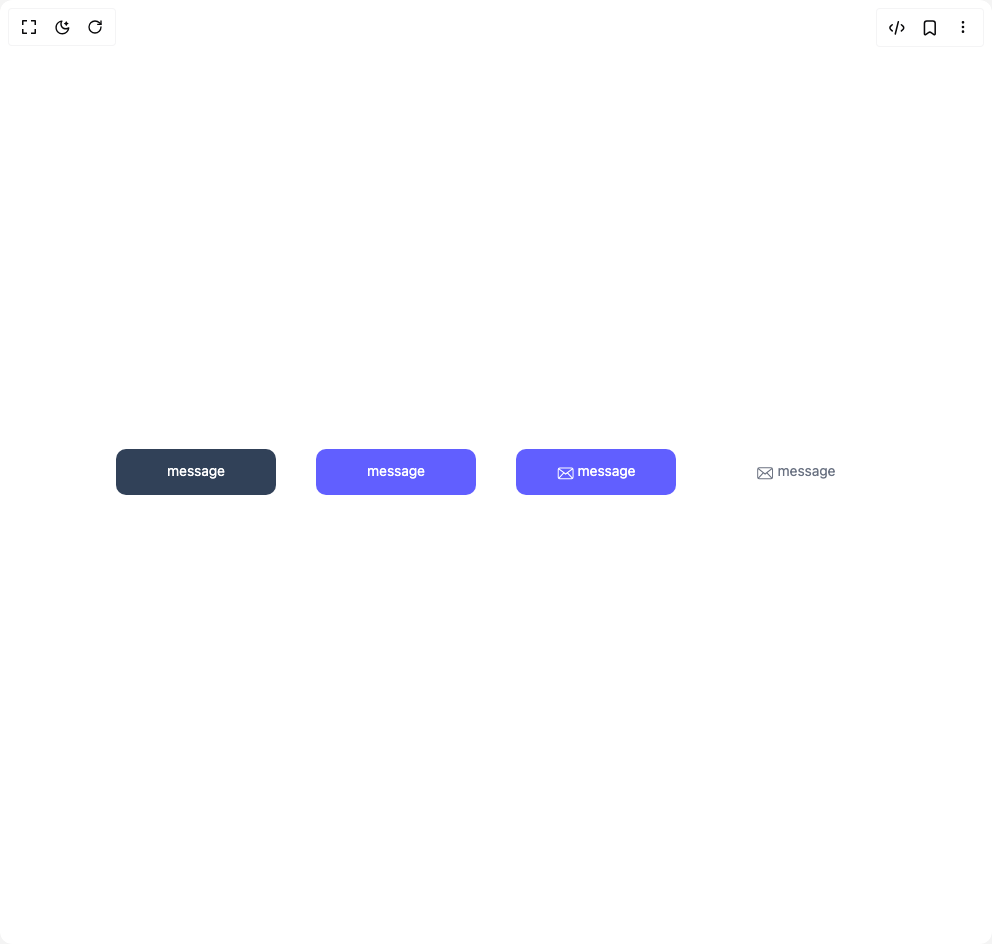

# Build Button Ui in BuilderStudio

> Build this component in our Agentic IDE: [BuilderStudio](https://builderstudio.dev).
>
> Join the BuilderStudio community on [Discord](https://discord.gg/QdWeSGCqfe) and [Reddit](https://reddit.com/r/builderstudio).



## Component

- Author group: `prebuiltui`
- Component: `button-ui`
- Variant: `compact-message-buttons`
- Rendered HTML snapshot: [`rendered.html`](rendered.html)

## BuilderStudio prompt

You are implementing a React component based on a component reference.

## Component identity

- Author: prebuiltui
- Component slug: button-ui
- Demo slug: compact-message-buttons
- Title: button-ui
- Description: 

## Goal

Recreate this component in a React + TypeScript + Tailwind CSS project. Preserve the visual layout, spacing, colors, border radius, shadows, interaction behavior, animation behavior, responsive behavior, and dark mode behavior shown in the rendered demo.

## Implementation requirements

- Use React and TypeScript.
- Use Tailwind CSS classes whenever possible.
- Keep the component self-contained unless the source files require helper components.
- If the source uses CSS variables, custom CSS, animations, or keyframes, include them.
- If the source uses external packages, list and use the required packages.
- Preserve accessibility attributes, button semantics, links, keyboard behavior, and ARIA attributes when visible in the source.
- Do not replace the component with a simplified placeholder.
- Return complete production-ready code.

## Dependencies

No reference metadata available.

## Rendered DOM snapshot

This is the rendered demo HTML extracted from the live preview. Use it to verify structure, class names, visible content, and layout.

```html
<div id="root"><div class="w-screen min-h-screen flex justify-center items-center"><div class="w-screen min-h-screen flex justify-center items-center"><div class="flex flex-wrap items-center justify-center gap-4 md:gap-10"><button type="button" class="w-40 py-3 active:scale-95 transition text-sm text-white rounded-lg bg-slate-700"><p class="mb-0.5">message</p></button><button type="button" class="w-40 py-3 active:scale-95 transition text-sm text-white rounded-lg bg-indigo-500"><p class="mb-0.5">message</p></button><button type="button" class="w-40 py-3 active:scale-95 transition text-sm text-white rounded-lg bg-indigo-500 flex items-center justify-center gap-1"><svg class="mt-0.5" width="17" height="13" viewBox="0 0 17 13" fill="none" xmlns="http://www.w3.org/2000/svg"><path fill-rule="evenodd" clip-rule="evenodd" d="M15.568 10.304c0 .1-.02.195-.047.285l-4.403-4.735 4.45-3.46zm-13.074.962 4.462-4.754 1.69 1.278 1.618-1.286 4.535 4.762c-.071.016-12.234.016-12.305 0m-.769-.962v-7.91l4.45 3.46-4.403 4.735a1 1 0 0 1-.047-.285m13.349-8.9L8.647 6.35 2.219 1.404zm-.495-.988H2.714A1.98 1.98 0 0 0 .736 2.393v7.91c0 1.093.886 1.978 1.978 1.978h11.865a1.98 1.98 0 0 0 1.978-1.977v-7.91A1.98 1.98 0 0 0 14.579.415" fill="#fff"></path></svg><p class="mb-0.5">message</p></button><button type="button" class="w-40 py-3 active:scale-95 transition text-sm text-gray-500 rounded-lg bg-white flex items-center justify-center gap-1"><svg class="mt-0.5" width="17" height="13" viewBox="0 0 17 13" fill="none" xmlns="http://www.w3.org/2000/svg"><path fill-rule="evenodd" clip-rule="evenodd" d="M15.03 10.228c0 .1-.018.196-.046.286L10.58 5.78l4.45-3.46zm-13.073.963L6.42 6.436l1.69 1.278L9.727 6.43l4.535 4.762c-.071.016-12.234.016-12.305 0m-.769-.963v-7.91l4.45 3.46-4.403 4.736a1 1 0 0 1-.047-.286M14.537 1.33 8.108 6.273 1.682 1.33zm-.495-.988H2.177A1.98 1.98 0 0 0 .199 2.318v7.91c0 1.092.886 1.978 1.978 1.978h11.865a1.98 1.98 0 0 0 1.978-1.978v-7.91A1.98 1.98 0 0 0 14.042.341" fill="#6B7280"></path></svg><p class="mb-0.5">message</p></button></div></div></div></div>
```

## Reference source files

No reference source files were available.
