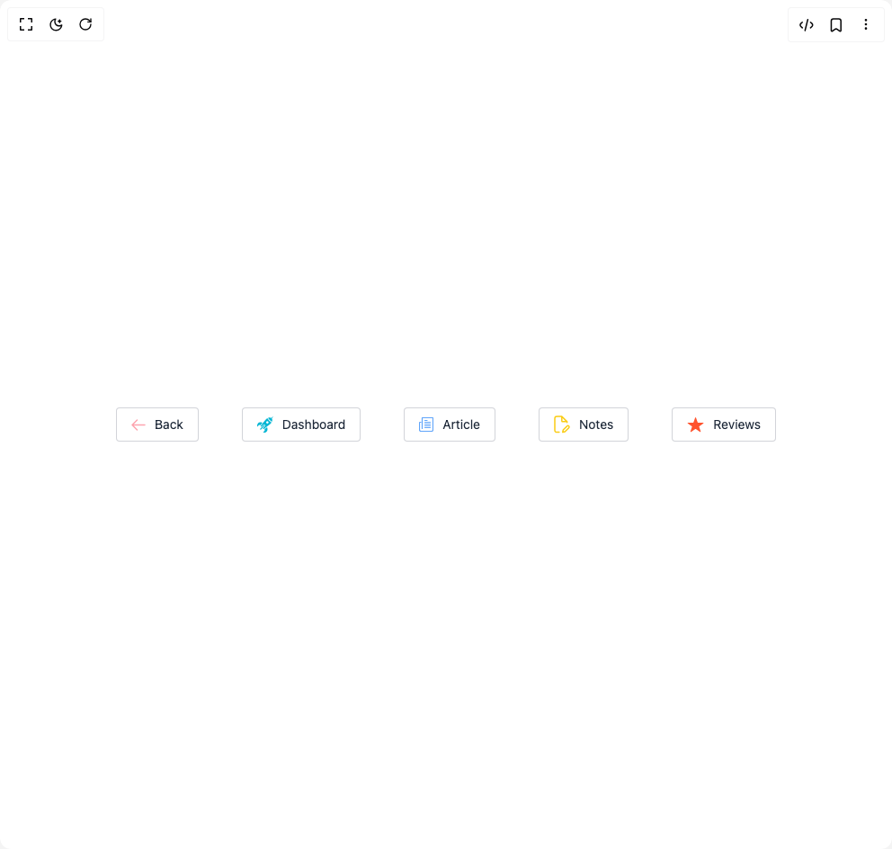

# Build Button Ui in BuilderStudio

> Build this component in our Agentic IDE: [BuilderStudio](https://builderstudio.dev).
>
> Join the BuilderStudio community on [Discord](https://discord.gg/QdWeSGCqfe) and [Reddit](https://reddit.com/r/builderstudio).



## Component

- Author group: `prebuiltui`
- Component: `button-ui`
- Variant: `premium-buttons`
- Rendered HTML snapshot: [`rendered.html`](rendered.html)

## BuilderStudio prompt

You are implementing a React component based on a component reference.

## Component identity

- Author: prebuiltui
- Component slug: button-ui
- Demo slug: premium-buttons
- Title: button-ui
- Description: 

## Goal

Recreate this component in a React + TypeScript + Tailwind CSS project. Preserve the visual layout, spacing, colors, border radius, shadows, interaction behavior, animation behavior, responsive behavior, and dark mode behavior shown in the rendered demo.

## Implementation requirements

- Use React and TypeScript.
- Use Tailwind CSS classes whenever possible.
- Keep the component self-contained unless the source files require helper components.
- If the source uses CSS variables, custom CSS, animations, or keyframes, include them.
- If the source uses external packages, list and use the required packages.
- Preserve accessibility attributes, button semantics, links, keyboard behavior, and ARIA attributes when visible in the source.
- Do not replace the component with a simplified placeholder.
- Return complete production-ready code.

## Dependencies

No reference metadata available.

## Rendered DOM snapshot

This is the rendered demo HTML extracted from the live preview. Use it to verify structure, class names, visible content, and layout.

```html
<div id="root"><div class="w-screen min-h-screen flex justify-center items-center"><div class="w-screen min-h-screen flex justify-center items-center"><div class="flex flex-wrap items-center justify-center gap-6 md:gap-12"><button type="button" class="flex items-center gap-2.5 border border-gray-500/30 px-4 py-2 text-sm text-gray-800 rounded bg-white hover:text-pink-500/70 hover:bg-pink-500/10 hover:border-pink-500/30 active:scale-95 transition"><svg width="16" height="13" viewBox="0 0 16 13" fill="none" xmlns="http://www.w3.org/2000/svg"><path d="M15 6.5H1M6.5 12 1 6.5 6.5 1" stroke="#FDA4AF" stroke-width="1.5" stroke-linecap="round" stroke-linejoin="round"></path></svg>Back</button><button type="button" class="flex items-center gap-2.5 border border-gray-500/30 px-4 py-2 text-sm text-gray-800 rounded bg-white hover:text-cyan-500 hover:bg-cyan-500/10 hover:border-cyan-500/30 active:scale-95 transition"><svg width="18" height="18" viewBox="0 0 18 18" fill="none" xmlns="http://www.w3.org/2000/svg"><path d="M4.13 14.652a.553.553 0 0 1-.78-.78l4.097-4.098a.552.552 0 0 1 .78.78zM5.882 6.95l-2.11 2.887s-.402-.343-1.224-.236C1.332 9.76.816 11.167.56 11.457.295 11.639-.553 9.829.555 8.16c1.872-2.815 5.327-1.21 5.327-1.21m5.169 5.168-2.887 2.11s.343.401.236 1.224c-.16 1.216-1.566 1.731-1.856 1.988-.182.265 1.629 1.112 3.295.005 2.817-1.872 1.212-5.327 1.212-5.327m5.303-6.198c.607-1.365.616-2.753-.07-3.686l.02-.02C17.375 1.145 18.129.16 17.986.018c-.142-.142-1.126.611-2.198 1.682l-.019.02c-.931-.685-2.32-.677-3.683-.071a13.3 13.3 0 0 0 1.895 2.374 13.3 13.3 0 0 0 2.373 1.898" fill="#06B6D4"></path><path d="M13.363 4.639a14.2 14.2 0 0 1-2.054-2.58 7 7 0 0 0-1.279 1.016c-1.314 1.314-6.163 7.728-6.163 7.728l.865.865 2.305-2.305a1.134 1.134 0 0 1 1.602 1.602L6.334 13.27l.865.865s6.414-4.849 7.728-6.163a7 7 0 0 0 1.018-1.283 14.2 14.2 0 0 1-2.582-2.05m-2.978 2.978A1.355 1.355 0 1 1 12.3 5.7a1.355 1.355 0 0 1-1.916 1.917" fill="#06B6D4"></path></svg>Dashboard</button><button type="button" class="flex items-center gap-2.5 border border-gray-500/30 px-4 py-2 text-sm text-gray-800 rounded bg-white hover:text-blue-400 hover:bg-blue-400/10 hover:border-blue-400/30 active:scale-95 transition"><svg width="16" height="16" viewBox="0 0 16 16" fill="none" xmlns="http://www.w3.org/2000/svg"><path d="M3.5 12.5V1.003S3.5.5 4 .5h11s.5.002.5.502v13s0 1.498-1.5 1.498H2s-1.5.002-1.5-1.998v-7.5S.5 5.5 1 5.5h1m4.5-2H9m-2.5 2h6m-6 2h6m-6 2h6m-6 2h6" stroke="#60A5FA" stroke-width="1.2" stroke-linecap="round" stroke-linejoin="round"></path></svg>Article</button><button type="button" class="flex items-center gap-2.5 border border-gray-500/30 px-4 py-2 text-sm text-gray-800 rounded bg-white hover:text-yellow-400 hover:bg-yellow-400/10 hover:border-yellow-400/30 active:scale-95 transition"><svg width="18" height="20" viewBox="0 0 18 20" fill="none" xmlns="http://www.w3.org/2000/svg"><path d="M8.798 1H4.12c-1.092 0-1.638 0-2.055.212a1.95 1.95 0 0 0-.852.852C1 2.481 1 3.027 1 4.12v11.308c0 1.091 0 1.637.212 2.054.187.367.486.665.852.852.417.213.963.213 2.055.213h1.755M8.798 1l5.849 5.849M8.798 1v4.289c0 .546 0 .819.106 1.027a1 1 0 0 0 .426.426c.209.107.482.107 1.028.107h4.289m0 0v.974M9.773 18.546l1.974-.395c.172-.034.258-.052.338-.083a1 1 0 0 0 .202-.108c.07-.05.133-.111.257-.236l4.052-4.052a1.378 1.378 0 1 0-1.95-1.95l-4.052 4.053c-.124.124-.186.186-.235.257a1 1 0 0 0-.108.201c-.032.08-.049.167-.083.339z" stroke="#FACC14" stroke-width="1.5" stroke-linecap="round" stroke-linejoin="round"></path></svg>Notes</button><button type="button" class="flex items-center gap-2.5 border border-gray-500/30 px-4 py-2 text-sm text-gray-800 rounded bg-white hover:text-red-500 hover:bg-red-500/10 hover:border-red-500/30 active:scale-95 transition"><svg width="19" height="17" viewBox="0 0 19 17" fill="none" xmlns="http://www.w3.org/2000/svg"><path d="M9.083.379a.5.5 0 0 1 .945 0l1.782 5.193a.5.5 0 0 0 .473.338h5.703a.5.5 0 0 1 .284.912l-4.567 3.143a.5.5 0 0 0-.19.574l1.755 5.118a.5.5 0 0 1-.756.574l-4.673-3.216a.5.5 0 0 0-.567 0L4.6 16.23a.5.5 0 0 1-.756-.574l1.755-5.118a.5.5 0 0 0-.19-.574L.841 6.822a.5.5 0 0 1 .284-.912h5.704a.5.5 0 0 0 .473-.338z" fill="#FF532E"></path></svg>Reviews</button></div></div></div></div>
```

## Reference source files

No reference source files were available.
