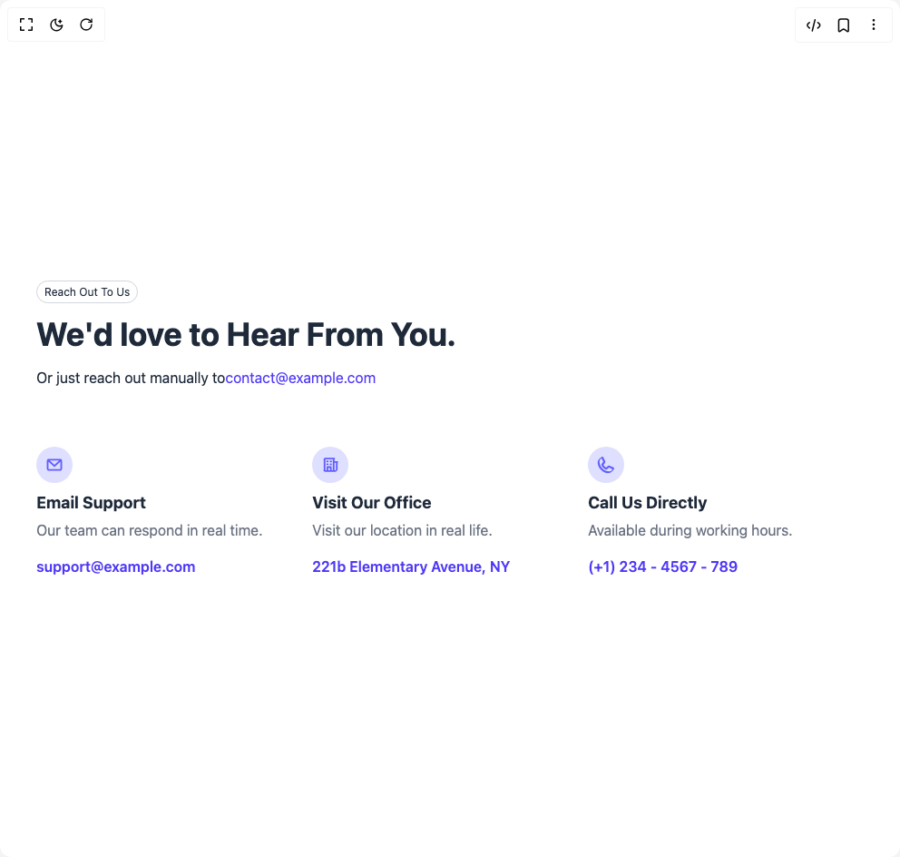

# Build Call To Action 1 in BuilderStudio

> Build this component in our Agentic IDE: [BuilderStudio](https://builderstudio.dev).
>
> Join the BuilderStudio community on [Discord](https://discord.gg/QdWeSGCqfe) and [Reddit](https://reddit.com/r/builderstudio).



## Component

- Author group: `prebuiltui`
- Component: `call-to-action-1`
- Variant: `contact-us-section`
- Rendered HTML snapshot: [`rendered.html`](rendered.html)

## BuilderStudio prompt

You are implementing a React component based on a component reference.

## Component identity

- Author: prebuiltui
- Component slug: call-to-action-1
- Demo slug: contact-us-section
- Title: call-to-action-1
- Description: 

## Goal

Recreate this component in a React + TypeScript + Tailwind CSS project. Preserve the visual layout, spacing, colors, border radius, shadows, interaction behavior, animation behavior, responsive behavior, and dark mode behavior shown in the rendered demo.

## Implementation requirements

- Use React and TypeScript.
- Use Tailwind CSS classes whenever possible.
- Keep the component self-contained unless the source files require helper components.
- If the source uses CSS variables, custom CSS, animations, or keyframes, include them.
- If the source uses external packages, list and use the required packages.
- Preserve accessibility attributes, button semantics, links, keyboard behavior, and ARIA attributes when visible in the source.
- Do not replace the component with a simplified placeholder.
- Return complete production-ready code.

## Dependencies

No reference metadata available.

## Rendered DOM snapshot

This is the rendered demo HTML extracted from the live preview. Use it to verify structure, class names, visible content, and layout.

```html
<div id="root"><div class="w-screen min-h-screen flex justify-center items-center"><div class="w-screen min-h-screen flex justify-center items-center"><div class="max-w-5xl w-full mx-auto p-10 text-gray-800"><span class="px-2 py-1 text-xs border border-gray-300 rounded-full">Reach Out To Us</span><h1 class="text-4xl font-bold text-left mt-4">We'd love to Hear From You.</h1><p class="text-left mt-4">Or just reach out manually to<a href="mailto:contact@example.com" class="text-indigo-600 hover:underline">contact@example.com</a></p><div class="grid md:grid-cols-3 mt-16"><div><svg class="text-indigo-500 bg-indigo-500/20 p-2.5 aspect-square rounded-full size-10" width="24" height="24" viewBox="0 0 24 24" fill="none" xmlns="http://www.w3.org/2000/svg"><path d="M21 4.125H3A1.125 1.125 0 0 0 1.875 5.25V18a1.875 1.875 0 0 0 1.875 1.875h16.5A1.875 1.875 0 0 0 22.125 18V5.25A1.125 1.125 0 0 0 21 4.125m-2.892 2.25L12 11.974 5.892 6.375zM4.125 17.625V7.808l7.115 6.522a1.125 1.125 0 0 0 1.52 0l7.115-6.522v9.817z" fill="currentColor"></path></svg><p class="text-lg font-bold mt-2">Email Support</p><p class="text-gray-500 mt-1 mb-4">Our team can respond in real time.</p><a href="mailto:support@example.com" class="text-indigo-600 font-semibold">support@example.com</a></div><div><svg class="text-indigo-500 bg-indigo-500/20 p-2.5 aspect-square rounded-full size-10" width="24" height="24" viewBox="0 0 24 24" fill="none" xmlns="http://www.w3.org/2000/svg"><path d="M22.875 19.125H21.75V9.309a1.125 1.125 0 0 0-.375-2.184h-3.75V4.809a1.125 1.125 0 0 0-.375-2.184H3.75a1.125 1.125 0 0 0-.375 2.184v14.316H2.25a1.125 1.125 0 1 0 0 2.25h20.625a1.125 1.125 0 1 0 0-2.25M19.5 9.375v9.75h-1.875v-9.75zm-13.875-4.5h9.75v14.25h-1.5V15a1.125 1.125 0 0 0-1.125-1.125h-4.5A1.125 1.125 0 0 0 7.125 15v4.125h-1.5zm6 14.25h-2.25v-3h2.25zM6.75 7.5a1.125 1.125 0 0 1 1.125-1.125h.75a1.125 1.125 0 0 1 0 2.25h-.75A1.125 1.125 0 0 1 6.75 7.5m4.5 0a1.125 1.125 0 0 1 1.125-1.125h.75a1.125 1.125 0 0 1 0 2.25h-.75A1.125 1.125 0 0 1 11.25 7.5m-4.5 3.75a1.125 1.125 0 0 1 1.125-1.125h.75a1.125 1.125 0 1 1 0 2.25h-.75A1.125 1.125 0 0 1 6.75 11.25m4.5 0a1.125 1.125 0 0 1 1.125-1.125h.75a1.125 1.125 0 1 1 0 2.25h-.75a1.125 1.125 0 0 1-1.125-1.125" fill="currentColor"></path></svg><p class="text-lg font-bold mt-2">Visit Our Office</p><p class="text-gray-500 mt-1 mb-4">Visit our location in real life.</p><span class="text-indigo-600 font-semibold">221b Elementary Avenue, NY</span></div><div><svg class="text-indigo-500 bg-indigo-500/20 p-2.5 aspect-square rounded-full size-10" width="21" height="21" viewBox="0 0 21 21" fill="none" xmlns="http://www.w3.org/2000/svg"><path d="m19 13.513-4.415-1.98-.017-.007a1.87 1.87 0 0 0-1.886.243l-2.091 1.781c-1.22-.66-2.478-1.91-3.14-3.113l1.787-2.125q.043-.051.08-.108a1.88 1.88 0 0 0 .148-1.782L7.488 2A1.88 1.88 0 0 0 5.539.89 5.65 5.65 0 0 0 .625 6.5c0 7.651 6.224 13.875 13.875 13.875a5.65 5.65 0 0 0 5.61-4.914A1.88 1.88 0 0 0 19 13.513m-4.5 4.612A11.64 11.64 0 0 1 2.875 6.5a3.4 3.4 0 0 1 2.67-3.332l1.764 3.938-1.796 2.14q-.044.051-.08.108a1.88 1.88 0 0 0-.12 1.841c.883 1.808 2.702 3.615 4.529 4.5a1.88 1.88 0 0 0 1.845-.136q.055-.036.105-.08l2.102-1.787 3.938 1.763a3.4 3.4 0 0 1-3.332 2.67" fill="currentColor"></path></svg><p class="text-lg font-bold mt-2">Call Us Directly</p><p class="text-gray-500 mt-1 mb-4">Available during working hours.</p><span class="text-indigo-600 font-semibold">(+1) 234 - 4567 - 789</span></div></div></div></div></div></div>
```

## Reference source files

No reference source files were available.
