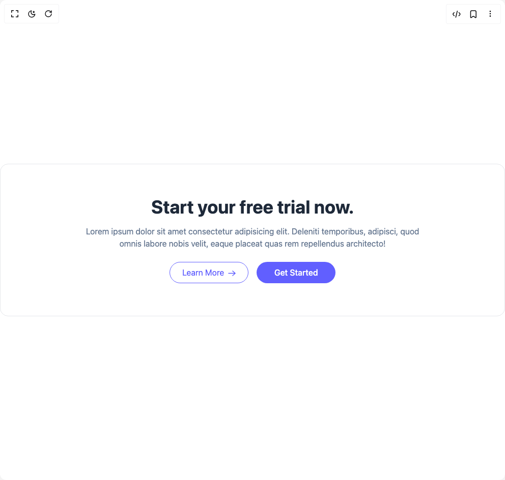

# Build Call To Action 1 in BuilderStudio

> Build this component in our Agentic IDE: [BuilderStudio](https://builderstudio.dev).
>
> Join the BuilderStudio community on [Discord](https://discord.gg/QdWeSGCqfe) and [Reddit](https://reddit.com/r/builderstudio).



## Component

- Author group: `prebuiltui`
- Component: `call-to-action-1`
- Variant: `simple-call-to-acton`
- Rendered HTML snapshot: [`rendered.html`](rendered.html)

## BuilderStudio prompt

You are implementing a React component based on a component reference.

## Component identity

- Author: prebuiltui
- Component slug: call-to-action-1
- Demo slug: simple-call-to-acton
- Title: call-to-action-1
- Description: 

## Goal

Recreate this component in a React + TypeScript + Tailwind CSS project. Preserve the visual layout, spacing, colors, border radius, shadows, interaction behavior, animation behavior, responsive behavior, and dark mode behavior shown in the rendered demo.

## Implementation requirements

- Use React and TypeScript.
- Use Tailwind CSS classes whenever possible.
- Keep the component self-contained unless the source files require helper components.
- If the source uses CSS variables, custom CSS, animations, or keyframes, include them.
- If the source uses external packages, list and use the required packages.
- Preserve accessibility attributes, button semantics, links, keyboard behavior, and ARIA attributes when visible in the source.
- Do not replace the component with a simplified placeholder.
- Return complete production-ready code.

## Dependencies

No reference metadata available.

## Rendered DOM snapshot

This is the rendered demo HTML extracted from the live preview. Use it to verify structure, class names, visible content, and layout.

```html
<div id="root"><div class="w-screen min-h-screen flex justify-center items-center"><div class="w-screen min-h-screen flex justify-center items-center"><div class="flex flex-col items-center bg-white py-16 px-4 max-w-5xl w-full text-center border border-gray-200 rounded-2xl"><h1 class="text-3xl sm:text-4xl font-semibold sm:font-bold text-gray-800">Start your free trial now.</h1><p class="max-w-2xl text-slate-500 mt-4 max-sm:text-sm">Lorem ipsum dolor sit amet consectetur adipisicing elit. Deleniti temporibus, adipisci, quod omnis labore nobis velit, eaque placeat quas rem repellendus architecto!</p><div class="grid grid-cols-1 sm:grid-cols-2 gap-4 mt-6 max-sm:w-full"><button type="button" class="group flex items-center justify-center gap-2 px-6 py-2 border border-indigo-500 rounded-full text-indigo-500">Learn More<svg class="mt-0.5 group-hover:translate-x-1 transition-all" width="15" height="11" viewBox="0 0 15 11" fill="none" xmlns="http://www.w3.org/2000/svg"><path d="M1 5.5h13.092M8.949 1l5.143 4.5L8.949 10" stroke="currentColor" stroke-width="1.5" stroke-linecap="round" stroke-linejoin="round"></path></svg></button><button type="button" class="bg-indigo-500 hover:bg-indigo-600 transition-all px-4 py-2 text-white font-medium rounded-full">Get Started</button></div></div></div></div></div>
```

## Reference source files

No reference source files were available.
