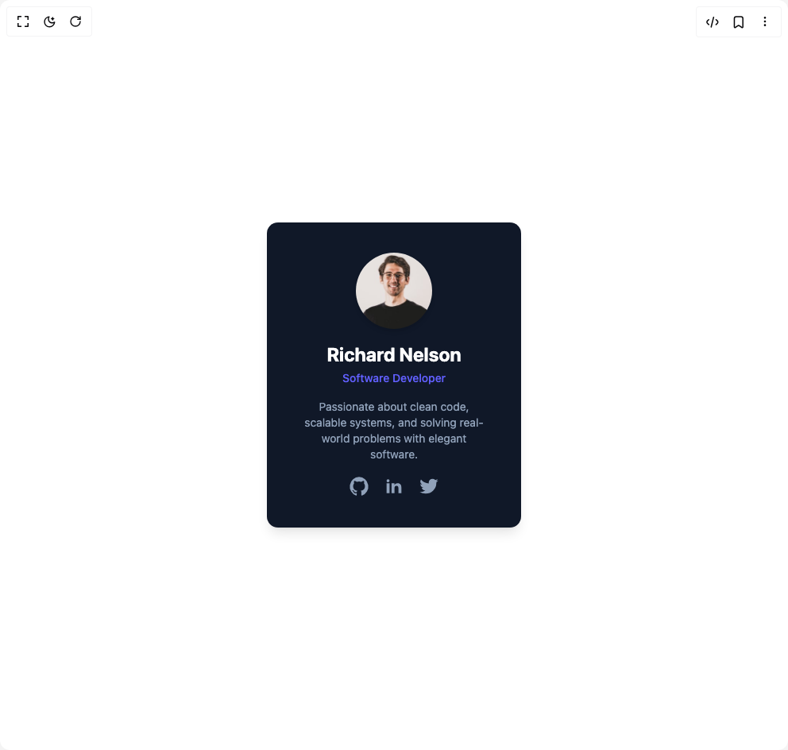

# Build Cards in BuilderStudio

> Build this component in our Agentic IDE: [BuilderStudio](https://builderstudio.dev).
>
> Join the BuilderStudio community on [Discord](https://discord.gg/QdWeSGCqfe) and [Reddit](https://reddit.com/r/builderstudio).



## Component

- Author group: `prebuiltui`
- Component: `cards`
- Variant: `glowing-border-on-hover-card`
- Rendered HTML snapshot: [`rendered.html`](rendered.html)

## BuilderStudio prompt

You are implementing a React component based on a component reference.

## Component identity

- Author: prebuiltui
- Component slug: cards
- Demo slug: glowing-border-on-hover-card
- Title: cards
- Description: 

## Goal

Recreate this component in a React + TypeScript + Tailwind CSS project. Preserve the visual layout, spacing, colors, border radius, shadows, interaction behavior, animation behavior, responsive behavior, and dark mode behavior shown in the rendered demo.

## Implementation requirements

- Use React and TypeScript.
- Use Tailwind CSS classes whenever possible.
- Keep the component self-contained unless the source files require helper components.
- If the source uses CSS variables, custom CSS, animations, or keyframes, include them.
- If the source uses external packages, list and use the required packages.
- Preserve accessibility attributes, button semantics, links, keyboard behavior, and ARIA attributes when visible in the source.
- Do not replace the component with a simplified placeholder.
- Return complete production-ready code.

## Dependencies

No reference metadata available.

## Rendered DOM snapshot

This is the rendered demo HTML extracted from the live preview. Use it to verify structure, class names, visible content, and layout.

```html
<div id="root"><div class="w-screen min-h-screen flex justify-center items-center"><div class="w-screen min-h-screen flex justify-center items-center"><div class="relative w-80 h-96 rounded-xl p-px bg-gray-900 backdrop-blur-md text-gray-800 overflow-hidden shadow-lg cursor-pointer"><div class="pointer-events-none blur-3xl rounded-full bg-gradient-to-r from-blue-500 via-indigo-500 to-purple-300 size-60 absolute z-0 transition-opacity duration-500 opacity-0" style="top: -120px; left: -120px;"></div><div class="relative z-10 bg-gray-900/75 p-6 h-full w-full rounded-[11px] flex flex-col items-center justify-center text-center"><h2 class="text-2xl font-bold text-white mb-1">Richard Nelson</h2><p class="text-sm text-indigo-500 font-medium mb-4">Software Developer</p><p class="text-sm text-slate-400 mb-4 px-4">Passionate about clean code, scalable systems, and solving real-world problems with elegant software.</p><div class="flex space-x-4 mb-4 text-xl text-slate-400"><a href="#" target="_blank" class="hover:-translate-y-0.5 transition"><svg class="size-7" aria-hidden="true" xmlns="http://www.w3.org/2000/svg" width="24" height="24" fill="currentColor" viewBox="0 0 24 24"><path fill-rule="evenodd" d="M12.006 2a9.847 9.847 0 0 0-6.484 2.44 10.32 10.32 0 0 0-3.393 6.17 10.48 10.48 0 0 0 1.317 6.955 10.045 10.045 0 0 0 5.4 4.418c.504.095.683-.223.683-.494 0-.245-.01-1.052-.014-1.908-2.78.62-3.366-1.21-3.366-1.21a2.711 2.711 0 0 0-1.11-1.5c-.907-.637.07-.621.07-.621.317.044.62.163.885.346.266.183.487.426.647.71.135.253.318.476.538.655a2.079 2.079 0 0 0 2.37.196c.045-.52.27-1.006.635-1.37-2.219-.259-4.554-1.138-4.554-5.07a4.022 4.022 0 0 1 1.031-2.75 3.77 3.77 0 0 1 .096-2.713s.839-.275 2.749 1.05a9.26 9.26 0 0 1 5.004 0c1.906-1.325 2.74-1.05 2.74-1.05.37.858.406 1.828.101 2.713a4.017 4.017 0 0 1 1.029 2.75c0 3.939-2.339 4.805-4.564 5.058a2.471 2.471 0 0 1 .679 1.897c0 1.372-.012 2.477-.012 2.814 0 .272.18.592.687.492a10.05 10.05 0 0 0 5.388-4.421 10.473 10.473 0 0 0 1.313-6.948 10.32 10.32 0 0 0-3.39-6.165A9.847 9.847 0 0 0 12.007 2Z" clip-rule="evenodd"></path></svg></a><a href="#" target="_blank" class="hover:-translate-y-0.5 transition"><svg class="size-7" aria-hidden="true" xmlns="http://www.w3.org/2000/svg" width="24" height="24" fill="currentColor" viewBox="0 0 24 24"><path fill-rule="evenodd" d="M12.51 8.796v1.697a3.738 3.738 0 0 1 3.288-1.684c3.455 0 4.202 2.16 4.202 4.97V19.5h-3.2v-5.072c0-1.21-.244-2.766-2.128-2.766-1.827 0-2.139 1.317-2.139 2.676V19.5h-3.19V8.796h3.168ZM7.2 6.106a1.61 1.61 0 0 1-.988 1.483 1.595 1.595 0 0 1-1.743-.348A1.607 1.607 0 0 1 5.6 4.5a1.601 1.601 0 0 1 1.6 1.606Z" clip-rule="evenodd"></path><path d="M7.2 8.809H4V19.5h3.2V8.809Z"></path></svg></a><a href="#" target="_blank" class="hover:-translate-y-0.5 transition"><svg class="size-7" aria-hidden="true" xmlns="http://www.w3.org/2000/svg" width="24" height="24" fill="currentColor" viewBox="0 0 24 24"><path fill-rule="evenodd" d="M22 5.892a8.178 8.178 0 0 1-2.355.635 4.074 4.074 0 0 0 1.8-2.235 8.343 8.343 0 0 1-2.605.981A4.13 4.13 0 0 0 15.85 4a4.068 4.068 0 0 0-4.1 4.038c0 .31.035.618.105.919A11.705 11.705 0 0 1 3.4 4.734a4.006 4.006 0 0 0 1.268 5.392 4.165 4.165 0 0 1-1.859-.5v.05A4.057 4.057 0 0 0 6.1 13.635a4.192 4.192 0 0 1-1.856.07 4.108 4.108 0 0 0 3.831 2.807A8.36 8.36 0 0 1 2 18.184 11.732 11.732 0 0 0 8.291 20 11.502 11.502 0 0 0 19.964 8.5c0-.177 0-.349-.012-.523A8.143 8.143 0 0 0 22 5.892Z" clip-rule="evenodd"></path></svg></a></div></div></div></div></div></div>
```

## Reference source files

No reference source files were available.
