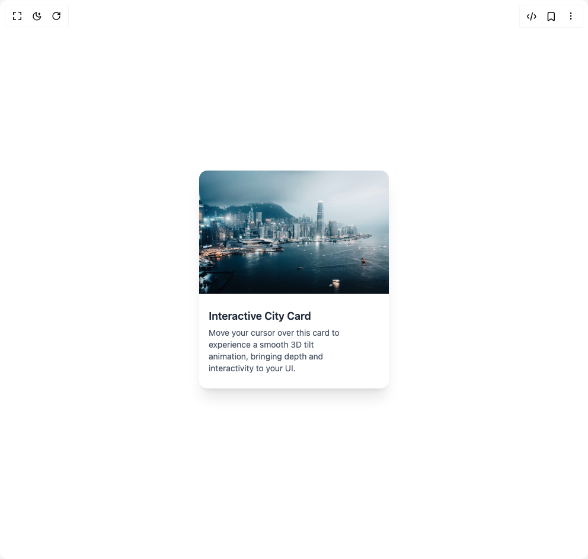

# Build Cards in BuilderStudio

> Build this component in our Agentic IDE: [BuilderStudio](https://builderstudio.dev).
>
> Join the BuilderStudio community on [Discord](https://discord.gg/QdWeSGCqfe) and [Reddit](https://reddit.com/r/builderstudio).



## Component

- Author group: `prebuiltui`
- Component: `cards`
- Variant: `on-hover-tilt-effect-card`
- Rendered HTML snapshot: [`rendered.html`](rendered.html)

## BuilderStudio prompt

You are implementing a React component based on a component reference.

## Component identity

- Author: prebuiltui
- Component slug: cards
- Demo slug: on-hover-tilt-effect-card
- Title: cards
- Description: 

## Goal

Recreate this component in a React + TypeScript + Tailwind CSS project. Preserve the visual layout, spacing, colors, border radius, shadows, interaction behavior, animation behavior, responsive behavior, and dark mode behavior shown in the rendered demo.

## Implementation requirements

- Use React and TypeScript.
- Use Tailwind CSS classes whenever possible.
- Keep the component self-contained unless the source files require helper components.
- If the source uses CSS variables, custom CSS, animations, or keyframes, include them.
- If the source uses external packages, list and use the required packages.
- Preserve accessibility attributes, button semantics, links, keyboard behavior, and ARIA attributes when visible in the source.
- Do not replace the component with a simplified placeholder.
- Return complete production-ready code.

## Dependencies

No reference metadata available.

## Rendered DOM snapshot

This is the rendered demo HTML extracted from the live preview. Use it to verify structure, class names, visible content, and layout.

```html
<div id="root"><div class="w-screen min-h-screen flex justify-center items-center"><div class="w-screen min-h-screen flex justify-center items-center"><div class="rounded-xl shadow-xl overflow-hidden transition-transform duration-200 ease-out cursor-pointer max-w-80 bg-white" style="transform: perspective(1000px) rotateX(0deg) rotateY(0deg);"><h3 class="mt-3 px-4 pt-3 mb-1 text-lg font-semibold text-gray-800">Interactive City Card</h3><p class="text-sm px-4 pb-6 text-gray-600 w-5/6">Move your cursor over this card to experience a smooth 3D tilt animation, bringing depth and interactivity to your UI.</p></div></div></div></div>
```

## Reference source files

No reference source files were available.
