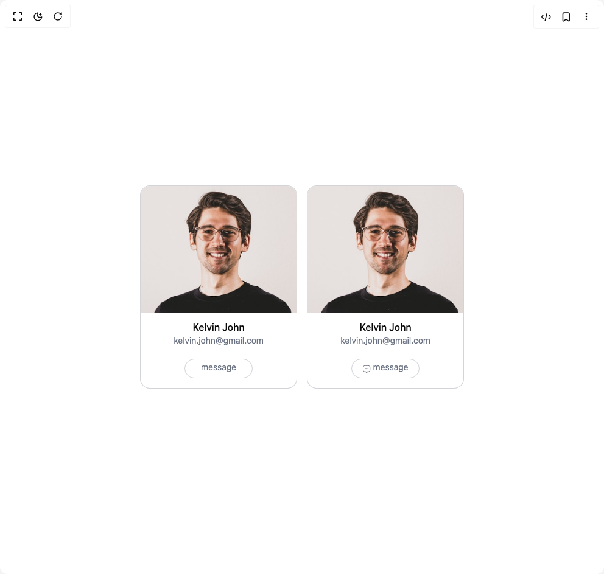

# Build Cards in BuilderStudio

> Build this component in our Agentic IDE: [BuilderStudio](https://builderstudio.dev).
>
> Join the BuilderStudio community on [Discord](https://discord.gg/QdWeSGCqfe) and [Reddit](https://reddit.com/r/builderstudio).



## Component

- Author group: `prebuiltui`
- Component: `cards`
- Variant: `user-profile-card`
- Rendered HTML snapshot: [`rendered.html`](rendered.html)

## BuilderStudio prompt

You are implementing a React component based on a component reference.

## Component identity

- Author: prebuiltui
- Component slug: cards
- Demo slug: user-profile-card
- Title: cards
- Description: 

## Goal

Recreate this component in a React + TypeScript + Tailwind CSS project. Preserve the visual layout, spacing, colors, border radius, shadows, interaction behavior, animation behavior, responsive behavior, and dark mode behavior shown in the rendered demo.

## Implementation requirements

- Use React and TypeScript.
- Use Tailwind CSS classes whenever possible.
- Keep the component self-contained unless the source files require helper components.
- If the source uses CSS variables, custom CSS, animations, or keyframes, include them.
- If the source uses external packages, list and use the required packages.
- Preserve accessibility attributes, button semantics, links, keyboard behavior, and ARIA attributes when visible in the source.
- Do not replace the component with a simplified placeholder.
- Return complete production-ready code.

## Dependencies

No reference metadata available.

## Rendered DOM snapshot

This is the rendered demo HTML extracted from the live preview. Use it to verify structure, class names, visible content, and layout.

```html
<div id="root"><div class="w-screen min-h-screen flex justify-center items-center"><div class="w-screen min-h-screen flex justify-center items-center"><div class="flex flex-wrap items-center justify-center gap-4"><div class="bg-white rounded-2xl pb-4 overflow-hidden border border-gray-500/30"><div class="flex flex-col items-center"><p class="font-medium mt-3">Kelvin John</p><p class="text-gray-500 text-sm">kelvin.john@gmail.com</p><button class="border text-sm text-gray-500 border-gray-500/30 w-28 h-8 rounded-full mt-5"><p class="mb-1">message</p></button></div></div><div class="bg-white rounded-2xl pb-4 overflow-hidden border border-gray-500/30"><div class="flex flex-col items-center"><p class="font-medium mt-3">Kelvin John</p><p class="text-gray-500 text-sm">kelvin.john@gmail.com</p><button class="border text-sm text-gray-500 border-gray-500/30 w-28 h-8 rounded-full mt-5 flex items-center justify-center gap-1"><svg class="mt-0.5" width="13" height="13" viewBox="0 0 13 13" fill="none" xmlns="http://www.w3.org/2000/svg"><path d="m7.107 11.684.31-.521-.736-.436-.309.522zm-2.28-.521.308.521.735-.435-.309-.522zm1.545.086a.297.297 0 0 1-.502 0l-.735.435a1.15 1.15 0 0 0 1.972 0zM5.267.854h1.708V0H5.267zm6.121 4.413v.57h.854v-.57zm-10.534.57v-.57H0v.57zm-.854 0c0 .657 0 1.171.028 1.586.029.42.088.768.221 1.09l.79-.327c-.084-.2-.133-.446-.159-.82-.026-.38-.026-.86-.026-1.53zm3.731 3.838c-.715-.012-1.09-.058-1.383-.18l-.327.79c.459.19.98.232 1.695.244zM.249 8.513c.333.802.97 1.44 1.772 1.772l.327-.79a2.42 2.42 0 0 1-1.31-1.309zm11.14-2.677c0 .67-.001 1.15-.027 1.53-.026.374-.075.62-.158.82l.79.327c.133-.322.192-.67.22-1.09.028-.415.028-.93.028-1.587zM8.525 10.53c.715-.012 1.237-.054 1.695-.244l-.327-.79c-.293.122-.668.168-1.383.18zm2.678-2.343a2.42 2.42 0 0 1-1.31 1.31l.327.789a3.27 3.27 0 0 0 1.772-1.772zM6.975.854c.94 0 1.616 0 2.142.05.52.05.852.145 1.116.307l.446-.729C10.259.225 9.78.11 9.199.054 8.621 0 7.898 0 6.974 0zm5.267 4.413c0-.924 0-1.646-.054-2.223-.056-.583-.17-1.06-.428-1.48l-.728.446c.161.264.256.595.306 1.115.05.527.05 1.202.05 2.142zm-2.01-4.056c.326.2.6.473.8.799l.728-.447c-.27-.44-.64-.81-1.081-1.08zM5.268 0c-.924 0-1.646 0-2.223.054-.583.056-1.06.17-1.48.428l.446.729c.264-.162.595-.257 1.115-.306.527-.05 1.202-.05 2.142-.05zM.854 5.267c0-.94 0-1.615.05-2.142.05-.52.145-.851.307-1.115l-.729-.447c-.257.421-.372.898-.428 1.481C0 3.621 0 4.344 0 5.267zm.71-4.785A3.3 3.3 0 0 0 .482 1.563l.729.447c.2-.326.473-.6.799-.8zM5.56 10.728a6 6 0 0 0-.316-.503 1.3 1.3 0 0 0-.388-.368l-.43.739a.4.4 0 0 1 .128.131c.07.095.147.226.271.436zm-1.845-.199c.25.004.409.008.53.02a.45.45 0 0 1 .182.047l.429-.739a1.3 1.3 0 0 0-.518-.156c-.169-.019-.374-.022-.608-.026zm3.7.634c.124-.21.202-.34.271-.436a.4.4 0 0 1 .128-.131l-.43-.739a1.3 1.3 0 0 0-.388.368c-.099.135-.2.307-.316.502zM8.51 9.675c-.234.004-.439.007-.608.026-.178.02-.351.06-.518.156l.43.739a.45.45 0 0 1 .182-.046 6 6 0 0 1 .529-.02z" fill="#6B7280"></path><path d="M3.844 5.552h.005m2.268 0h.005m2.272 0H8.4" stroke="#6B7280" stroke-width="1.5" stroke-linecap="round" stroke-linejoin="round"></path></svg><p class="mb-1">message</p></button></div></div></div></div></div></div>
```

## Reference source files

No reference source files were available.
