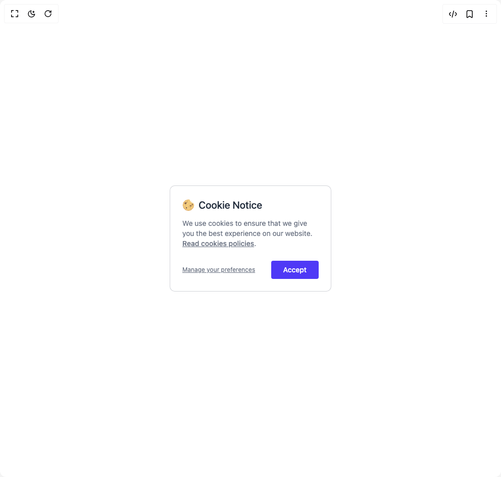

# Build Cookies in BuilderStudio

> Build this component in our Agentic IDE: [BuilderStudio](https://builderstudio.dev).
>
> Join the BuilderStudio community on [Discord](https://discord.gg/QdWeSGCqfe) and [Reddit](https://reddit.com/r/builderstudio).



## Component

- Author group: `prebuiltui`
- Component: `cookies`
- Variant: `basic-cookie-alert`
- Rendered HTML snapshot: [`rendered.html`](rendered.html)

## BuilderStudio prompt

You are implementing a React component based on a component reference.

## Component identity

- Author: prebuiltui
- Component slug: cookies
- Demo slug: basic-cookie-alert
- Title: cookies
- Description: 

## Goal

Recreate this component in a React + TypeScript + Tailwind CSS project. Preserve the visual layout, spacing, colors, border radius, shadows, interaction behavior, animation behavior, responsive behavior, and dark mode behavior shown in the rendered demo.

## Implementation requirements

- Use React and TypeScript.
- Use Tailwind CSS classes whenever possible.
- Keep the component self-contained unless the source files require helper components.
- If the source uses CSS variables, custom CSS, animations, or keyframes, include them.
- If the source uses external packages, list and use the required packages.
- Preserve accessibility attributes, button semantics, links, keyboard behavior, and ARIA attributes when visible in the source.
- Do not replace the component with a simplified placeholder.
- Return complete production-ready code.

## Dependencies

No reference metadata available.

## Rendered DOM snapshot

This is the rendered demo HTML extracted from the live preview. Use it to verify structure, class names, visible content, and layout.

```html
<div id="root"><div class="w-screen min-h-screen flex justify-center items-center"><div class="w-screen min-h-screen flex justify-center items-center"><div class="flex flex-col items-center w-80 bg-white text-gray-500 p-4 md:p-6 rounded-lg border border-gray-500/30 text-sm"><div class="flex items-center justify-start w-full gap-2 pb-3"><h2 class="text-gray-800 text-xl font-medium">Cookie Notice</h2></div><p>We use cookies to ensure that we give you the best experience on our website. <a href="#" class="font-medium underline">Read cookies policies</a>.</p><div class="flex items-center justify-between mt-6 gap-3 w-full"><a class="underline text-xs" href="#">Manage your preferences</a><button type="button" class="bg-indigo-600 px-6 py-2 rounded text-white font-medium active:scale-95 transition">Accept</button></div></div></div></div></div>
```

## Reference source files

No reference source files were available.
