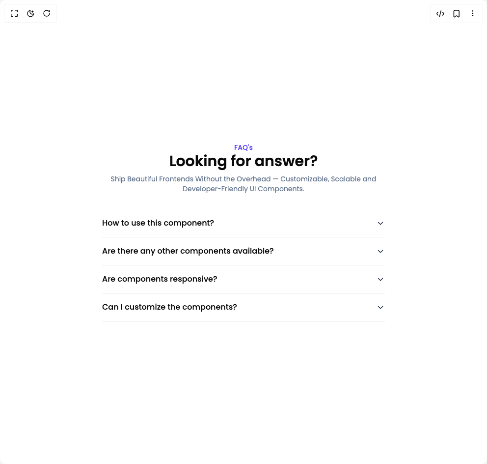

# Build Faq Sections in BuilderStudio

> Build this component in our Agentic IDE: [BuilderStudio](https://builderstudio.dev).
>
> Join the BuilderStudio community on [Discord](https://discord.gg/QdWeSGCqfe) and [Reddit](https://reddit.com/r/builderstudio).



## Component

- Author group: `prebuiltui`
- Component: `faq-sections`
- Variant: `faq-section-center-aligned`
- Rendered HTML snapshot: [`rendered.html`](rendered.html)

## BuilderStudio prompt

You are implementing a React component based on a component reference.

## Component identity

- Author: prebuiltui
- Component slug: faq-sections
- Demo slug: faq-section-center-aligned
- Title: faq-sections
- Description: 

## Goal

Recreate this component in a React + TypeScript + Tailwind CSS project. Preserve the visual layout, spacing, colors, border radius, shadows, interaction behavior, animation behavior, responsive behavior, and dark mode behavior shown in the rendered demo.

## Implementation requirements

- Use React and TypeScript.
- Use Tailwind CSS classes whenever possible.
- Keep the component self-contained unless the source files require helper components.
- If the source uses CSS variables, custom CSS, animations, or keyframes, include them.
- If the source uses external packages, list and use the required packages.
- Preserve accessibility attributes, button semantics, links, keyboard behavior, and ARIA attributes when visible in the source.
- Do not replace the component with a simplified placeholder.
- Return complete production-ready code.

## Dependencies

No reference metadata available.

## Rendered DOM snapshot

This is the rendered demo HTML extracted from the live preview. Use it to verify structure, class names, visible content, and layout.

```html
<div id="root"><div class="w-screen min-h-screen flex justify-center items-center"><div class="w-screen min-h-screen flex justify-center items-center"><style>
                @import url('https://fonts.googleapis.com/css2?family=Poppins:ital,wght@0,100;0,200;0,300;0,400;0,500;0,600;0,700;0,800;0,900;1,100;1,200;1,300;1,400;1,500;1,600;1,700;1,800;1,900&display=swap');
            
                * {
                    font-family: 'Poppins', sans-serif;
                }
            </style><div class="max-w-xl mx-auto flex flex-col items-center justify-center px-4 md:px-0"><p class="text-indigo-600 text-sm font-medium">FAQ's</p><h1 class="text-3xl font-semibold text-center">Looking for answer?</h1><p class="text-sm text-slate-500 mt-2 pb-8 text-center">Ship Beautiful Frontends Without the Overhead — Customizable, Scalable and Developer-Friendly UI Components.</p><div class="border-b border-slate-200 py-4 cursor-pointer w-full"><div class="flex items-center justify-between"><h3 class="text-base font-medium">How to use this component?</h3><svg width="18" height="18" viewBox="0 0 18 18" fill="none" xmlns="http://www.w3.org/2000/svg" class=" transition-all duration-500 ease-in-out"><path d="m4.5 7.2 3.793 3.793a1 1 0 0 0 1.414 0L13.5 7.2" stroke="#1D293D" stroke-width="1.5" stroke-linecap="round" stroke-linejoin="round"></path></svg></div><p class="text-sm text-slate-500 transition-all duration-500 ease-in-out max-w-md opacity-0 max-h-0 -translate-y-2">To use this component, you need to import it in your project and use it in your JSX code. Here's an example of how to use it:</p></div><div class="border-b border-slate-200 py-4 cursor-pointer w-full"><div class="flex items-center justify-between"><h3 class="text-base font-medium">Are there any other components available?</h3><svg width="18" height="18" viewBox="0 0 18 18" fill="none" xmlns="http://www.w3.org/2000/svg" class=" transition-all duration-500 ease-in-out"><path d="m4.5 7.2 3.793 3.793a1 1 0 0 0 1.414 0L13.5 7.2" stroke="#1D293D" stroke-width="1.5" stroke-linecap="round" stroke-linejoin="round"></path></svg></div><p class="text-sm text-slate-500 transition-all duration-500 ease-in-out max-w-md opacity-0 max-h-0 -translate-y-2">Yes, there are many other components available in this library. You can find them in the 'Components' section of the website.</p></div><div class="border-b border-slate-200 py-4 cursor-pointer w-full"><div class="flex items-center justify-between"><h3 class="text-base font-medium">Are components responsive?</h3><svg width="18" height="18" viewBox="0 0 18 18" fill="none" xmlns="http://www.w3.org/2000/svg" class=" transition-all duration-500 ease-in-out"><path d="m4.5 7.2 3.793 3.793a1 1 0 0 0 1.414 0L13.5 7.2" stroke="#1D293D" stroke-width="1.5" stroke-linecap="round" stroke-linejoin="round"></path></svg></div><p class="text-sm text-slate-500 transition-all duration-500 ease-in-out max-w-md opacity-0 max-h-0 -translate-y-2">Yes, all components are responsive and can be used on different screen sizes.</p></div><div class="border-b border-slate-200 py-4 cursor-pointer w-full"><div class="flex items-center justify-between"><h3 class="text-base font-medium">Can I customize the components?</h3><svg width="18" height="18" viewBox="0 0 18 18" fill="none" xmlns="http://www.w3.org/2000/svg" class=" transition-all duration-500 ease-in-out"><path d="m4.5 7.2 3.793 3.793a1 1 0 0 0 1.414 0L13.5 7.2" stroke="#1D293D" stroke-width="1.5" stroke-linecap="round" stroke-linejoin="round"></path></svg></div><p class="text-sm text-slate-500 transition-all duration-500 ease-in-out max-w-md opacity-0 max-h-0 -translate-y-2">Yes, you can customize the components by passing props to them. You can find more information about customizing components in the 'Customization' section of the website.</p></div></div></div></div></div>
```

## Reference source files

No reference source files were available.
