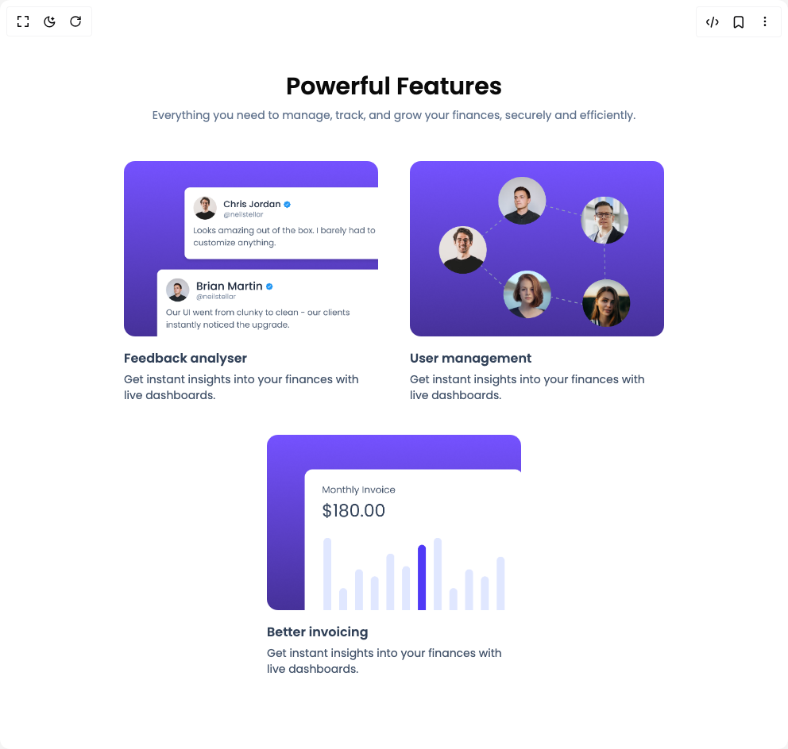

# Build Feature Sections in BuilderStudio

> Build this component in our Agentic IDE: [BuilderStudio](https://builderstudio.dev).
>
> Join the BuilderStudio community on [Discord](https://discord.gg/QdWeSGCqfe) and [Reddit](https://reddit.com/r/builderstudio).



## Component

- Author group: `prebuiltui`
- Component: `feature-sections`
- Variant: `default`
- Rendered HTML snapshot: [`rendered.html`](rendered.html)

## BuilderStudio prompt

You are implementing a React component based on a component reference.

## Component identity

- Author: prebuiltui
- Component slug: feature-sections
- Demo slug: default
- Title: feature-sections
- Description: 

## Goal

Recreate this component in a React + TypeScript + Tailwind CSS project. Preserve the visual layout, spacing, colors, border radius, shadows, interaction behavior, animation behavior, responsive behavior, and dark mode behavior shown in the rendered demo.

## Implementation requirements

- Use React and TypeScript.
- Use Tailwind CSS classes whenever possible.
- Keep the component self-contained unless the source files require helper components.
- If the source uses CSS variables, custom CSS, animations, or keyframes, include them.
- If the source uses external packages, list and use the required packages.
- Preserve accessibility attributes, button semantics, links, keyboard behavior, and ARIA attributes when visible in the source.
- Do not replace the component with a simplified placeholder.
- Return complete production-ready code.

## Dependencies

No reference metadata available.

## Rendered DOM snapshot

This is the rendered demo HTML extracted from the live preview. Use it to verify structure, class names, visible content, and layout.

```html
<div id="root"><div class="w-screen min-h-screen flex justify-center items-center"><div class="w-screen min-h-screen flex justify-center items-center"><section class="w-full py-16"><style>
        @import url('https://fonts.googleapis.com/css2?family=Poppins:ital,wght@0,100;0,200;0,300;0,400;0,500;0,600;0,700;0,800;0,900;1,100;1,200;1,300;1,400;1,500;1,600;1,700;1,800;1,900&display=swap');
        * {
          font-family: 'Poppins', sans-serif;
        }
      </style><div class="text-center max-w-2xl mx-auto mb-12"><h1 class="text-3xl font-semibold">Powerful Features</h1><p class="text-sm text-slate-500 mt-2">Everything you need to manage, track, and grow your finances, securely and efficiently.</p></div><div class="flex flex-wrap items-start justify-center gap-10"><div class="max-w-80 hover:-translate-y-0.5 transition duration-300"><h3 class="text-base font-semibold text-slate-700 mt-4">Feedback analyser</h3><p class="text-sm text-slate-600 mt-1">Get instant insights into your finances with live dashboards.</p></div><div class="max-w-80 hover:-translate-y-0.5 transition duration-300"><h3 class="text-base font-semibold text-slate-700 mt-4">User management</h3><p class="text-sm text-slate-600 mt-1">Get instant insights into your finances with live dashboards.</p></div><div class="max-w-80 hover:-translate-y-0.5 transition duration-300"><h3 class="text-base font-semibold text-slate-700 mt-4">Better invoicing</h3><p class="text-sm text-slate-600 mt-1">Get instant insights into your finances with live dashboards.</p></div></div></section></div></div></div>
```

## Reference source files

No reference source files were available.
