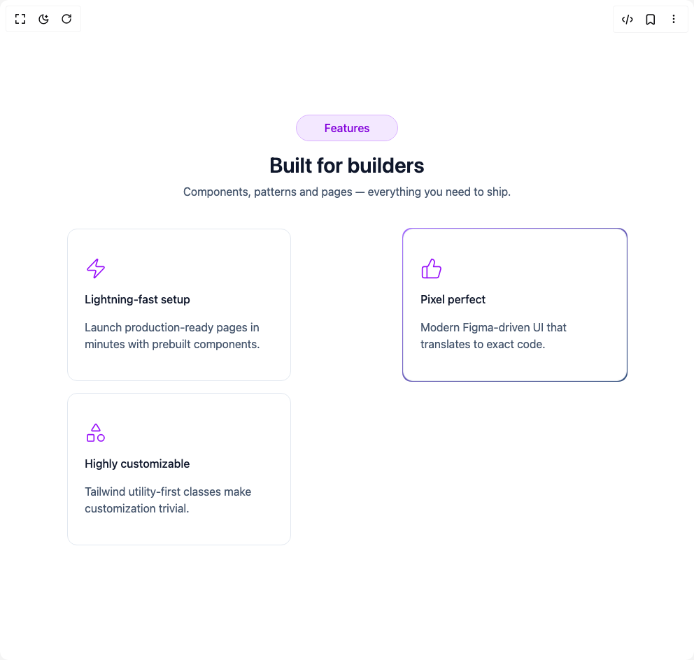

# Build Feature Sections in BuilderStudio

> Build this component in our Agentic IDE: [BuilderStudio](https://builderstudio.dev).
>
> Join the BuilderStudio community on [Discord](https://discord.gg/QdWeSGCqfe) and [Reddit](https://reddit.com/r/builderstudio).



## Component

- Author group: `prebuiltui`
- Component: `feature-sections`
- Variant: `features-section-dark-theme`
- Rendered HTML snapshot: [`rendered.html`](rendered.html)

## BuilderStudio prompt

You are implementing a React component based on a component reference.

## Component identity

- Author: prebuiltui
- Component slug: feature-sections
- Demo slug: features-section-dark-theme
- Title: feature-sections
- Description: 

## Goal

Recreate this component in a React + TypeScript + Tailwind CSS project. Preserve the visual layout, spacing, colors, border radius, shadows, interaction behavior, animation behavior, responsive behavior, and dark mode behavior shown in the rendered demo.

## Implementation requirements

- Use React and TypeScript.
- Use Tailwind CSS classes whenever possible.
- Keep the component self-contained unless the source files require helper components.
- If the source uses CSS variables, custom CSS, animations, or keyframes, include them.
- If the source uses external packages, list and use the required packages.
- Preserve accessibility attributes, button semantics, links, keyboard behavior, and ARIA attributes when visible in the source.
- Do not replace the component with a simplified placeholder.
- Return complete production-ready code.

## Dependencies

No reference metadata available.

## Rendered DOM snapshot

This is the rendered demo HTML extracted from the live preview. Use it to verify structure, class names, visible content, and layout.

```html
<div id="root"><div class="w-screen min-h-screen flex justify-center items-center"><div class="w-screen min-h-screen flex justify-center items-center"><section class="w-full py-12"><div class="text-center"><p class="font-medium text-purple-700 dark:text-purple-400 px-10 py-1.5 rounded-full
                       bg-purple-100 dark:bg-purple-950 border border-purple-300 dark:border-purple-800
                       w-max mx-auto">Features</p><h2 class="text-3xl font-semibold mt-4 text-slate-900 dark:text-white">Built for builders</h2><p class="mt-2 text-slate-600 dark:text-slate-300 max-w-xl mx-auto">Components, patterns and pages — everything you need to ship.</p></div><div class="mt-10 px-6 grid grid-cols-1 sm:grid-cols-2 lg:grid-cols-3 gap-6 md:gap-4 place-items-center"><div class="hover:-translate-y-0.5 transition duration-300 "><div class="p-6 rounded-xl space-y-4
                            border border-slate-200 dark:border-slate-800
                            bg-white dark:bg-slate-950
                            text-slate-900 dark:text-white
                            w-80 max-w-sm"><svg xmlns="http://www.w3.org/2000/svg" width="32" height="32" viewBox="0 0 24 24" fill="none" stroke="currentColor" stroke-width="1.25" stroke-linecap="round" stroke-linejoin="round" class="text-purple-600 dark:text-purple-500 size-8 mt-4" aria-hidden="true"><path d="M4 14a1 1 0 0 1-.78-1.63l9.9-10.2a.5.5 0 0 1 .86.46l-1.92 6.02A1 1 0 0 0 13 10h7a1 1 0 0 1 .78 1.63l-9.9 10.2a.5.5 0 0 1-.86-.46l1.92-6.02A1 1 0 0 0 11 14z"></path></svg><h3 class="text-base font-medium">Lightning-fast setup</h3><p class="text-slate-600 dark:text-slate-400 line-clamp-2 pb-4">Launch production-ready pages in minutes with prebuilt components.</p></div></div><div class="hover:-translate-y-0.5 transition duration-300 p-px rounded-[13px] bg-gradient-to-br from-[#A46BFF] to-[#33507C] dark:from-[#9544FF] dark:to-[#223B60]"><div class="p-6 rounded-xl space-y-4
                            border border-slate-200 dark:border-slate-800
                            bg-white dark:bg-slate-950
                            text-slate-900 dark:text-white
                            w-80 max-w-sm"><svg xmlns="http://www.w3.org/2000/svg" width="32" height="32" viewBox="0 0 24 24" fill="none" stroke="currentColor" stroke-width="1.25" stroke-linecap="round" stroke-linejoin="round" class="text-purple-600 dark:text-purple-500 size-8 mt-4" aria-hidden="true"><path d="M7 10v12"></path><path d="M15 5.88 14 10h5.83a2 2 0 0 1 1.92 2.56l-2.33 8A2 2 0 0 1 17.5 22H4a2 2 0 0 1-2-2v-8a2 2 0 0 1 2-2h2.76a2 2 0 0 0 1.79-1.11L12 2a3.13 3.13 0 0 1 3 3.88Z"></path></svg><h3 class="text-base font-medium">Pixel perfect</h3><p class="text-slate-600 dark:text-slate-400 line-clamp-2 pb-4">Modern Figma-driven UI that translates to exact code.</p></div></div><div class="hover:-translate-y-0.5 transition duration-300 "><div class="p-6 rounded-xl space-y-4
                            border border-slate-200 dark:border-slate-800
                            bg-white dark:bg-slate-950
                            text-slate-900 dark:text-white
                            w-80 max-w-sm"><svg xmlns="http://www.w3.org/2000/svg" width="32" height="32" viewBox="0 0 24 24" fill="none" stroke="currentColor" stroke-width="1.25" stroke-linecap="round" stroke-linejoin="round" class="text-purple-600 dark:text-purple-500 size-8 mt-4" aria-hidden="true"><path d="M8.3 10a.7.7 0 0 1-.626-1.079L11.4 3a.7.7 0 0 1 1.198-.043L16.3 8.9a.7.7 0 0 1-.572 1.1Z"></path><rect x="3" y="14" width="7" height="7" rx="1"></rect><circle cx="17.5" cy="17.5" r="3.5"></circle></svg><h3 class="text-base font-medium">Highly customizable</h3><p class="text-slate-600 dark:text-slate-400 line-clamp-2 pb-4">Tailwind utility-first classes make customization trivial.</p></div></div></div></section></div></div></div>
```

## Reference source files

No reference source files were available.
