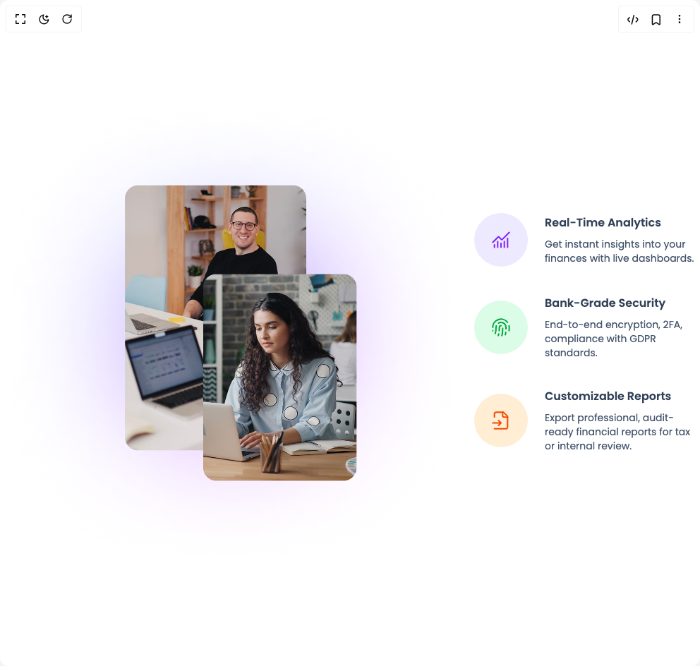

# Build Feature Sections in BuilderStudio

> Build this component in our Agentic IDE: [BuilderStudio](https://builderstudio.dev).
>
> Join the BuilderStudio community on [Discord](https://discord.gg/QdWeSGCqfe) and [Reddit](https://reddit.com/r/builderstudio).



## Component

- Author group: `prebuiltui`
- Component: `feature-sections`
- Variant: `features-section-with-gradient-bg`
- Rendered HTML snapshot: [`rendered.html`](rendered.html)

## BuilderStudio prompt

You are implementing a React component based on a component reference.

## Component identity

- Author: prebuiltui
- Component slug: feature-sections
- Demo slug: features-section-with-gradient-bg
- Title: feature-sections
- Description: 

## Goal

Recreate this component in a React + TypeScript + Tailwind CSS project. Preserve the visual layout, spacing, colors, border radius, shadows, interaction behavior, animation behavior, responsive behavior, and dark mode behavior shown in the rendered demo.

## Implementation requirements

- Use React and TypeScript.
- Use Tailwind CSS classes whenever possible.
- Keep the component self-contained unless the source files require helper components.
- If the source uses CSS variables, custom CSS, animations, or keyframes, include them.
- If the source uses external packages, list and use the required packages.
- Preserve accessibility attributes, button semantics, links, keyboard behavior, and ARIA attributes when visible in the source.
- Do not replace the component with a simplified placeholder.
- Return complete production-ready code.

## Dependencies

No reference metadata available.

## Rendered DOM snapshot

This is the rendered demo HTML extracted from the live preview. Use it to verify structure, class names, visible content, and layout.

```html
<div id="root"><div class="w-screen min-h-screen flex justify-center items-center"><div class="w-screen min-h-screen flex justify-center items-center"><style>
                @import url('https://fonts.googleapis.com/css2?family=Poppins:ital,wght@0,100;0,200;0,300;0,400;0,500;0,600;0,700;0,800;0,900;1,100;1,200;1,300;1,400;1,500;1,600;1,700;1,800;1,900&display=swap');
            
                * {
                    font-family: 'Poppins', sans-serif;
                }
            </style><div class="flex flex-col md:flex-row items-center"><div class="space-y-10 px-4 md:px-0"><div class="flex items-center justify-center gap-6 max-w-md"><div class="p-6 aspect-square bg-violet-100 rounded-full"><svg width="28" height="28" viewBox="0 0 28 28" fill="none" xmlns="http://www.w3.org/2000/svg"><path d="M14 18.667V24.5m4.668-8.167V24.5m4.664-12.833V24.5m2.333-21L15.578 13.587a.584.584 0 0 1-.826 0l-3.84-3.84a.583.583 0 0 0-.825 0L2.332 17.5M4.668 21v3.5m4.664-8.167V24.5" stroke="#7F22FE" stroke-width="2" stroke-linecap="round" stroke-linejoin="round"></path></svg></div><div class="space-y-2"><h3 class="text-base font-semibold text-slate-700">Real-Time Analytics</h3><p class="text-sm text-slate-600">Get instant insights into your finances with live dashboards.</p></div></div><div class="flex items-center justify-center gap-6 max-w-md"><div class="p-6 aspect-square bg-green-100 rounded-full"><svg width="28" height="28" viewBox="0 0 28 28" fill="none" xmlns="http://www.w3.org/2000/svg"><path d="M14 11.667A2.333 2.333 0 0 0 11.667 14c0 1.19-.117 2.929-.304 4.667m4.972-3.36c0 2.776 0 7.443-1.167 10.36m5.004-1.144c.14-.7.502-2.683.583-3.523M2.332 14a11.667 11.667 0 0 1 21-7m-21 11.667h.01m23.092 0c.233-2.333.152-6.246 0-7" stroke="#00A63E" stroke-width="2" stroke-linecap="round" stroke-linejoin="round"></path><path d="M5.832 22.75C6.415 21 6.999 17.5 6.999 14a7 7 0 0 1 .396-2.333m2.695 13.999c.245-.77.525-1.54.665-2.333m-.255-15.4A7 7 0 0 1 21 14v2.333" stroke="#00A63E" stroke-width="2" stroke-linecap="round" stroke-linejoin="round"></path></svg></div><div class="space-y-2"><h3 class="text-base font-semibold text-slate-700">Bank-Grade Security</h3><p class="text-sm text-slate-600">End-to-end encryption, 2FA, compliance with GDPR standards.</p></div></div><div class="flex items-center justify-center gap-6 max-w-md"><div class="p-6 aspect-square bg-orange-100 rounded-full"><svg width="28" height="28" viewBox="0 0 28 28" fill="none" xmlns="http://www.w3.org/2000/svg"><path d="M4.668 25.666h16.333a2.333 2.333 0 0 0 2.334-2.333V8.166L17.5 2.333H7a2.333 2.333 0 0 0-2.333 2.333v4.667" stroke="#F54900" stroke-width="2" stroke-linecap="round" stroke-linejoin="round"></path><path d="M16.332 2.333V7a2.334 2.334 0 0 0 2.333 2.333h4.667m-21 8.167h11.667M10.5 21l3.5-3.5-3.5-3.5" stroke="#F54900" stroke-width="2" stroke-linecap="round" stroke-linejoin="round"></path></svg></div><div class="space-y-2"><h3 class="text-base font-semibold text-slate-700">Customizable Reports</h3><p class="text-sm text-slate-600">Export professional, audit-ready financial reports for tax or internal review.</p></div></div></div></div></div></div></div>
```

## Reference source files

No reference source files were available.
