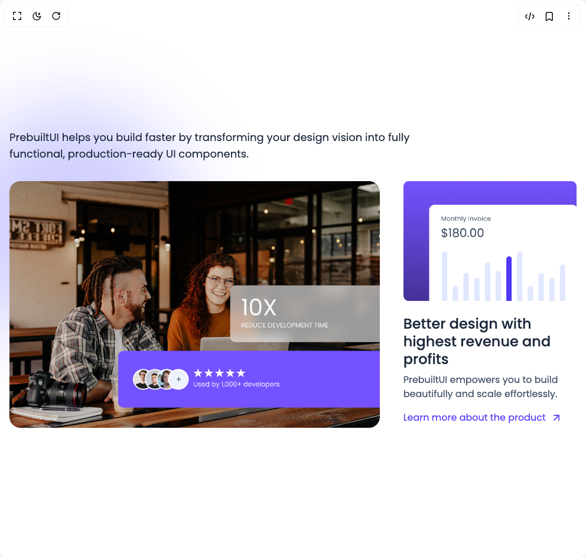

# Build Feature Sections in BuilderStudio

> Build this component in our Agentic IDE: [BuilderStudio](https://builderstudio.dev).
>
> Join the BuilderStudio community on [Discord](https://discord.gg/QdWeSGCqfe) and [Reddit](https://reddit.com/r/builderstudio).



## Component

- Author group: `prebuiltui`
- Component: `feature-sections`
- Variant: `features-section-with-team`
- Rendered HTML snapshot: [`rendered.html`](rendered.html)

## BuilderStudio prompt

You are implementing a React component based on a component reference.

## Component identity

- Author: prebuiltui
- Component slug: feature-sections
- Demo slug: features-section-with-team
- Title: feature-sections
- Description: 

## Goal

Recreate this component in a React + TypeScript + Tailwind CSS project. Preserve the visual layout, spacing, colors, border radius, shadows, interaction behavior, animation behavior, responsive behavior, and dark mode behavior shown in the rendered demo.

## Implementation requirements

- Use React and TypeScript.
- Use Tailwind CSS classes whenever possible.
- Keep the component self-contained unless the source files require helper components.
- If the source uses CSS variables, custom CSS, animations, or keyframes, include them.
- If the source uses external packages, list and use the required packages.
- Preserve accessibility attributes, button semantics, links, keyboard behavior, and ARIA attributes when visible in the source.
- Do not replace the component with a simplified placeholder.
- Return complete production-ready code.

## Dependencies

No reference metadata available.

## Rendered DOM snapshot

This is the rendered demo HTML extracted from the live preview. Use it to verify structure, class names, visible content, and layout.

```html
<div id="root"><div class="w-screen min-h-screen flex justify-center items-center"><div class="w-screen min-h-screen flex justify-center items-center"><style>
                @import url('https://fonts.googleapis.com/css2?family=Poppins:ital,wght@0,100;0,200;0,300;0,400;0,500;0,600;0,700;0,800;0,900;1,100;1,200;1,300;1,400;1,500;1,600;1,700;1,800;1,900&display=swap');
            
                * {
                    font-family: 'Poppins', sans-serif;
                }
            </style><div class="relative mx-auto max-w-5xl px-4"><div class="absolute -z-50 size-[400px] -top-10 -left-20 aspect-square rounded-full bg-indigo-500/30 blur-3xl"></div><p class="text-slate-800 text-lg text-left max-w-3xl">PrebuiltUI helps you build faster by transforming your design vision into fully functional, production-ready UI components.</p><div class="grid grid-cols-1 md:grid-cols-3 mt-8 gap-10"><div class="md:col-span-2"></div><div class="md:col-span-1"><h3 class="text-[24px]/7.5 text-slate-800 font-medium mt-6">Better design with highest revenue and profits </h3><p class="text-slate-600 mt-2">PrebuiltUI empowers you to build beautifully and scale effortlessly.</p><a href="https://prebuiltui.com" class="group flex items-center gap-2 mt-4 text-indigo-600 hover:text-indigo-700 transition">Learn more about the product<svg xmlns="http://www.w3.org/2000/svg" width="24" height="24" viewBox="0 0 24 24" fill="none" stroke="currentColor" stroke-width="2" stroke-linecap="round" stroke-linejoin="round" class="lucide lucide-arrow-up-right size-5 group-hover:translate-x-0.5 transition duration-300" aria-hidden="true"><path d="M7 7h10v10"></path><path d="M7 17 17 7"></path></svg></a></div></div></div></div></div></div>
```

## Reference source files

No reference source files were available.
