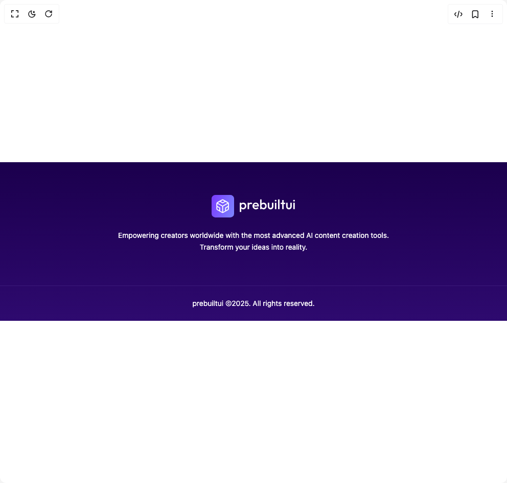

# Build Footer 1 in BuilderStudio

> Build this component in our Agentic IDE: [BuilderStudio](https://builderstudio.dev).
>
> Join the BuilderStudio community on [Discord](https://discord.gg/QdWeSGCqfe) and [Reddit](https://reddit.com/r/builderstudio).



## Component

- Author group: `prebuiltui`
- Component: `footer-1`
- Variant: `default`
- Rendered HTML snapshot: [`rendered.html`](rendered.html)

## BuilderStudio prompt

You are implementing a React component based on a component reference.

## Component identity

- Author: prebuiltui
- Component slug: footer-1
- Demo slug: default
- Title: footer-1
- Description: 

## Goal

Recreate this component in a React + TypeScript + Tailwind CSS project. Preserve the visual layout, spacing, colors, border radius, shadows, interaction behavior, animation behavior, responsive behavior, and dark mode behavior shown in the rendered demo.

## Implementation requirements

- Use React and TypeScript.
- Use Tailwind CSS classes whenever possible.
- Keep the component self-contained unless the source files require helper components.
- If the source uses CSS variables, custom CSS, animations, or keyframes, include them.
- If the source uses external packages, list and use the required packages.
- Preserve accessibility attributes, button semantics, links, keyboard behavior, and ARIA attributes when visible in the source.
- Do not replace the component with a simplified placeholder.
- Return complete production-ready code.

## Dependencies

No reference metadata available.

## Rendered DOM snapshot

This is the rendered demo HTML extracted from the live preview. Use it to verify structure, class names, visible content, and layout.

```html
<div id="root"><div class="w-screen min-h-screen flex justify-center items-center"><div class="w-screen min-h-screen flex justify-center items-center"><footer class="w-full bg-gradient-to-b from-[#1B004D] to-[#2E0A6F] text-white"><div class="max-w-7xl mx-auto px-6 py-16 flex flex-col items-center"><div class="flex items-center space-x-3 mb-6"></div><p class="text-center max-w-xl text-sm font-normal leading-relaxed">Empowering creators worldwide with the most advanced AI content creation tools. Transform your ideas into reality.</p></div><div class="border-t border-[#3B1A7A]"><div class="max-w-7xl mx-auto px-6 py-6 text-center text-sm font-normal"><a href="https://prebuiltui.com">prebuiltui</a> ©2025. All rights reserved.</div></div></footer></div></div></div>
```

## Reference source files

No reference source files were available.
