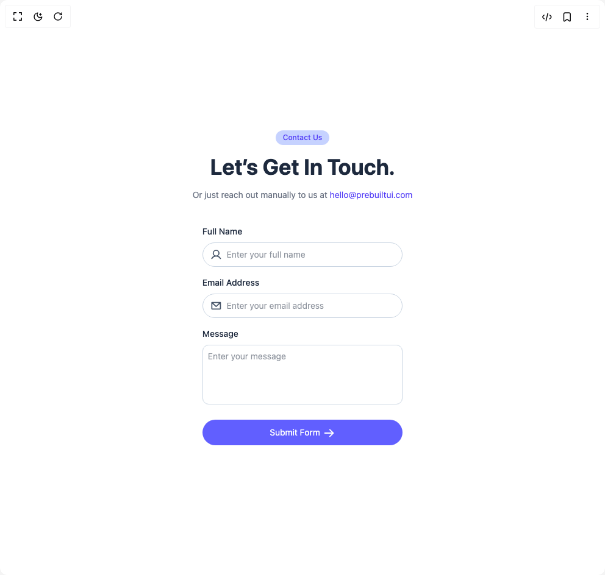

# Build Form 1 in BuilderStudio

> Build this component in our Agentic IDE: [BuilderStudio](https://builderstudio.dev).
>
> Join the BuilderStudio community on [Discord](https://discord.gg/QdWeSGCqfe) and [Reddit](https://reddit.com/r/builderstudio).



## Component

- Author group: `prebuiltui`
- Component: `form-1`
- Variant: `default`
- Rendered HTML snapshot: [`rendered.html`](rendered.html)

## BuilderStudio prompt

You are implementing a React component based on a component reference.

## Component identity

- Author: prebuiltui
- Component slug: form-1
- Demo slug: default
- Title: form-1
- Description: 

## Goal

Recreate this component in a React + TypeScript + Tailwind CSS project. Preserve the visual layout, spacing, colors, border radius, shadows, interaction behavior, animation behavior, responsive behavior, and dark mode behavior shown in the rendered demo.

## Implementation requirements

- Use React and TypeScript.
- Use Tailwind CSS classes whenever possible.
- Keep the component self-contained unless the source files require helper components.
- If the source uses CSS variables, custom CSS, animations, or keyframes, include them.
- If the source uses external packages, list and use the required packages.
- Preserve accessibility attributes, button semantics, links, keyboard behavior, and ARIA attributes when visible in the source.
- Do not replace the component with a simplified placeholder.
- Return complete production-ready code.

## Dependencies

No reference metadata available.

## Rendered DOM snapshot

This is the rendered demo HTML extracted from the live preview. Use it to verify structure, class names, visible content, and layout.

```html
<div id="root"><div class="w-screen min-h-screen flex justify-center items-center"><div class="w-screen min-h-screen flex justify-center items-center"><form class="flex flex-col items-center text-sm text-slate-800"><p class="text-xs bg-indigo-200 text-indigo-600 font-medium px-3 py-1 rounded-full">Contact Us</p><h1 class="text-4xl font-bold py-4 text-center">Let’s Get In Touch.</h1><p class="max-md:text-sm text-gray-500 pb-10 text-center">Or just reach out manually to us at <a href="#" class="text-indigo-600 hover:underline">hello@prebuiltui.com</a></p><div class="max-w-96 w-full px-4"><label for="name" class="font-medium">Full Name</label><div class="flex items-center mt-2 mb-4 h-10 pl-3 border border-slate-300 rounded-full focus-within:ring-2 focus-within:ring-indigo-400 transition-all overflow-hidden"><svg width="20" height="20" viewBox="0 0 20 20" fill="none" xmlns="http://www.w3.org/2000/svg"><path d="M18.311 16.406a9.64 9.64 0 0 0-4.748-4.158 5.938 5.938 0 1 0-7.125 0 9.64 9.64 0 0 0-4.749 4.158.937.937 0 1 0 1.623.938c1.416-2.447 3.916-3.906 6.688-3.906 2.773 0 5.273 1.46 6.689 3.906a.938.938 0 0 0 1.622-.938M5.938 7.5a4.063 4.063 0 1 1 8.125 0 4.063 4.063 0 0 1-8.125 0" fill="#475569"></path></svg><input class="h-full px-2 w-full outline-none bg-transparent" placeholder="Enter your full name" required="" type="text"></div><label for="email-address" class="font-medium mt-4">Email Address</label><div class="flex items-center mt-2 mb-4 h-10 pl-3 border border-slate-300 rounded-full focus-within:ring-2 focus-within:ring-indigo-400 transition-all overflow-hidden"><svg width="20" height="20" viewBox="0 0 20 20" fill="none" xmlns="http://www.w3.org/2000/svg"><path d="M17.5 3.438h-15a.937.937 0 0 0-.937.937V15a1.563 1.563 0 0 0 1.562 1.563h13.75A1.563 1.563 0 0 0 18.438 15V4.375a.94.94 0 0 0-.938-.937m-2.41 1.874L10 9.979 4.91 5.313zM3.438 14.688v-8.18l5.928 5.434a.937.937 0 0 0 1.268 0l5.929-5.435v8.182z" fill="#475569"></path></svg><input class="h-full px-2 w-full outline-none bg-transparent" placeholder="Enter your email address" required="" type="email"></div><label for="message" class="font-medium mt-4">Message</label><textarea rows="4" class="w-full mt-2 p-2 bg-transparent border border-slate-300 rounded-lg resize-none outline-none focus:ring-2 focus-within:ring-indigo-400 transition-all" placeholder="Enter your message" required=""></textarea><button type="submit" class="flex items-center justify-center gap-1 mt-5 bg-indigo-500 hover:bg-indigo-600 text-white py-2.5 w-full rounded-full transition">Submit Form<svg class="mt-0.5" width="21" height="20" viewBox="0 0 21 20" fill="none" xmlns="http://www.w3.org/2000/svg"><path d="m18.038 10.663-5.625 5.625a.94.94 0 0 1-1.328-1.328l4.024-4.023H3.625a.938.938 0 0 1 0-1.875h11.484l-4.022-4.025a.94.94 0 0 1 1.328-1.328l5.625 5.625a.935.935 0 0 1-.002 1.33" fill="#fff"></path></svg></button></div></form></div></div></div>
```

## Reference source files

No reference source files were available.
