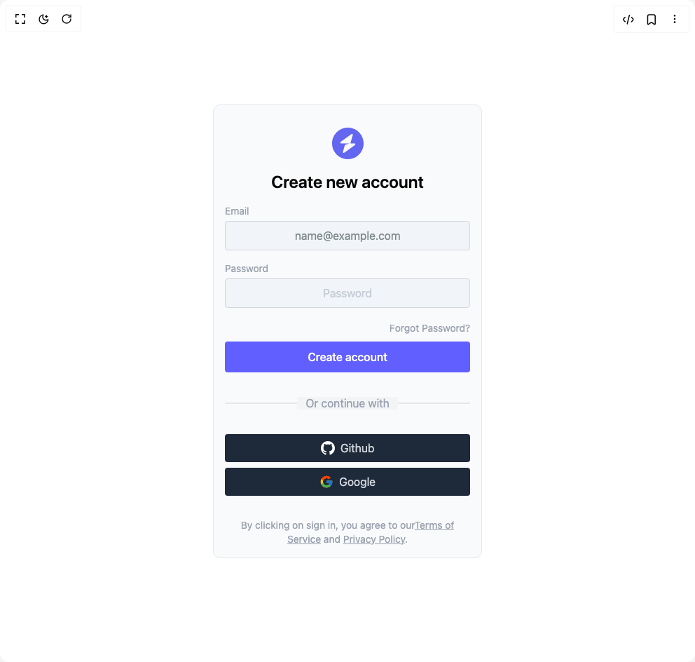

# Build Form 1 in BuilderStudio

> Build this component in our Agentic IDE: [BuilderStudio](https://builderstudio.dev).
>
> Join the BuilderStudio community on [Discord](https://discord.gg/QdWeSGCqfe) and [Reddit](https://reddit.com/r/builderstudio).



## Component

- Author group: `prebuiltui`
- Component: `form-1`
- Variant: `sign-up-form-with-social-login`
- Rendered HTML snapshot: [`rendered.html`](rendered.html)

## BuilderStudio prompt

You are implementing a React component based on a component reference.

## Component identity

- Author: prebuiltui
- Component slug: form-1
- Demo slug: sign-up-form-with-social-login
- Title: form-1
- Description: 

## Goal

Recreate this component in a React + TypeScript + Tailwind CSS project. Preserve the visual layout, spacing, colors, border radius, shadows, interaction behavior, animation behavior, responsive behavior, and dark mode behavior shown in the rendered demo.

## Implementation requirements

- Use React and TypeScript.
- Use Tailwind CSS classes whenever possible.
- Keep the component self-contained unless the source files require helper components.
- If the source uses CSS variables, custom CSS, animations, or keyframes, include them.
- If the source uses external packages, list and use the required packages.
- Preserve accessibility attributes, button semantics, links, keyboard behavior, and ARIA attributes when visible in the source.
- Do not replace the component with a simplified placeholder.
- Return complete production-ready code.

## Dependencies

No reference metadata available.

## Rendered DOM snapshot

This is the rendered demo HTML extracted from the live preview. Use it to verify structure, class names, visible content, and layout.

```html
<div id="root"><div class="w-screen min-h-screen flex justify-center items-center"><div class="w-screen min-h-screen flex justify-center items-center"><div class="w-full max-w-sm rounded-lg bg-gray-50 border border-gray-200 p-4 mx-2"><div class="py-4 flex justify-center"><a href="/"></a></div><h1 class="mb-4 text-center text-2xl font-semibold">Create new account</h1><form><div class="mb-4"><label for="email" class="mb-1 block text-sm text-gray-400">Email</label><input id="email" placeholder="name@example.com" autocomplete="email" class="py-2 w-full rounded border border-gray-300 bg-slate-100 px-2 text-center text-gray-400 placeholder-[#7f8c8d] focus:ring-2 focus:ring-indigo-500 focus:outline-none" type="email"></div><div class="mb-4"><label for="password" class="mb-1 block text-sm text-gray-400">Password</label><input id="password" placeholder="Password" autocomplete="new-password" class="py-2 w-full rounded border border-gray-300 bg-slate-100 px-2 text-center text-gray-400 focus:ring-2 focus:ring-indigo-500 focus:outline-none" type="password"></div><div class="mb-2 text-right"><a href="#" class="text-sm text-gray-400 hover:text-indigo-500">Forgot Password?</a></div><button class="py-2.5 font-medium w-full rounded bg-indigo-500 text-white transition-colors duration-300 hover:bg-indigo-600">Create account</button></form><div class="relative my-8 text-center"><span class="relative z-10 bg-gray-100 px-3 text-gray-400">Or continue with</span><div class="absolute top-1/2 left-0 h-px w-2/5 -translate-y-1/2 transform bg-gray-300"></div><div class="absolute top-1/2 right-0 h-px w-2/5 -translate-y-1/2 transform bg-gray-300"></div></div><button type="button" class="flex py-2 w-full items-center justify-center gap-2 rounded bg-gray-800 text-gray-300 hover:bg-gray-900"><svg xmlns="http://www.w3.org/2000/svg" viewBox="0 0 24 24" width="20" height="20"><path d="M12 0c-6.626 0-12 5.373-12 12 0 5.302 3.438 9.8 8.207 11.387.599.111.793-.261.793-.577v-2.234c-3.338.726-4.033-1.416-4.033-1.416-.546-1.387-1.333-1.756-1.333-1.756-1.089-.745.083-.729.083-.729 1.205.084 1.839 1.237 1.839 1.237 1.07 1.834 2.807 1.304 3.492.997.107-.775.418-1.305.762-1.604-2.665-.305-5.467-1.334-5.467-5.931 0-1.311.469-2.381 1.236-3.221-.124-.303-.535-1.524.117-3.176 0 0 1.008-.322 3.301 1.23.957-.266 1.983-.399 3.003-.404 1.02.005 2.047.138 3.006.404 2.291-1.552 3.297-1.23 3.297-1.23.653 1.653.242 2.874.118 3.176.77.84 1.235 1.911 1.235 3.221 0 4.609-2.807 5.624-5.479 5.921.43.372.823 1.102.823 2.222v3.293c0 .319.192.694.801.576 4.765-1.589 8.199-6.086 8.199-11.386 0-6.627-5.373-12-12-12z" fill="#fff"></path></svg>Github</button><button type="button" class="mt-2 flex py-2 w-full items-center justify-center gap-2 rounded bg-gray-800 text-gray-300 hover:bg-gray-900"><svg xmlns="http://www.w3.org/2000/svg" viewBox="0 0 48 48" width="20" height="20"><path fill="#FFC107" d="M43.611 20.083H42V20H24v8h11.303c-1.649 4.657-6.08 8-11.303 8-6.627 0-12-5.373-12-12s5.373-12 12-12c3.059 0 5.842 1.154 7.961 3.039l5.657-5.657C34.046 6.053 29.268 4 24 4 12.955 4 4 12.955 4 24s8.955 20 20 20 20-8.955 20-20c0-1.341-.138-2.65-.389-3.917"></path><path fill="#FF3D00" d="m6.306 14.691 6.571 4.819C14.655 15.108 18.961 12 24 12c3.059 0 5.842 1.154 7.961 3.039l5.657-5.657C34.046 6.053 29.268 4 24 4 16.318 4 9.656 8.337 6.306 14.691"></path><path fill="#4CAF50" d="M24 44c5.166 0 9.86-1.977 13.409-5.192l-6.19-5.238A11.9 11.9 0 0 1 24 36c-5.202 0-9.619-3.317-11.283-7.946l-6.522 5.025C9.505 39.556 16.227 44 24 44"></path><path fill="#1976D2" d="M43.611 20.083H42V20H24v8h11.303a12.04 12.04 0 0 1-4.087 5.571l.003-.002 6.19 5.238C36.971 39.205 44 34 44 24c0-1.341-.138-2.65-.389-3.917"></path></svg>Google</button><p class="mt-8 text-center text-sm text-gray-400">By clicking on sign in, you agree to our<a href="#" class="underline">Terms of Service</a> and <a href="#" class="underline">Privacy Policy</a>.</p></div></div></div></div>
```

## Reference source files

No reference source files were available.
