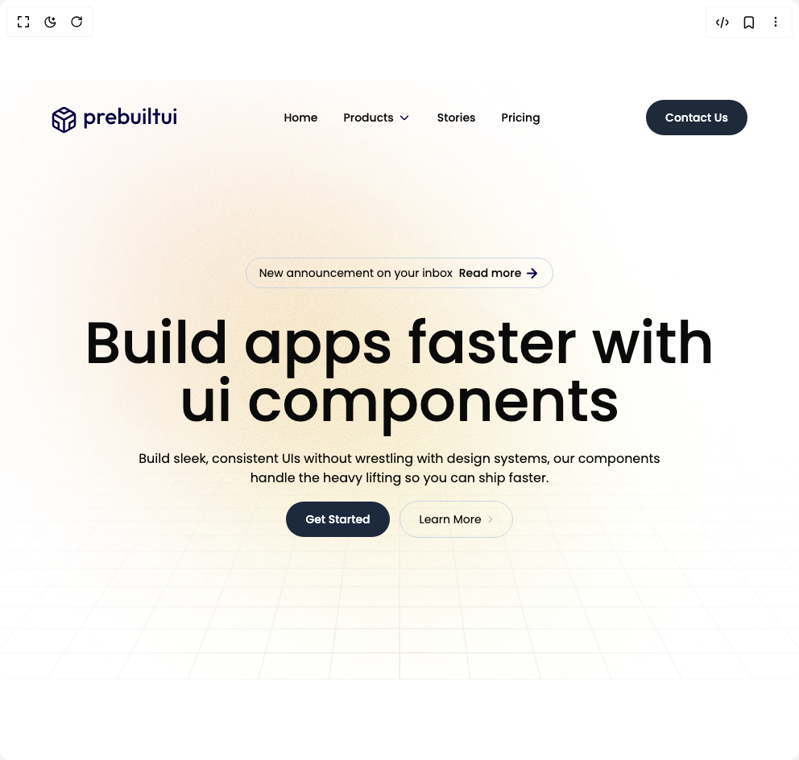

# Build Hero Section in BuilderStudio

> Build this component in our Agentic IDE: [BuilderStudio](https://builderstudio.dev).
>
> Join the BuilderStudio community on [Discord](https://discord.gg/QdWeSGCqfe) and [Reddit](https://reddit.com/r/builderstudio).



## Component

- Author group: `prebuiltui`
- Component: `hero-section`
- Variant: `default`
- Rendered HTML snapshot: [`rendered.html`](rendered.html)

## BuilderStudio prompt

You are implementing a React component based on a component reference.

## Component identity

- Author: prebuiltui
- Component slug: hero-section
- Demo slug: default
- Title: hero-section
- Description: 

## Goal

Recreate this component in a React + TypeScript + Tailwind CSS project. Preserve the visual layout, spacing, colors, border radius, shadows, interaction behavior, animation behavior, responsive behavior, and dark mode behavior shown in the rendered demo.

## Implementation requirements

- Use React and TypeScript.
- Use Tailwind CSS classes whenever possible.
- Keep the component self-contained unless the source files require helper components.
- If the source uses CSS variables, custom CSS, animations, or keyframes, include them.
- If the source uses external packages, list and use the required packages.
- Preserve accessibility attributes, button semantics, links, keyboard behavior, and ARIA attributes when visible in the source.
- Do not replace the component with a simplified placeholder.
- Return complete production-ready code.

## Dependencies

No reference metadata available.

## Rendered DOM snapshot

This is the rendered demo HTML extracted from the live preview. Use it to verify structure, class names, visible content, and layout.

```html
<div id="root"><div class="w-screen min-h-screen flex justify-center items-center"><div class="w-screen min-h-screen flex justify-center items-center"><style>
        @import url('https://fonts.googleapis.com/css2?family=Poppins:ital,wght@0,100;0,200;0,300;0,400;0,500;0,600;0,700;0,800;0,900;1,100;1,200;1,300;1,400;1,500;1,600;1,700;1,800;1,900&display=swap');
        * { font-family: 'Poppins', sans-serif; }
      </style><section class="bg-[url('https://raw.githubusercontent.com/prebuiltui/prebuiltui/main/assets/hero/gridBackground.png')] w-full bg-no-repeat bg-cover bg-center text-sm pb-44"><nav class="flex items-center justify-between p-4 md:px-16 lg:px-24 xl:px-32 md:py-6 w-full"><a href="https://prebuiltui.com" aria-label="PrebuiltUI home" class="flex items-center"><svg width="157" height="40" viewBox="0 0 157 40" fill="none" xmlns="http://www.w3.org/2000/svg" role="img" aria-hidden="true"><path d="M47.904 28.28q-1.54 0-2.744-.644a5.1 5.1 0 0 1-1.904-1.82q-.672-1.148-.672-2.604v-3.864q0-1.456.7-2.604a4.9 4.9 0 0 1 1.904-1.792q1.204-.672 2.716-.672 1.82 0 3.276.952a6.44 6.44 0 0 1 2.324 2.52q.868 1.567.868 3.556 0 1.96-.868 3.556a6.5 6.5 0 0 1-2.324 2.492q-1.456.924-3.276.924m-7.196 5.32V14.56h3.08v3.612l-.532 3.276.532 3.248V33.6zm6.692-8.232q1.12 0 1.96-.504a3.6 3.6 0 0 0 1.344-1.456q.504-.924.504-2.128t-.504-2.128a3.43 3.43 0 0 0-1.344-1.428q-.84-.532-1.96-.532t-1.988.532a3.43 3.43 0 0 0-1.344 1.428q-.476.924-.476 2.128t.476 2.128a3.6 3.6 0 0 0 1.344 1.456q.868.504 1.988.504M56.95 28V14.56h3.08V28zm3.08-7.476-1.064-.532q0-2.548 1.12-4.116 1.148-1.596 3.444-1.596 1.008 0 1.82.364.812.365 1.512 1.176l-2.016 2.072a2.1 2.1 0 0 0-.812-.56 3 3 0 0 0-1.036-.168q-1.287 0-2.128.812-.84.811-.84 2.548m14.156 7.756q-2.016 0-3.64-.896a7 7 0 0 1-2.548-2.52q-.924-1.596-.924-3.584t.924-3.556a6.87 6.87 0 0 1 2.492-2.52q1.596-.924 3.528-.924 1.876 0 3.304.868a6.05 6.05 0 0 1 2.268 2.38q.84 1.512.84 3.444 0 .336-.056.7a7 7 0 0 1-.112.756H69.23v-2.52h9.436l-1.148 1.008q-.056-1.232-.476-2.072a3 3 0 0 0-1.204-1.288q-.756-.448-1.876-.448-1.176 0-2.044.504a3.43 3.43 0 0 0-1.344 1.428q-.476.896-.476 2.156t.504 2.212 1.428 1.484q.924.504 2.128.504 1.037 0 1.904-.364a4 4 0 0 0 1.512-1.064l1.96 1.988a6.3 6.3 0 0 1-2.38 1.736 7.6 7.6 0 0 1-2.968.588m15.91 0q-1.54 0-2.745-.644a5.1 5.1 0 0 1-1.904-1.82q-.672-1.148-.672-2.604v-3.864q0-1.456.7-2.604a4.9 4.9 0 0 1 1.904-1.792q1.204-.672 2.716-.672 1.821 0 3.276.952a6.44 6.44 0 0 1 2.324 2.52q.869 1.567.868 3.556 0 1.96-.868 3.556a6.5 6.5 0 0 1-2.324 2.492q-1.455.924-3.276.924M82.898 28V7.84h3.08v10.024l-.532 3.248.532 3.276V28zm6.692-2.632q1.12 0 1.96-.504a3.6 3.6 0 0 0 1.344-1.456q.504-.924.504-2.128t-.504-2.128a3.43 3.43 0 0 0-1.344-1.428q-.84-.532-1.96-.532t-1.988.532a3.43 3.43 0 0 0-1.344 1.428q-.476.924-.476 2.128.001 1.204.476 2.128a3.6 3.6 0 0 0 1.344 1.456q.87.504 1.988.504m15.067 2.912q-1.708 0-3.052-.756a5.5 5.5 0 0 1-2.072-2.072q-.728-1.344-.728-3.08V14.56h3.08v7.672q0 .98.308 1.68.336.672.952 1.036.644.364 1.512.364 1.344 0 2.044-.784.728-.812.728-2.296V14.56h3.08v7.812q0 1.764-.756 3.108a5.3 5.3 0 0 1-2.044 2.072q-1.317.728-3.052.728m8.976-.28V14.56h3.08V28zm1.54-15.904q-.783 0-1.316-.532-.504-.532-.504-1.316t.504-1.316a1.8 1.8 0 0 1 1.316-.532q.813 0 1.316.532t.504 1.316q0 .784-.504 1.316t-1.316.532M120.169 28V7.84h3.08V28zm8.552 0V8.96h3.08V28zm-3.22-10.64v-2.8h9.52v2.8zm17.274 10.92q-1.708 0-3.052-.756a5.5 5.5 0 0 1-2.072-2.072q-.728-1.344-.728-3.08V14.56h3.08v7.672q0 .98.308 1.68.336.672.952 1.036.643.364 1.512.364 1.344 0 2.044-.784.728-.812.728-2.296V14.56h3.08v7.812q0 1.764-.756 3.108a5.3 5.3 0 0 1-2.044 2.072q-1.317.728-3.052.728m8.977-.28V14.56h3.08V28zm1.54-15.904q-.785 0-1.316-.532-.504-.532-.504-1.316t.504-1.316a1.8 1.8 0 0 1 1.316-.532q.812 0 1.316.532t.504 1.316-.504 1.316-1.316.532" fill="#050040"></path><path d="m8.75 11.3 6.75 3.884 6.75-3.885M8.75 34.58v-7.755L2 22.939m27 0-6.75 3.885v7.754M2.405 15.408 15.5 22.954l13.095-7.546M15.5 38V22.939M29 28.915V16.962a2.98 2.98 0 0 0-1.5-2.585L17 8.4a3.01 3.01 0 0 0-3 0L3.5 14.377A3 3 0 0 0 2 16.962v11.953A2.98 2.98 0 0 0 3.5 31.5L14 37.477a3.01 3.01 0 0 0 3 0L27.5 31.5a3 3 0 0 0 1.5-2.585" stroke="#050040" stroke-width="2.5" stroke-linecap="round" stroke-linejoin="round"></path></svg></a><div id="menu" class="max-md:absolute max-md:top-0 max-md:left-0 max-md:transition-all max-md:duration-300 max-md:overflow-hidden max-md:h-full max-md:bg-white/50 max-md:backdrop-blur flex items-center gap-8 font-medium max-md:flex-col max-md:justify-center max-md:w-0" aria-hidden="true"><a href="#" class="hover:text-gray-600">Home</a><div class="relative group flex items-center gap-1 cursor-pointer"><span>Products</span><svg width="18" height="18" viewBox="0 0 18 18" fill="none" xmlns="http://www.w3.org/2000/svg" aria-hidden="true"><path d="m4.5 7.2 3.793 3.793a1 1 0 0 0 1.414 0L13.5 7.2" stroke="#050040" stroke-width="1.5" stroke-linecap="round" stroke-linejoin="round"></path></svg><div class="absolute bg-white font-normal flex flex-col gap-2 w-max rounded-lg p-4 top-36 left-0 opacity-0 -translate-y-full group-hover:top-44 group-hover:opacity-100 transition-all duration-300 shadow-sm"><a href="#" class="hover:translate-x-1 hover:text-slate-500 transition-all">Templates</a><a href="#" class="hover:translate-x-1 hover:text-slate-500 transition-all">UI Components</a><a href="#" class="hover:translate-x-1 hover:text-slate-500 transition-all">Mobile Apps</a><a href="#" class="hover:translate-x-1 hover:text-slate-500 transition-all">Web Apps</a></div></div><a href="#" class="hover:text-gray-600">Stories</a><a href="#" class="hover:text-gray-600">Pricing</a><button class="md:hidden bg-gray-800 hover:bg-black text-white p-2 rounded-md aspect-square font-medium transition" aria-label="Close menu"><svg xmlns="http://www.w3.org/2000/svg" width="24" height="24" viewBox="0 0 24 24" fill="none" stroke="currentColor" stroke-width="2" stroke-linecap="round" stroke-linejoin="round" aria-hidden="true"><path d="M18 6 6 18"></path><path d="m6 6 12 12"></path></svg></button></div><button class="hidden md:block bg-gray-800 hover:bg-black text-white px-6 py-3 rounded-full font-medium transition">Contact Us</button><button id="open-menu" class="md:hidden bg-gray-800 hover:bg-black text-white p-2 rounded-md aspect-square font-medium transition" aria-label="Open menu"><svg xmlns="http://www.w3.org/2000/svg" width="24" height="24" viewBox="0 0 24 24" fill="none" stroke="currentColor" stroke-width="2" stroke-linecap="round" stroke-linejoin="round" aria-hidden="true"><path d="M4 12h16"></path><path d="M4 18h16"></path><path d="M4 6h16"></path></svg></button></nav><div class="flex items-center gap-2 border border-slate-300 hover:border-slate-400/70 rounded-full w-max mx-auto px-4 py-2 mt-40 md:mt-32"><span>New announcement on your inbox</span><button class="flex items-center gap-1 font-medium"><span>Read more</span><svg width="19" height="19" viewBox="0 0 19 19" fill="none" xmlns="http://www.w3.org/2000/svg" aria-hidden="true"><path d="M3.959 9.5h11.083m0 0L9.501 3.958M15.042 9.5l-5.541 5.54" stroke="#050040" stroke-width="2" stroke-linecap="round" stroke-linejoin="round"></path></svg></button></div><h5 class="text-4xl md:text-7xl font-medium max-w-[850px] text-center mx-auto mt-8">Build apps faster with ui components</h5><p class="text-sm md:text-base mx-auto max-w-2xl text-center mt-6 max-md:px-2">Build sleek, consistent UIs without wrestling with design systems, our components handle the heavy lifting so you can ship faster.</p><div class="mx-auto w-full flex items-center justify-center gap-3 mt-4"><button class="bg-slate-800 hover:bg-black text-white px-6 py-3 rounded-full font-medium transition">Get Started</button><button class="flex items-center gap-2 border border-slate-300 hover:bg-slate-200/30 rounded-full px-6 py-3"><span>Learn More</span><svg width="6" height="8" viewBox="0 0 6 8" fill="none" xmlns="http://www.w3.org/2000/svg" aria-hidden="true"><path d="M1.25.5 4.75 4l-3.5 3.5" stroke="#050040" stroke-opacity=".4" stroke-linecap="round" stroke-linejoin="round"></path></svg></button></div></section></div></div></div>
```

## Reference source files

No reference source files were available.
