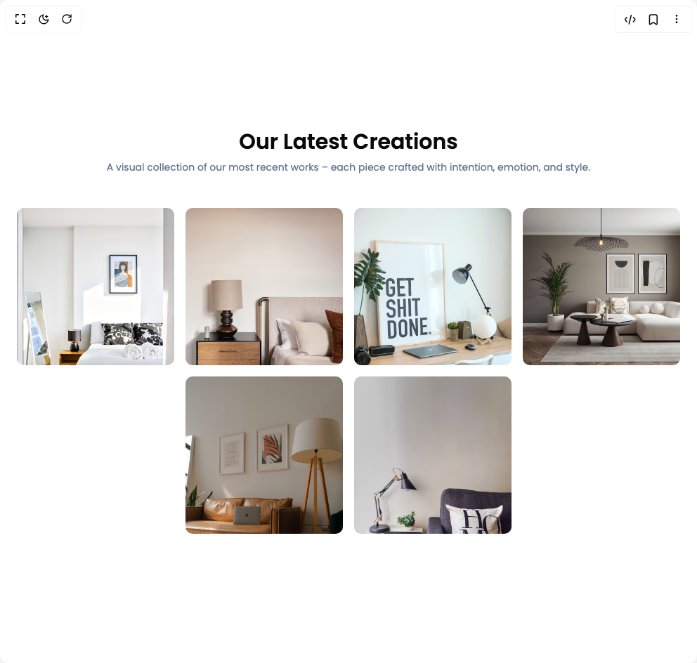

# Build Image Gallery in BuilderStudio

> Build this component in our Agentic IDE: [BuilderStudio](https://builderstudio.dev).
>
> Join the BuilderStudio community on [Discord](https://discord.gg/QdWeSGCqfe) and [Reddit](https://reddit.com/r/builderstudio).



## Component

- Author group: `prebuiltui`
- Component: `image-gallery`
- Variant: `image-grid-gallery`
- Rendered HTML snapshot: [`rendered.html`](rendered.html)

## BuilderStudio prompt

You are implementing a React component based on a component reference.

## Component identity

- Author: prebuiltui
- Component slug: image-gallery
- Demo slug: image-grid-gallery
- Title: image-gallery
- Description: 

## Goal

Recreate this component in a React + TypeScript + Tailwind CSS project. Preserve the visual layout, spacing, colors, border radius, shadows, interaction behavior, animation behavior, responsive behavior, and dark mode behavior shown in the rendered demo.

## Implementation requirements

- Use React and TypeScript.
- Use Tailwind CSS classes whenever possible.
- Keep the component self-contained unless the source files require helper components.
- If the source uses CSS variables, custom CSS, animations, or keyframes, include them.
- If the source uses external packages, list and use the required packages.
- Preserve accessibility attributes, button semantics, links, keyboard behavior, and ARIA attributes when visible in the source.
- Do not replace the component with a simplified placeholder.
- Return complete production-ready code.

## Dependencies

No reference metadata available.

## Rendered DOM snapshot

This is the rendered demo HTML extracted from the live preview. Use it to verify structure, class names, visible content, and layout.

```html
<div id="root"><div class="w-screen min-h-screen flex justify-center items-center"><div class="w-screen min-h-screen flex justify-center items-center"><style>
        @import url('https://fonts.googleapis.com/css2?family=Poppins:ital,wght@0,100;0,200;0,300;0,400;0,500;0,600;0,700;0,800;0,900&display=swap');
        * { font-family: 'Poppins', sans-serif; }
      </style><section class="w-full flex flex-col items-center py-12"><div class="max-w-3xl text-center px-4"><h1 class="text-3xl font-semibold">Our Latest Creations</h1><p class="text-sm text-slate-500 mt-2">A visual collection of our most recent works – each piece crafted with intention, emotion, and style.</p></div><div class="flex flex-wrap items-center justify-center mt-12 gap-4 max-w-5xl mx-auto"><div class="relative group rounded-lg overflow-hidden"><div class="absolute inset-0 flex flex-col justify-end p-4 text-white bg-black/50 opacity-0 group-hover:opacity-100 transition-all duration-300"><h1 class="text-xl font-medium">Image Title</h1><a href="#" class="flex items-center gap-1 text-sm text-white/70">Show More<svg width="16" height="16" viewBox="0 0 13 13" fill="none" xmlns="http://www.w3.org/2000/svg"><path d="M8.125 1.625H11.375V4.875" stroke="currentColor" stroke-linecap="round" stroke-linejoin="round"></path><path d="M5.41602 7.58333L11.3743 1.625" stroke="currentColor" stroke-linecap="round" stroke-linejoin="round"></path><path d="M9.75 7.04167V10.2917C9.75 10.579 9.63586 10.8545 9.4327 11.0577C9.22953 11.2609 8.95398 11.375 8.66667 11.375H2.70833C2.42102 11.375 2.14547 11.2609 1.9423 11.0577C1.73914 10.8545 1.625 10.579 1.625 10.2917V4.33333C1.625 4.04602 1.73914 3.77047 1.9423 3.5673C2.14547 3.36414 2.42102 3.25 2.70833 3.25H5.95833" stroke="currentColor" stroke-linecap="round" stroke-linejoin="round"></path></svg></a></div></div><div class="relative group rounded-lg overflow-hidden"><div class="absolute inset-0 flex flex-col justify-end p-4 text-white bg-black/50 opacity-0 group-hover:opacity-100 transition-all duration-300"><h1 class="text-xl font-medium">Image Title</h1><a href="#" class="flex items-center gap-1 text-sm text-white/70">Show More<svg width="16" height="16" viewBox="0 0 13 13" fill="none" xmlns="http://www.w3.org/2000/svg"><path d="M8.125 1.625H11.375V4.875" stroke="currentColor" stroke-linecap="round" stroke-linejoin="round"></path><path d="M5.41602 7.58333L11.3743 1.625" stroke="currentColor" stroke-linecap="round" stroke-linejoin="round"></path><path d="M9.75 7.04167V10.2917C9.75 10.579 9.63586 10.8545 9.4327 11.0577C9.22953 11.2609 8.95398 11.375 8.66667 11.375H2.70833C2.42102 11.375 2.14547 11.2609 1.9423 11.0577C1.73914 10.8545 1.625 10.579 1.625 10.2917V4.33333C1.625 4.04602 1.73914 3.77047 1.9423 3.5673C2.14547 3.36414 2.42102 3.25 2.70833 3.25H5.95833" stroke="currentColor" stroke-linecap="round" stroke-linejoin="round"></path></svg></a></div></div><div class="relative group rounded-lg overflow-hidden"><div class="absolute inset-0 flex flex-col justify-end p-4 text-white bg-black/50 opacity-0 group-hover:opacity-100 transition-all duration-300"><h1 class="text-xl font-medium">Image Title</h1><a href="#" class="flex items-center gap-1 text-sm text-white/70">Show More<svg width="16" height="16" viewBox="0 0 13 13" fill="none" xmlns="http://www.w3.org/2000/svg"><path d="M8.125 1.625H11.375V4.875" stroke="currentColor" stroke-linecap="round" stroke-linejoin="round"></path><path d="M5.41602 7.58333L11.3743 1.625" stroke="currentColor" stroke-linecap="round" stroke-linejoin="round"></path><path d="M9.75 7.04167V10.2917C9.75 10.579 9.63586 10.8545 9.4327 11.0577C9.22953 11.2609 8.95398 11.375 8.66667 11.375H2.70833C2.42102 11.375 2.14547 11.2609 1.9423 11.0577C1.73914 10.8545 1.625 10.579 1.625 10.2917V4.33333C1.625 4.04602 1.73914 3.77047 1.9423 3.5673C2.14547 3.36414 2.42102 3.25 2.70833 3.25H5.95833" stroke="currentColor" stroke-linecap="round" stroke-linejoin="round"></path></svg></a></div></div><div class="relative group rounded-lg overflow-hidden"><div class="absolute inset-0 flex flex-col justify-end p-4 text-white bg-black/50 opacity-0 group-hover:opacity-100 transition-all duration-300"><h1 class="text-xl font-medium">Image Title</h1><a href="#" class="flex items-center gap-1 text-sm text-white/70">Show More<svg width="16" height="16" viewBox="0 0 13 13" fill="none" xmlns="http://www.w3.org/2000/svg"><path d="M8.125 1.625H11.375V4.875" stroke="currentColor" stroke-linecap="round" stroke-linejoin="round"></path><path d="M5.41602 7.58333L11.3743 1.625" stroke="currentColor" stroke-linecap="round" stroke-linejoin="round"></path><path d="M9.75 7.04167V10.2917C9.75 10.579 9.63586 10.8545 9.4327 11.0577C9.22953 11.2609 8.95398 11.375 8.66667 11.375H2.70833C2.42102 11.375 2.14547 11.2609 1.9423 11.0577C1.73914 10.8545 1.625 10.579 1.625 10.2917V4.33333C1.625 4.04602 1.73914 3.77047 1.9423 3.5673C2.14547 3.36414 2.42102 3.25 2.70833 3.25H5.95833" stroke="currentColor" stroke-linecap="round" stroke-linejoin="round"></path></svg></a></div></div><div class="relative group rounded-lg overflow-hidden"><div class="absolute inset-0 flex flex-col justify-end p-4 text-white bg-black/50 opacity-0 group-hover:opacity-100 transition-all duration-300"><h1 class="text-xl font-medium">Image Title</h1><a href="#" class="flex items-center gap-1 text-sm text-white/70">Show More<svg width="16" height="16" viewBox="0 0 13 13" fill="none" xmlns="http://www.w3.org/2000/svg"><path d="M8.125 1.625H11.375V4.875" stroke="currentColor" stroke-linecap="round" stroke-linejoin="round"></path><path d="M5.41602 7.58333L11.3743 1.625" stroke="currentColor" stroke-linecap="round" stroke-linejoin="round"></path><path d="M9.75 7.04167V10.2917C9.75 10.579 9.63586 10.8545 9.4327 11.0577C9.22953 11.2609 8.95398 11.375 8.66667 11.375H2.70833C2.42102 11.375 2.14547 11.2609 1.9423 11.0577C1.73914 10.8545 1.625 10.579 1.625 10.2917V4.33333C1.625 4.04602 1.73914 3.77047 1.9423 3.5673C2.14547 3.36414 2.42102 3.25 2.70833 3.25H5.95833" stroke="currentColor" stroke-linecap="round" stroke-linejoin="round"></path></svg></a></div></div><div class="relative group rounded-lg overflow-hidden"><div class="absolute inset-0 flex flex-col justify-end p-4 text-white bg-black/50 opacity-0 group-hover:opacity-100 transition-all duration-300"><h1 class="text-xl font-medium">Image Title</h1><a href="#" class="flex items-center gap-1 text-sm text-white/70">Show More<svg width="16" height="16" viewBox="0 0 13 13" fill="none" xmlns="http://www.w3.org/2000/svg"><path d="M8.125 1.625H11.375V4.875" stroke="currentColor" stroke-linecap="round" stroke-linejoin="round"></path><path d="M5.41602 7.58333L11.3743 1.625" stroke="currentColor" stroke-linecap="round" stroke-linejoin="round"></path><path d="M9.75 7.04167V10.2917C9.75 10.579 9.63586 10.8545 9.4327 11.0577C9.22953 11.2609 8.95398 11.375 8.66667 11.375H2.70833C2.42102 11.375 2.14547 11.2609 1.9423 11.0577C1.73914 10.8545 1.625 10.579 1.625 10.2917V4.33333C1.625 4.04602 1.73914 3.77047 1.9423 3.5673C2.14547 3.36414 2.42102 3.25 2.70833 3.25H5.95833" stroke="currentColor" stroke-linecap="round" stroke-linejoin="round"></path></svg></a></div></div></div></section></div></div></div>
```

## Reference source files

No reference source files were available.
