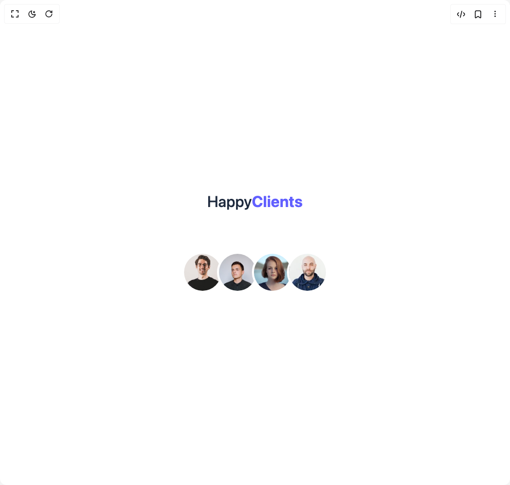

# Build Testimonial in BuilderStudio

> Build this component in our Agentic IDE: [BuilderStudio](https://builderstudio.dev).
>
> Join the BuilderStudio community on [Discord](https://discord.gg/QdWeSGCqfe) and [Reddit](https://reddit.com/r/builderstudio).



## Component

- Author group: `prebuiltui`
- Component: `testimonial`
- Variant: `happy-clients-section`
- Rendered HTML snapshot: [`rendered.html`](rendered.html)

## BuilderStudio prompt

You are implementing a React component based on a component reference.

## Component identity

- Author: prebuiltui
- Component slug: testimonial
- Demo slug: happy-clients-section
- Title: testimonial
- Description: 

## Goal

Recreate this component in a React + TypeScript + Tailwind CSS project. Preserve the visual layout, spacing, colors, border radius, shadows, interaction behavior, animation behavior, responsive behavior, and dark mode behavior shown in the rendered demo.

## Implementation requirements

- Use React and TypeScript.
- Use Tailwind CSS classes whenever possible.
- Keep the component self-contained unless the source files require helper components.
- If the source uses CSS variables, custom CSS, animations, or keyframes, include them.
- If the source uses external packages, list and use the required packages.
- Preserve accessibility attributes, button semantics, links, keyboard behavior, and ARIA attributes when visible in the source.
- Do not replace the component with a simplified placeholder.
- Return complete production-ready code.

## Dependencies

No reference metadata available.

## Rendered DOM snapshot

This is the rendered demo HTML extracted from the live preview. Use it to verify structure, class names, visible content, and layout.

```html
<div id="root"><div class="w-screen min-h-screen flex justify-center items-center"><div class="w-screen min-h-screen flex justify-center items-center"><div class="flex flex-col items-center text-slate-800"><h2 class="text-3xl font-medium mb-10">Happy<span class="text-indigo-500 font-bold">Clients</span></h2><div class="flex items-center -space-x-3"><div class="relative group flex flex-col items-center"><p class="opacity-0 scale-90 group-hover:scale-100 group-hover:opacity-100 transition duration-300 mb-3 px-2 py-1 text-sm font-medium">Michael</p></div><div class="relative group flex flex-col items-center"><p class="opacity-0 scale-90 group-hover:scale-100 group-hover:opacity-100 transition duration-300 mb-3 px-2 py-1 text-sm font-medium">James</p></div><div class="relative group flex flex-col items-center"><p class="opacity-0 scale-90 group-hover:scale-100 group-hover:opacity-100 transition duration-300 mb-3 px-2 py-1 text-sm font-medium">Emily</p></div><div class="relative group flex flex-col items-center"><p class="opacity-0 scale-90 group-hover:scale-100 group-hover:opacity-100 transition duration-300 mb-3 px-2 py-1 text-sm font-medium">John</p></div></div></div></div></div></div>
```

## Reference source files

No reference source files were available.
