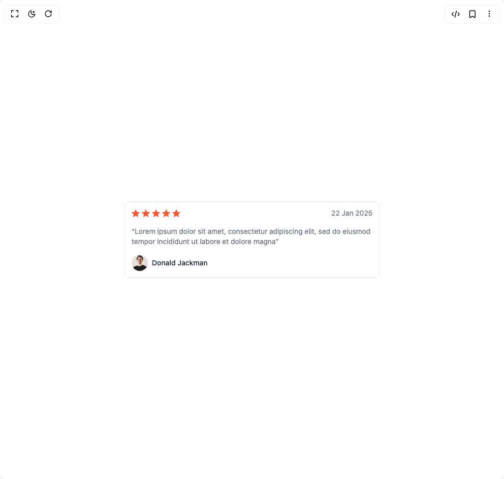

# Build Testimonial in BuilderStudio

> Build this component in our Agentic IDE: [BuilderStudio](https://builderstudio.dev).
>
> Join the BuilderStudio community on [Discord](https://discord.gg/QdWeSGCqfe) and [Reddit](https://reddit.com/r/builderstudio).



## Component

- Author group: `prebuiltui`
- Component: `testimonial`
- Variant: `review-rating-card`
- Rendered HTML snapshot: [`rendered.html`](rendered.html)

## BuilderStudio prompt

You are implementing a React component based on a component reference.

## Component identity

- Author: prebuiltui
- Component slug: testimonial
- Demo slug: review-rating-card
- Title: testimonial
- Description: 

## Goal

Recreate this component in a React + TypeScript + Tailwind CSS project. Preserve the visual layout, spacing, colors, border radius, shadows, interaction behavior, animation behavior, responsive behavior, and dark mode behavior shown in the rendered demo.

## Implementation requirements

- Use React and TypeScript.
- Use Tailwind CSS classes whenever possible.
- Keep the component self-contained unless the source files require helper components.
- If the source uses CSS variables, custom CSS, animations, or keyframes, include them.
- If the source uses external packages, list and use the required packages.
- Preserve accessibility attributes, button semantics, links, keyboard behavior, and ARIA attributes when visible in the source.
- Do not replace the component with a simplified placeholder.
- Return complete production-ready code.

## Dependencies

No reference metadata available.

## Rendered DOM snapshot

This is the rendered demo HTML extracted from the live preview. Use it to verify structure, class names, visible content, and layout.

```html
<div id="root"><div class="w-screen min-h-screen flex justify-center items-center"><div class="w-screen min-h-screen flex justify-center items-center"><div class="bg-white w-full max-w-[500px] space-y-4 p-3 rounded-md border border-gray-300/60 text-gray-500 text-sm"><div class="flex justify-between items-center"><div class="flex gap-1"><svg width="16" height="15" viewBox="0 0 16 15" fill="none" xmlns="http://www.w3.org/2000/svg"><path d="M7.049.927c.3-.921 1.603-.921 1.902 0l1.07 3.292a1 1 0 0 0 .95.69h3.462c.969 0 1.371 1.24.588 1.81l-2.8 2.034a1 1 0 0 0-.364 1.118l1.07 3.292c.3.921-.755 1.688-1.539 1.118l-2.8-2.034a1 1 0 0 0-1.176 0l-2.8 2.034c-.784.57-1.838-.197-1.539-1.118l1.07-3.292a1 1 0 0 0-.363-1.118L.98 6.72c-.784-.57-.382-1.81.587-1.81h3.461a1 1 0 0 0 .951-.69z" fill="#FF532E"></path></svg><svg width="16" height="15" viewBox="0 0 16 15" fill="none" xmlns="http://www.w3.org/2000/svg"><path d="M7.049.927c.3-.921 1.603-.921 1.902 0l1.07 3.292a1 1 0 0 0 .95.69h3.462c.969 0 1.371 1.24.588 1.81l-2.8 2.034a1 1 0 0 0-.364 1.118l1.07 3.292c.3.921-.755 1.688-1.539 1.118l-2.8-2.034a1 1 0 0 0-1.176 0l-2.8 2.034c-.784.57-1.838-.197-1.539-1.118l1.07-3.292a1 1 0 0 0-.363-1.118L.98 6.72c-.784-.57-.382-1.81.587-1.81h3.461a1 1 0 0 0 .951-.69z" fill="#FF532E"></path></svg><svg width="16" height="15" viewBox="0 0 16 15" fill="none" xmlns="http://www.w3.org/2000/svg"><path d="M7.049.927c.3-.921 1.603-.921 1.902 0l1.07 3.292a1 1 0 0 0 .95.69h3.462c.969 0 1.371 1.24.588 1.81l-2.8 2.034a1 1 0 0 0-.364 1.118l1.07 3.292c.3.921-.755 1.688-1.539 1.118l-2.8-2.034a1 1 0 0 0-1.176 0l-2.8 2.034c-.784.57-1.838-.197-1.539-1.118l1.07-3.292a1 1 0 0 0-.363-1.118L.98 6.72c-.784-.57-.382-1.81.587-1.81h3.461a1 1 0 0 0 .951-.69z" fill="#FF532E"></path></svg><svg width="16" height="15" viewBox="0 0 16 15" fill="none" xmlns="http://www.w3.org/2000/svg"><path d="M7.049.927c.3-.921 1.603-.921 1.902 0l1.07 3.292a1 1 0 0 0 .95.69h3.462c.969 0 1.371 1.24.588 1.81l-2.8 2.034a1 1 0 0 0-.364 1.118l1.07 3.292c.3.921-.755 1.688-1.539 1.118l-2.8-2.034a1 1 0 0 0-1.176 0l-2.8 2.034c-.784.57-1.838-.197-1.539-1.118l1.07-3.292a1 1 0 0 0-.363-1.118L.98 6.72c-.784-.57-.382-1.81.587-1.81h3.461a1 1 0 0 0 .951-.69z" fill="#FF532E"></path></svg><svg width="16" height="15" viewBox="0 0 16 15" fill="none" xmlns="http://www.w3.org/2000/svg"><path d="M7.049.927c.3-.921 1.603-.921 1.902 0l1.07 3.292a1 1 0 0 0 .95.69h3.462c.969 0 1.371 1.24.588 1.81l-2.8 2.034a1 1 0 0 0-.364 1.118l1.07 3.292c.3.921-.755 1.688-1.539 1.118l-2.8-2.034a1 1 0 0 0-1.176 0l-2.8 2.034c-.784.57-1.838-.197-1.539-1.118l1.07-3.292a1 1 0 0 0-.363-1.118L.98 6.72c-.784-.57-.382-1.81.587-1.81h3.461a1 1 0 0 0 .951-.69z" fill="#FF532E"></path></svg></div><p>22 Jan 2025</p></div><p>“Lorem ipsum dolor sit amet, consectetur adipiscing elit, sed do eiusmod tempor incididunt ut labore et dolore magna”</p><div class="flex items-center gap-2"><p class="text-gray-800 font-medium">Donald Jackman</p></div></div></div></div></div>
```

## Reference source files

No reference source files were available.
