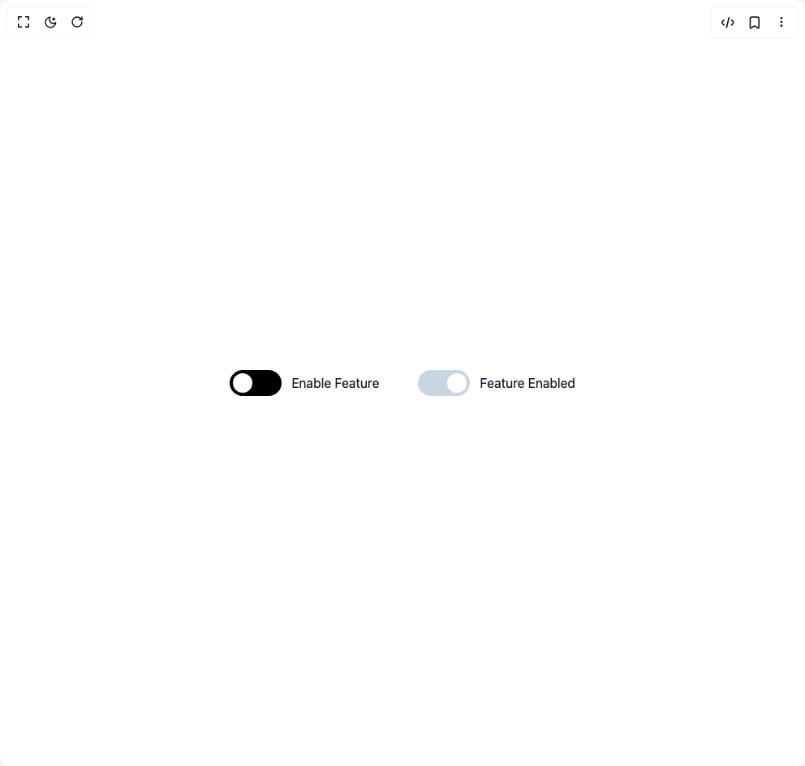

# Build Toggle Switch in BuilderStudio

> Build this component in our Agentic IDE: [BuilderStudio](https://builderstudio.dev).
>
> Join the BuilderStudio community on [Discord](https://discord.gg/QdWeSGCqfe) and [Reddit](https://reddit.com/r/builderstudio).



## Component

- Author group: `prebuiltui`
- Component: `toggle-switch`
- Variant: `toggle-switch-dark-theme`
- Rendered HTML snapshot: [`rendered.html`](rendered.html)

## BuilderStudio prompt

You are implementing a React component based on a component reference.

## Component identity

- Author: prebuiltui
- Component slug: toggle-switch
- Demo slug: toggle-switch-dark-theme
- Title: toggle-switch
- Description: 

## Goal

Recreate this component in a React + TypeScript + Tailwind CSS project. Preserve the visual layout, spacing, colors, border radius, shadows, interaction behavior, animation behavior, responsive behavior, and dark mode behavior shown in the rendered demo.

## Implementation requirements

- Use React and TypeScript.
- Use Tailwind CSS classes whenever possible.
- Keep the component self-contained unless the source files require helper components.
- If the source uses CSS variables, custom CSS, animations, or keyframes, include them.
- If the source uses external packages, list and use the required packages.
- Preserve accessibility attributes, button semantics, links, keyboard behavior, and ARIA attributes when visible in the source.
- Do not replace the component with a simplified placeholder.
- Return complete production-ready code.

## Dependencies

No reference metadata available.

## Rendered DOM snapshot

This is the rendered demo HTML extracted from the live preview. Use it to verify structure, class names, visible content, and layout.

```html
<div id="root"><div class="w-screen min-h-screen flex justify-center items-center"><div class="w-screen min-h-screen flex justify-center items-center"><div class="flex flex-wrap items-center justify-center gap-12"><label class="relative inline-flex items-center cursor-pointer text-gray-900 gap-3"><input class="sr-only peer" type="checkbox"><div class="w-16 h-8 bg-black rounded-full peer peer-checked:bg-slate-300 transition-colors duration-200"></div><span class="dot absolute left-1 top-1 w-6 h-6 bg-white rounded-full transition-transform duration-200 ease-in-out peer-checked:translate-x-8"></span>Enable Feature</label><label class="relative inline-flex items-center cursor-pointer text-gray-900 gap-3"><input class="sr-only peer" type="checkbox" checked=""><div class="w-16 h-8 bg-black rounded-full peer peer-checked:bg-slate-300 transition-colors duration-200"></div><span class="dot absolute left-1 top-1 w-6 h-6 bg-white rounded-full transition-transform duration-200 ease-in-out peer-checked:translate-x-8"></span>Feature Enabled</label></div></div></div></div>
```

## Reference source files

No reference source files were available.
