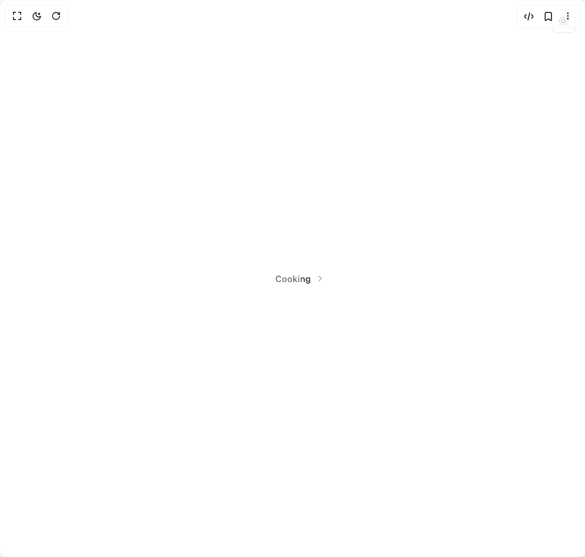
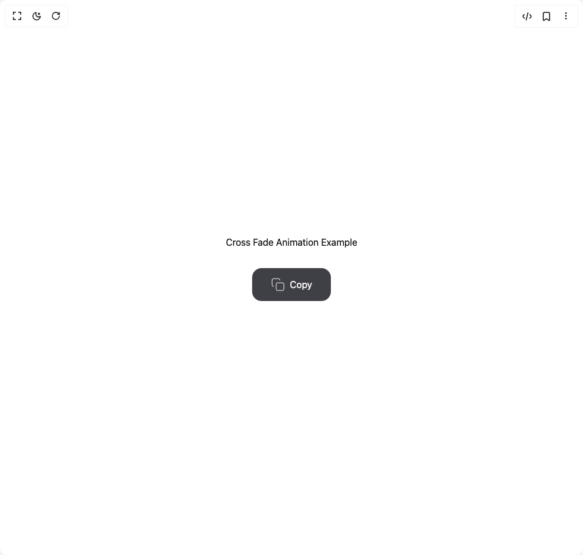
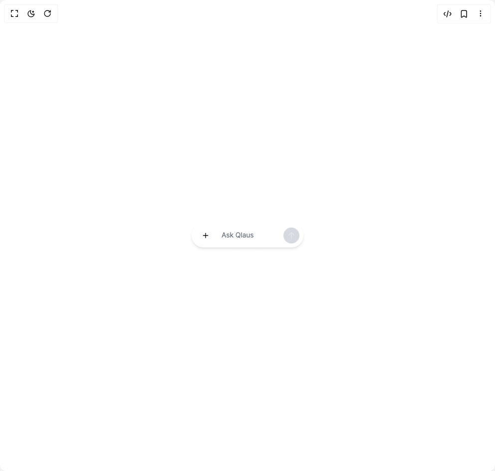

# Qredence Components

4 components are available in this author group.

> Build any component in [BuilderStudio](https://builderstudio.dev), then share improvements with the community on [Discord](https://discord.gg/QdWeSGCqfe) or [Reddit](https://reddit.com/r/builderstudio).

| Preview | Component | Variant |
| --- | --- | --- |
|  | [Animated Loading Svg Text Shimmer](animated-loading-svg-text-shimmer/default/README.md) | `default` |
|  | [Copy Button Variants](copy-button-variants/default/README.md) | `default` |
|  | [Copy Button Variants](copy-button-variants/icon-only/README.md) | `icon-only` |
|  | [Prompt Input Dynamic Grow](prompt-input-dynamic-grow/default/README.md) | `default` |
