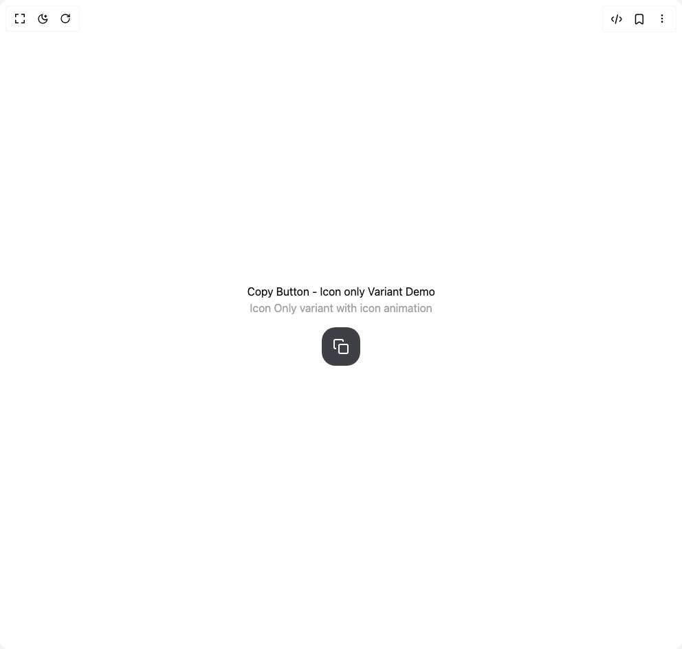

# Build Copy Button Variants in BuilderStudio

> Build this component in our Agentic IDE: [BuilderStudio](https://builderstudio.dev).
>
> Join the BuilderStudio community on [Discord](https://discord.gg/QdWeSGCqfe) and [Reddit](https://reddit.com/r/builderstudio).



## Component

- Author group: `qredence`
- Component: `copy-button-variants`
- Variant: `icon-only`
- Rendered HTML snapshot: [`rendered.html`](rendered.html)

## BuilderStudio prompt

You are implementing a React component based on a component reference.

## Component identity

- Author: qredence
- Component slug: copy-button-variants
- Demo slug: icon-only
- Title: copy-button-variants
- Description: 

## Goal

Recreate this component in a React + TypeScript + Tailwind CSS project. Preserve the visual layout, spacing, colors, border radius, shadows, interaction behavior, animation behavior, responsive behavior, and dark mode behavior shown in the rendered demo.

## Implementation requirements

- Use React and TypeScript.
- Use Tailwind CSS classes whenever possible.
- Keep the component self-contained unless the source files require helper components.
- If the source uses CSS variables, custom CSS, animations, or keyframes, include them.
- If the source uses external packages, list and use the required packages.
- Preserve accessibility attributes, button semantics, links, keyboard behavior, and ARIA attributes when visible in the source.
- Do not replace the component with a simplified placeholder.
- Return complete production-ready code.

## Dependencies

No reference metadata available.

## Rendered DOM snapshot

This is the rendered demo HTML extracted from the live preview. Use it to verify structure, class names, visible content, and layout.

```html
<div id="root"><div class="w-screen min-h-screen flex justify-center items-center"><div class="w-screen min-h-screen flex justify-center items-center"><div style="padding: 2rem; text-align: center;"><h1>Copy Button - Icon only Variant Demo</h1><p style="color: rgb(161, 161, 170); margin-bottom: 1rem;">Icon Only variant with icon animation</p><button style="padding: 1rem; font-size: 1rem; background: rgb(63, 63, 70); color: white; border-width: medium; border-style: none; border-color: currentcolor; border-image: initial; border-radius: 20px; cursor: pointer; display: inline-flex; align-items: center; gap: 0.75rem;"><div class="w-[var(--button-icon-size)] h-[var(--button-icon-size)]" style="position: relative;"><div style="top: 0px; left: 0px; width: 24px; height: 24px; opacity: 1; transform: scale(1); transition: opacity 150ms, transform 150ms;"><svg width="24" height="24" viewBox="0 0 24 24" fill="none" stroke="currentColor" stroke-width="2"><rect x="9" y="9" width="13" height="13" rx="2" ry="2"></rect><path d="M5 15H4a2 2 0 0 1-2-2V4a2 2 0 0 1 2-2h9a2 2 0 0 1 2 2v1"></path></svg></div><div style="position: absolute; top: 0px; left: 0px; width: 16px; height: 16px; opacity: 0; transform: scale(0.6); transition: opacity 400ms 150ms, transform 400ms 150ms;"><svg width="24" height="24" viewBox="0 0 24 24" fill="none" stroke="currentColor" stroke-width="2"><polyline points="20 6 9 17 4 12"></polyline></svg></div></div></button></div></div></div></div>
```

## Reference source files

No reference source files were available.
