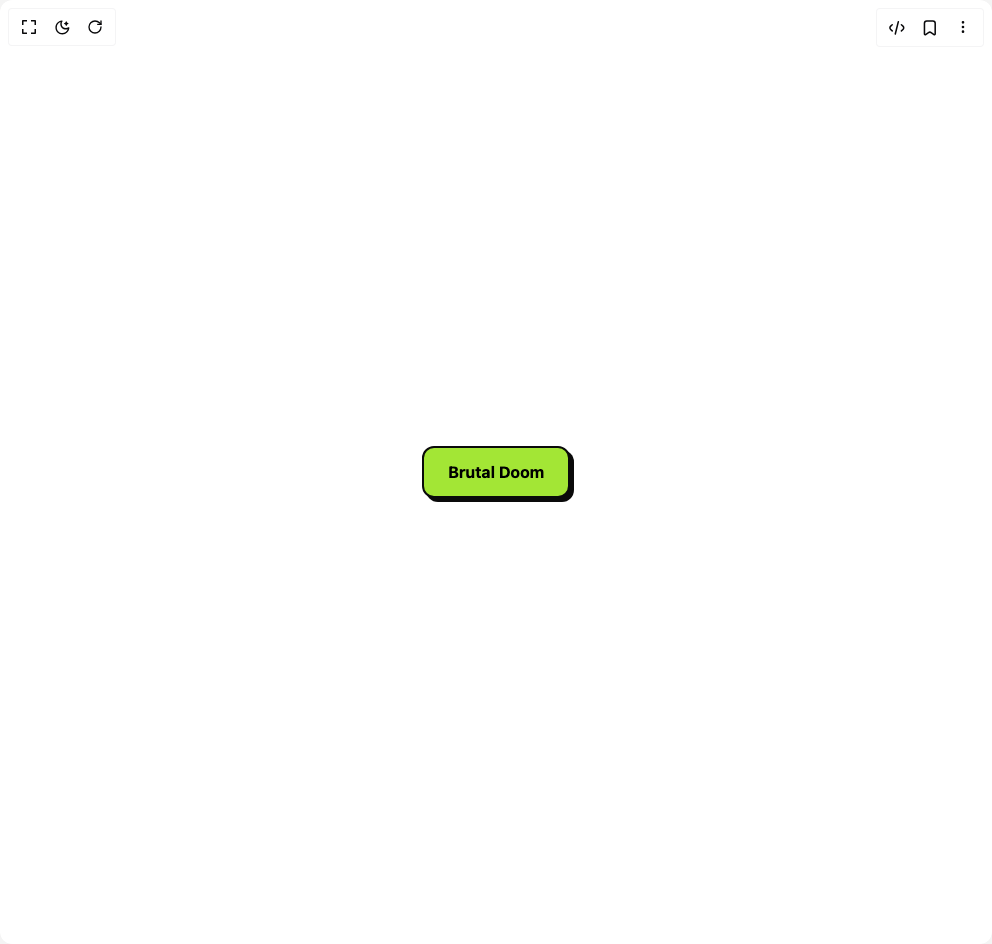
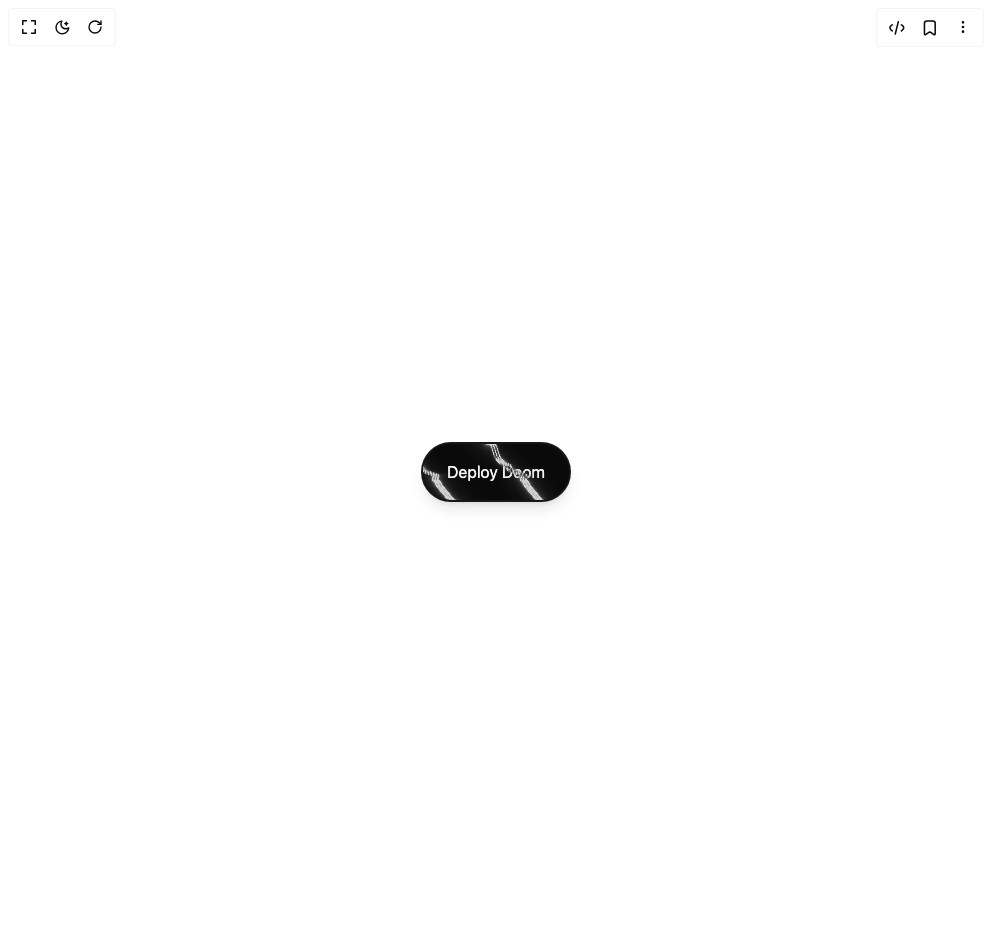
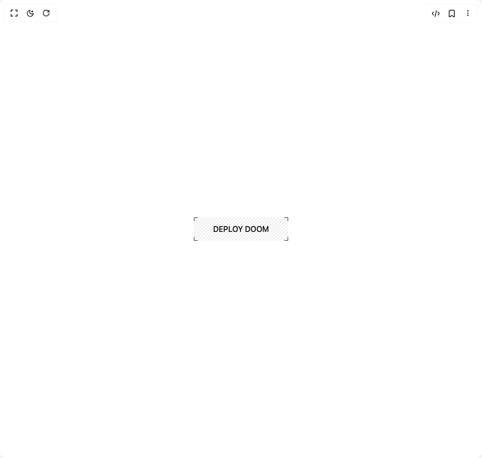
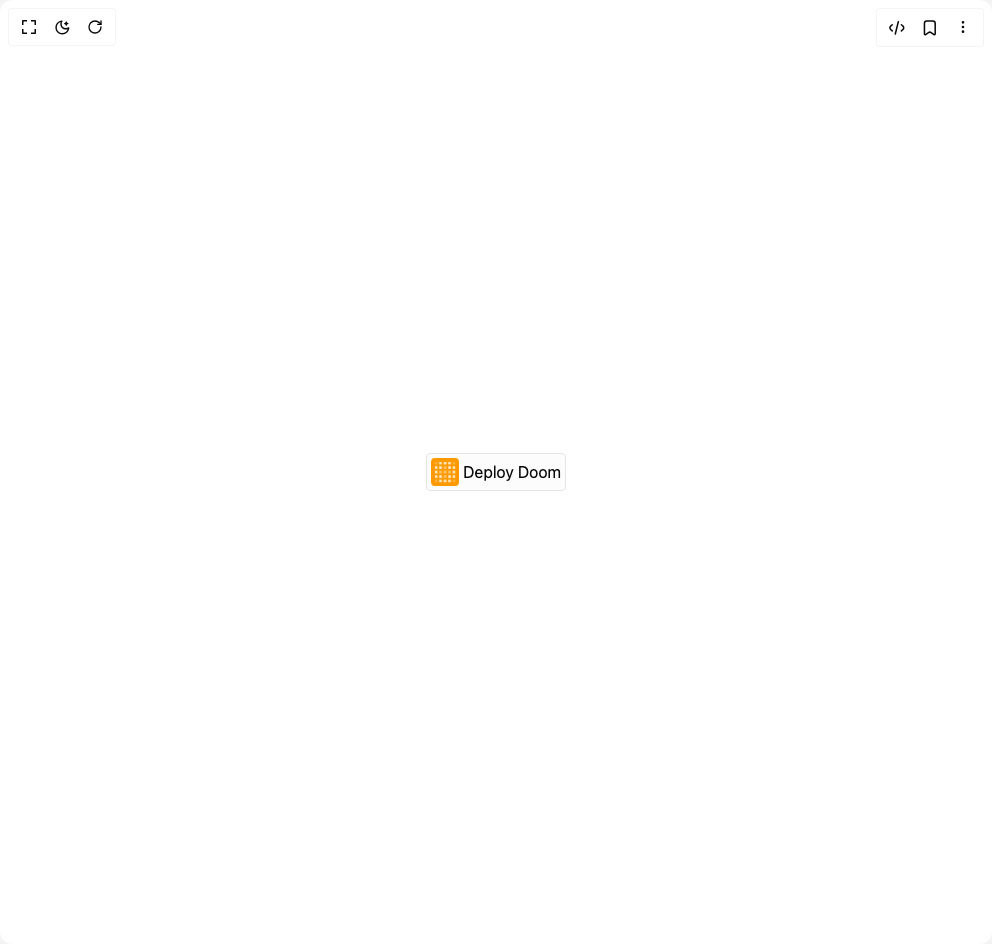
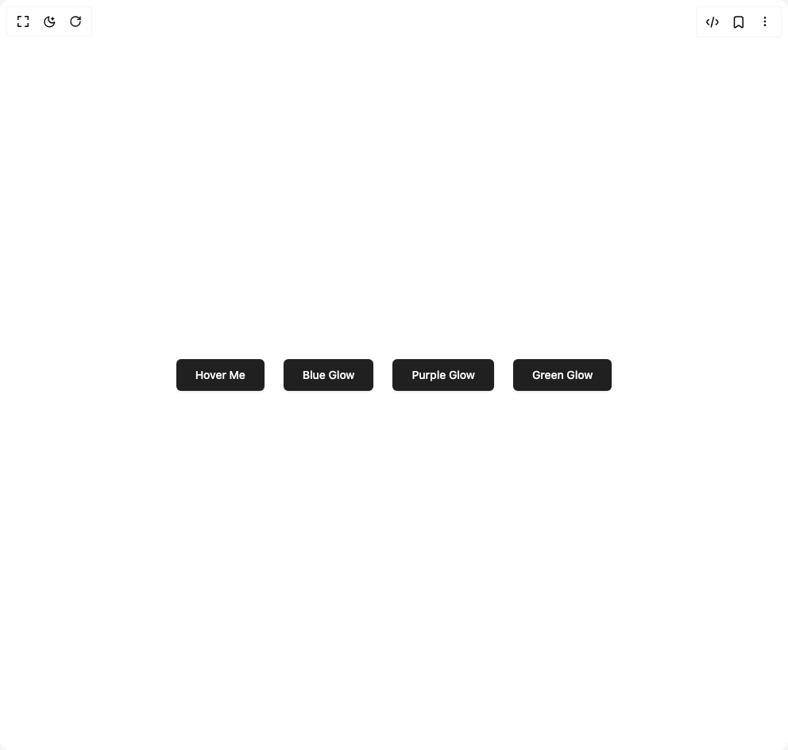
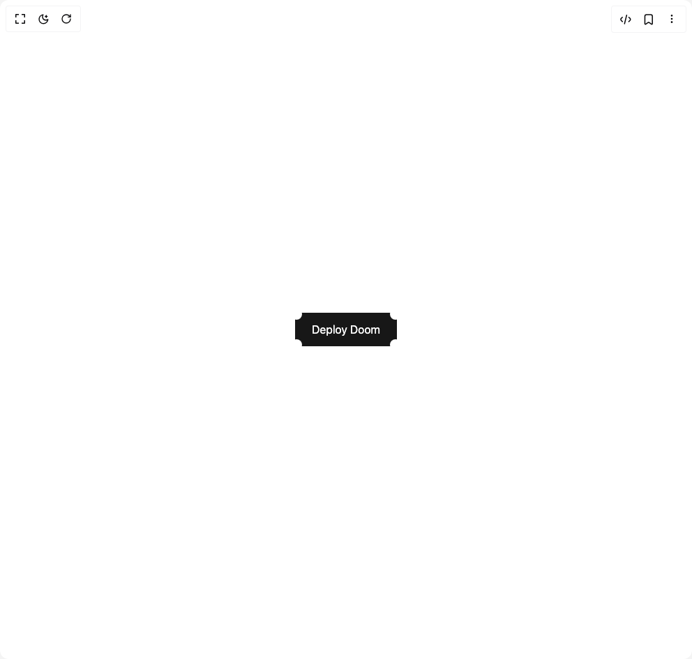

# Radiumcoders Components

15 components are available in this author group.

> Build any component in [BuilderStudio](https://builderstudio.dev), then share improvements with the community on [Discord](https://discord.gg/QdWeSGCqfe) or [Reddit](https://reddit.com/r/builderstudio).

| Preview | Component | Variant |
| --- | --- | --- |
|  | [Brutal Button](brutal-button/custom/README.md) | `custom` |
|  | [Brutal Button](brutal-button/default/README.md) | `default` |
|  | [Chrome Button](chrome-button/default/README.md) | `default` |
|  | [Click Powerup](click-powerup/default/README.md) | `default` |
|  | [Dither Button](dither-button/boss-mode/README.md) | `boss-mode` |
|  | [Dither Button](dither-button/default/README.md) | `default` |
|  | [Dither Button](dither-button/hi-res/README.md) | `hi-res` |
|  | [Dither Button](dither-button/press-start/README.md) | `press-start` |
|  | [Dither Button](dither-button/synthwave/README.md) | `synthwave` |
|  | [Frame Button](frame-button/default/README.md) | `default` |
|  | [Grid Button](grid-button/default/README.md) | `default` |
|  | [Highlight Button](highlight-button/default/README.md) | `default` |
|  | [Minimal Button](minimal-button/default/README.md) | `default` |
|  | [Movie Pass](movie-pass/default/README.md) | `default` |
|  | [Shiny Button](shiny-button/default/README.md) | `default` |
