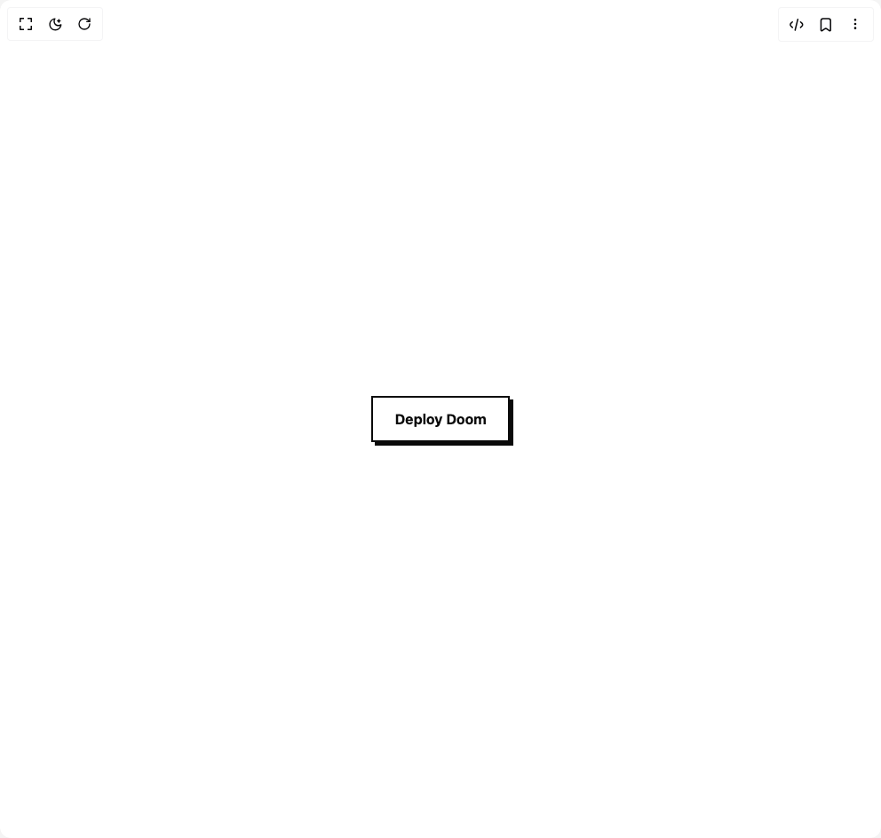

# Build Brutal Button in BuilderStudio

> Build this component in our Agentic IDE: [BuilderStudio](https://builderstudio.dev).
>
> Join the BuilderStudio community on [Discord](https://discord.gg/QdWeSGCqfe) and [Reddit](https://reddit.com/r/builderstudio).



## Component

- Author group: `radiumcoders`
- Component: `brutal-button`
- Variant: `default`
- Rendered HTML snapshot: [`rendered.html`](rendered.html)

## BuilderStudio prompt

You are implementing a React component based on a component reference.

## Component identity

- Author: radiumcoders
- Component slug: brutal-button
- Demo slug: default
- Title: brutal-button
- Description: 

## Goal

Recreate this component in a React + TypeScript + Tailwind CSS project. Preserve the visual layout, spacing, colors, border radius, shadows, interaction behavior, animation behavior, responsive behavior, and dark mode behavior shown in the rendered demo.

## Implementation requirements

- Use React and TypeScript.
- Use Tailwind CSS classes whenever possible.
- Keep the component self-contained unless the source files require helper components.
- If the source uses CSS variables, custom CSS, animations, or keyframes, include them.
- If the source uses external packages, list and use the required packages.
- Preserve accessibility attributes, button semantics, links, keyboard behavior, and ARIA attributes when visible in the source.
- Do not replace the component with a simplified placeholder.
- Return complete production-ready code.

## Dependencies

No reference metadata available.

## Rendered DOM snapshot

This is the rendered demo HTML extracted from the live preview. Use it to verify structure, class names, visible content, and layout.

```html
<div id="root"><div class="w-screen min-h-screen flex justify-center items-center"><div class="w-screen min-h-screen flex justify-center items-center"><div class="flex min-h-screen w-full items-center justify-center bg-background p-12"><button class="inline-flex items-center justify-center px-6 py-3 font-bold transition-all duration-200 ease-in-out border-2 shadow-[4px_4px_0px_var(--btn-shadow)] hover:translate-x-[-2px] hover:translate-y-[-2px] hover:shadow-[6px_6px_0px_var(--btn-shadow)] active:translate-x-[4px] active:translate-y-[4px] active:shadow-none" style="background-color: var(--btn-bg); color: var(--btn-text); border-color: var(--btn-border); border-radius: var(--btn-radius); --btn-bg: var(--background); --btn-text: var(--foreground); --btn-border: var(--foreground); --btn-shadow: var(--foreground); --btn-radius: 0px;">Deploy Doom</button></div></div></div></div>
```

## Reference source files

No reference source files were available.
