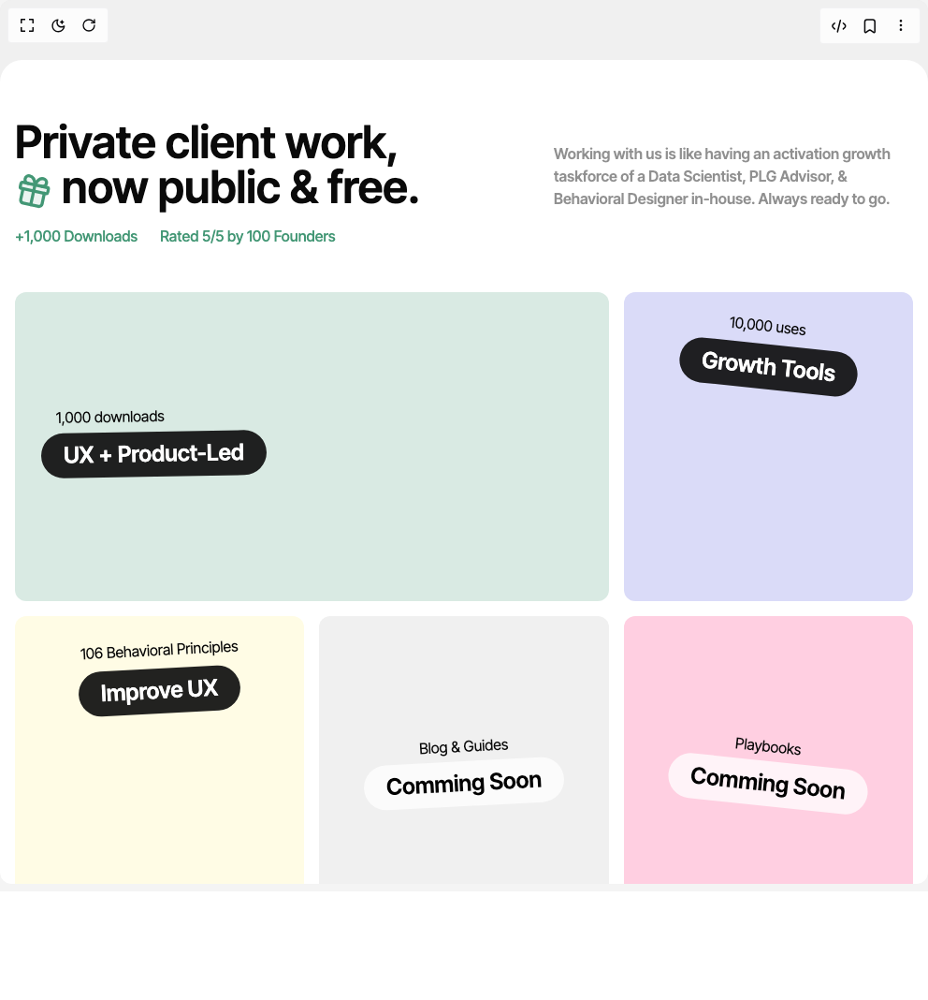

# Build Colorful Bento Grid in BuilderStudio

> Build this component in our Agentic IDE: [BuilderStudio](https://builderstudio.dev).
>
> Join the BuilderStudio community on [Discord](https://discord.gg/QdWeSGCqfe) and [Reddit](https://reddit.com/r/builderstudio).



## Component

- Author group: `radu-activation-popescu`
- Component: `colorful-bento-grid`
- Variant: `default`
- Rendered HTML snapshot: [`rendered.html`](rendered.html)

## BuilderStudio prompt

You are implementing a React component based on a component reference.

## Component identity

- Author: radu-activation-popescu
- Component slug: colorful-bento-grid
- Demo slug: default
- Title: colorful-bento-grid
- Description: 

## Goal

Recreate this component in a React + TypeScript + Tailwind CSS project. Preserve the visual layout, spacing, colors, border radius, shadows, interaction behavior, animation behavior, responsive behavior, and dark mode behavior shown in the rendered demo.

## Implementation requirements

- Use React and TypeScript.
- Use Tailwind CSS classes whenever possible.
- Keep the component self-contained unless the source files require helper components.
- If the source uses CSS variables, custom CSS, animations, or keyframes, include them.
- If the source uses external packages, list and use the required packages.
- Preserve accessibility attributes, button semantics, links, keyboard behavior, and ARIA attributes when visible in the source.
- Do not replace the component with a simplified placeholder.
- Return complete production-ready code.

## Dependencies

No reference metadata available.

## Rendered DOM snapshot

This is the rendered demo HTML extracted from the live preview. Use it to verify structure, class names, visible content, and layout.

```html
<div id="root"><div class="w-screen min-h-screen flex justify-center items-center"><div class="w-screen min-h-screen flex justify-center items-center"><main class="bg-[#F0F0F0] w-screen min-h-screen"><section id="free-tools" class="bg-white rounded-3xl p-4 my-16 max-w-6xl mx-auto"><div class="flex flex-col md:flex-row items-end justify-between w-full"><div class="flex flex-col my-12 w-full items-start justify-start gap-4"><div class="flex flex-col md:flex-row gap-2 items-end w-full justify-between "><h2 class="relative text-4xl md:text-5xl font-sans font-semibold max-w-xl text-left leading-[1em] text-base-content">Private client work, <br> <span><svg xmlns="http://www.w3.org/2000/svg" width="40" height="40" viewBox="0 0 24 24" fill="none" stroke="currentColor" stroke-width="2" stroke-linecap="round" stroke-linejoin="round" class="lucide lucide-gift inline-flex text-accent fill-accent/10 rotate-12" aria-hidden="true"><rect x="3" y="8" width="18" height="4" rx="1"></rect><path d="M12 8v13"></path><path d="M19 12v7a2 2 0 0 1-2 2H7a2 2 0 0 1-2-2v-7"></path><path d="M7.5 8a2.5 2.5 0 0 1 0-5A4.8 8 0 0 1 12 8a4.8 8 0 0 1 4.5-5 2.5 2.5 0 0 1 0 5"></path></svg></span> now public &amp; free.</h2><p class="max-w-sm font-semibold text-md text-neutral/50">Working with us is like having an activation growth taskforce of a Data Scientist, PLG Advisor, &amp; Behavioral Designer in-house. Always ready to go.</p></div><div class="flex flex-row text-accent gap-6 items-start justify-center"><p class="text-base whitespace-nowrap font-medium">+1,000 Downloads</p><p class="text-base whitespace-nowrap font-medium">Rated 5/5 by 100 Founders</p></div></div></div><div class="grid grid-cols-1 md:grid-cols-3 md:items-start md:justify-start gap-4 "><a href="/resources/freebies" class="md:col-span-2 overflow-hidden hover:scale-101 hover:shadow-[-6px_6px_32px_8px_rgba(192,192,192,0.2)] hover:rotate-1 transition-all duration-200 ease-in-out h-[330px] overflow-hidden relative bg-accent/20 rounded-xl flex flex-row items-center gap-8 justify-between px-3 pt-3 pb-6"><div class="relative flex flex-col items-start justify-center ml-4 gap-0"><p class="-rotate-1 ml-4 mb-1 text-base-content">1,000 downloads</p><h3 class="-rotate-1 text-2xl whitespace-nowrap font-semibold text-center px-6 py-2 bg-base-content/90 text-white rounded-full">UX + Product-Led</h3></div><div class="w-full object-fill rounded-xl"></div></a><a href="/resources/tools" class="overflow-hidden md:hover:scale-105 hover:shadow-[-6px_6px_32px_8px_rgba(192,192,192,0.2)] hover:rotate-3 transition-all duration-200 ease-in-out relative bg-highlight/20 h-[330px] rounded-xl flex flex-col items-center justify-between px-3 py-6"><div class="flex flex-col items-center justify-center gap-1"><p class="rotate-6 mb-1 text-base-content">10,000 uses</p><h3 class="rotate-6 text-2xl font-semibold text-center px-6 py-2 bg-base-content/90 text-white rounded-full">Growth Tools</h3></div><div class="w-full object-fill rounded-xl"></div></a><a href="/resources/behavior-principles" class="overflow-hidden md:hover:scale-105 hover:shadow-[-6px_6px_32px_8px_rgba(192,192,192,0.2)] hover:-rotate-3 transition-all duration-200 ease-in-out relative bg-secondary/20 h-[330px] rounded-xl flex flex-col items-center justify-between px-5 py-6"><div class="flex flex-col items-center justify-center gap-1"><p class="-rotate-3 mb-1 text-base-content">106 Behavioral Principles</p><h3 class="-rotate-3 text-2xl font-semibold text-center px-6 py-2 bg-base-content/90 text-white rounded-full">Improve UX</h3></div><div class="w-full object-fill rounded-xl"></div></a><a href="/resources/blog" class="pointer-events-none overflow-hidden md:hover:scale-105 hover:shadow-[-6px_6px_32px_8px_rgba(192,192,192,0.2)] hover:rotate-4 transition-all duration-200 ease-in-out relative bg-base-100 h-[330px] rounded-xl flex flex-col items-center justify-center px-5 py-6"><p class="-rotate-3 mb-1 text-base-content">Blog &amp; Guides</p><h3 class="-rotate-3 text-2xl font-semibold text-center px-6 py-2 bg-white/75 rounded-full">Comming Soon</h3></a><a href="/resources/playbooks" class="pointer-events-none flex items-center justify-center overflow-hidden md:hover:scale-105 hover:shadow-[-6px_6px_32px_8px_rgba(192,192,192,0.2)] hover:-rotate-6 transition-all duration-200 ease-in-out relative bg-primary/20 h-[330px] rounded-xl flex flex-col items-center justify-center px-5 py-6"><p class="rotate-6 mb-1 text-base-content">Playbooks</p><h3 class="rotate-6 text-2xl font-semibold text-center px-6 py-2 bg-white/75 rounded-full">Comming Soon</h3></a></div></section></main></div></div></div>
```

## Reference source files

No reference source files were available.
