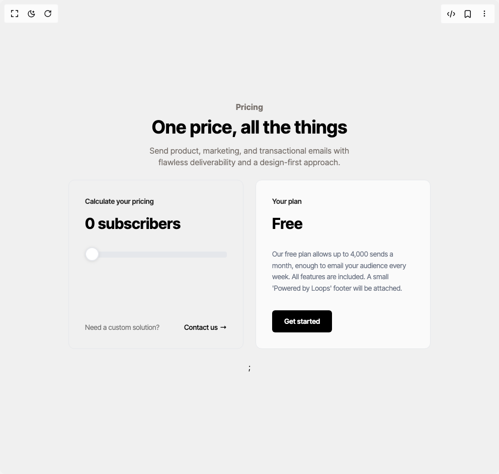

# Build Pricing Slider Loops in BuilderStudio

> Build this component in our Agentic IDE: [BuilderStudio](https://builderstudio.dev).
>
> Join the BuilderStudio community on [Discord](https://discord.gg/QdWeSGCqfe) and [Reddit](https://reddit.com/r/builderstudio).



## Component

- Author group: `radu-activation-popescu`
- Component: `pricing-slider-loops`
- Variant: `default`
- Rendered HTML snapshot: [`rendered.html`](rendered.html)

## BuilderStudio prompt

You are implementing a React component based on a component reference.

## Component identity

- Author: radu-activation-popescu
- Component slug: pricing-slider-loops
- Demo slug: default
- Title: pricing-slider-loops
- Description: 

## Goal

Recreate this component in a React + TypeScript + Tailwind CSS project. Preserve the visual layout, spacing, colors, border radius, shadows, interaction behavior, animation behavior, responsive behavior, and dark mode behavior shown in the rendered demo.

## Implementation requirements

- Use React and TypeScript.
- Use Tailwind CSS classes whenever possible.
- Keep the component self-contained unless the source files require helper components.
- If the source uses CSS variables, custom CSS, animations, or keyframes, include them.
- If the source uses external packages, list and use the required packages.
- Preserve accessibility attributes, button semantics, links, keyboard behavior, and ARIA attributes when visible in the source.
- Do not replace the component with a simplified placeholder.
- Return complete production-ready code.

## Dependencies

No reference metadata available.

## Rendered DOM snapshot

This is the rendered demo HTML extracted from the live preview. Use it to verify structure, class names, visible content, and layout.

```html
<div id="root"><div class="w-screen min-h-screen flex justify-center items-center"><div class="w-screen min-h-screen flex justify-center items-center"><main class="bg-[#F0F0F0] w-screen min-h-screen flex flex-col items-center justify-center"><div class="flex flex-col gap-2 items-center justify-center text-center"><p class="font-bold text-base text-[#78716c] tracking-[0.4px]">Pricing</p><h1 class="text-4xl font-bold">One price, all the things</h1><p class="tracking-[0.4px] leading-[1.4em] text-center max-w-md mt-2 text-[#78716c]">Send product, marketing, and transactional emails with flawless deliverability and a design-first approach.</p></div><section class="max-w-3xl mx-auto p-6"><div class="flex flex-col md:flex-row gap-6"><div class="flex-1 rounded-xl border border-gray-200 p-8 relative"><h2 class="text-sm font-semibold text-neutral-800 mb-4">Calculate your pricing</h2><div class="text-3xl font-bold text-black mb-8">0 subscribers</div><input min="0" max="26" step="1" class="w-full appearance-none h-3 rounded bg-gray-200 mb-12" type="range" value="0" style="background: linear-gradient(to right, rgb(249, 115, 22) 0%, rgb(249, 115, 22) 0%, rgb(229, 231, 235) 0%, rgb(229, 231, 235) 100%);"><style>
            input[type='range']::-webkit-slider-thumb {
              -webkit-appearance: none;
              appearance: none;
              width: 28px;
              height: 28px;
              background: #ffffff;
              border: 2px solid #E5E7EB;
              border-radius: 50%;
              cursor: pointer;
              margin-top: -1px;
              box-shadow: 0 1px 5px rgba(192, 192, 192, 0.5);
              position: relative;
            }
            input[type='range']::-moz-range-thumb {
              width: 26px;
              height: 26px;
              background: #ffffff;
              border: 2px solid #E5E7EB;
              border-radius: 50%;
              cursor: pointer;
              box-shadow: 0 1px 5px rgba(192, 192, 192, 0.5);
            }
          </style><div class="absolute bottom-8 left-8 right-8 flex items-center justify-between text-sm text-neutral-500"><span>Need a custom solution?</span><a href="mailto:chris@loops.so?subject=Enterprise%20pricing" class="text-black font-medium flex items-center">Contact us <span class="ml-1">→</span></a></div></div><div class="flex-1 rounded-xl border border-gray-200 p-8 bg-neutral-50"><h2 class="text-sm font-semibold text-neutral-800 mb-4">Your plan</h2><div class="mb-2"><h3 class="text-3xl font-bold text-black mb-6">Free</h3></div><p class="text-sm text-gray-500 leading-relaxed mt-8">Our free plan allows up to 4,000 sends a month, enough to email your audience every week. All features are included. A small 'Powered by Loops' footer will be attached.</p><a href="https://app.loops.so/register" class="mt-8 inline-block bg-black text-white px-6 py-3 rounded-md font-semibold text-sm">Get started</a></div></div></section>;</main></div></div></div>
```

## Reference source files

No reference source files were available.
