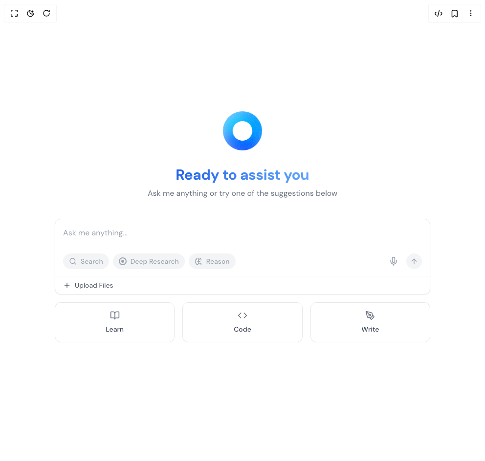

# Build Ai Assistant Interface in BuilderStudio

> Build this component in our Agentic IDE: [BuilderStudio](https://builderstudio.dev).
>
> Join the BuilderStudio community on [Discord](https://discord.gg/QdWeSGCqfe) and [Reddit](https://reddit.com/r/builderstudio).



## Component

- Author group: `rafa-porto`
- Component: `ai-assistant-interface`
- Variant: `default`
- Rendered HTML snapshot: [`rendered.html`](rendered.html)

## BuilderStudio prompt

You are implementing a React component based on a component reference.

## Component identity

- Author: rafa-porto
- Component slug: ai-assistant-interface
- Demo slug: default
- Title: ai-assistant-interface
- Description: 

## Goal

Recreate this component in a React + TypeScript + Tailwind CSS project. Preserve the visual layout, spacing, colors, border radius, shadows, interaction behavior, animation behavior, responsive behavior, and dark mode behavior shown in the rendered demo.

## Implementation requirements

- Use React and TypeScript.
- Use Tailwind CSS classes whenever possible.
- Keep the component self-contained unless the source files require helper components.
- If the source uses CSS variables, custom CSS, animations, or keyframes, include them.
- If the source uses external packages, list and use the required packages.
- Preserve accessibility attributes, button semantics, links, keyboard behavior, and ARIA attributes when visible in the source.
- Do not replace the component with a simplified placeholder.
- Return complete production-ready code.

## Dependencies

No reference metadata available.

## Rendered DOM snapshot

This is the rendered demo HTML extracted from the live preview. Use it to verify structure, class names, visible content, and layout.

```html
<div id="root"><div class="relative flex items-center justify-center h-screen w-full m-auto p-16 bg-background text-foreground"><div class="absolute lab-bg inset-0 size-full"><div class="absolute inset-0 bg-[radial-gradient(#00000021_1px,transparent_1px)] dark:bg-[radial-gradient(#ffffff22_1px,transparent_1px)]"></div></div><div class="flex w-full justify-center relative"><div class="w-screen"><div class="min-h-screen flex flex-col items-center justify-center bg-white p-6"><div class="w-full max-w-3xl mx-auto flex flex-col items-center"><div class="mb-8 w-20 h-20 relative"><svg xmlns="http://www.w3.org/2000/svg" fill="none" viewBox="0 0 200 200" width="100%" height="100%" class="w-full h-full"><g clip-path="url(#cs_clip_1_ellipse-12)"><mask id="cs_mask_1_ellipse-12" width="200" height="200" x="0" y="0" maskUnits="userSpaceOnUse" style="mask-type: alpha;"><path fill="#fff" fill-rule="evenodd" d="M100 150c27.614 0 50-22.386 50-50s-22.386-50-50-50-50 22.386-50 50 22.386 50 50 50zm0 50c55.228 0 100-44.772 100-100S155.228 0 100 0 0 44.772 0 100s44.772 100 100 100z" clip-rule="evenodd"></path></mask><g mask="url(#cs_mask_1_ellipse-12)"><path fill="#fff" d="M200 0H0v200h200V0z"></path><path fill="#0066FF" fill-opacity="0.33" d="M200 0H0v200h200V0z"></path><g filter="url(#filter0_f_844_2811)" class="animate-gradient"><path fill="#0066FF" d="M110 32H18v68h92V32z"></path><path fill="#0044FF" d="M188-24H15v98h173v-98z"></path><path fill="#0099FF" d="M175 70H5v156h170V70z"></path><path fill="#00CCFF" d="M230 51H100v103h130V51z"></path></g></g></g><defs><filter id="filter0_f_844_2811" width="385" height="410" x="-75" y="-104" color-interpolation-filters="sRGB" filterUnits="userSpaceOnUse"><feFlood flood-opacity="0" result="BackgroundImageFix"></feFlood><feBlend in="SourceGraphic" in2="BackgroundImageFix" result="shape"></feBlend><feGaussianBlur result="effect1_foregroundBlur_844_2811" stdDeviation="40"></feGaussianBlur></filter><clipPath id="cs_clip_1_ellipse-12"><path fill="#fff" d="M0 0H200V200H0z"></path></clipPath></defs><g mask="url(#cs_mask_1_ellipse-12)" style="mix-blend-mode: overlay;"><path fill="gray" stroke="transparent" d="M200 0H0v200h200V0z" filter="url(#cs_noise_1_ellipse-12)"></path></g><defs><filter id="cs_noise_1_ellipse-12" width="100%" height="100%" x="0%" y="0%" filterUnits="objectBoundingBox"><feTurbulence baseFrequency="0.6" numOctaves="5" result="out1" seed="4"></feTurbulence><feComposite in="out1" in2="SourceGraphic" operator="in" result="out2"></feComposite><feBlend in="SourceGraphic" in2="out2" mode="overlay" result="out3"></feBlend></filter></defs></svg></div><div class="mb-10 text-center"><div class="flex flex-col items-center" style="opacity: 1; transform: none;"><h1 class="text-3xl font-bold bg-clip-text text-transparent bg-gradient-to-r from-blue-600 to-blue-400 mb-2">Ready to assist you</h1><p class="text-gray-500 max-w-md">Ask me anything or try one of the suggestions below</p></div></div><div class="w-full bg-white border border-gray-200 rounded-xl shadow-sm overflow-hidden mb-4"><div class="p-4"><input placeholder="Ask me anything..." class="w-full text-gray-700 text-base outline-none placeholder:text-gray-400" type="text" value=""></div><div class="px-4 py-3 flex items-center justify-between"><div class="flex items-center gap-2"><button class="flex items-center gap-2 px-3 py-1.5 rounded-full text-sm font-medium transition-colors bg-gray-100 text-gray-400 hover:bg-gray-200"><svg xmlns="http://www.w3.org/2000/svg" width="24" height="24" viewBox="0 0 24 24" fill="none" stroke="currentColor" stroke-width="2" stroke-linecap="round" stroke-linejoin="round" class="lucide lucide-search w-4 h-4" aria-hidden="true"><path d="m21 21-4.34-4.34"></path><circle cx="11" cy="11" r="8"></circle></svg><span>Search</span></button><button class="flex items-center gap-2 px-3 py-1.5 rounded-full text-sm font-medium transition-colors bg-gray-100 text-gray-400 hover:bg-gray-200"><svg width="16" height="16" viewBox="0 0 16 16" fill="none" xmlns="http://www.w3.org/2000/svg" class="text-gray-400"><circle cx="8" cy="8" r="7" stroke="currentColor" stroke-width="2"></circle><circle cx="8" cy="8" r="3" fill="currentColor"></circle></svg><span>Deep Research</span></button><button class="flex items-center gap-2 px-3 py-1.5 rounded-full text-sm font-medium transition-colors bg-gray-100 text-gray-400 hover:bg-gray-200"><svg xmlns="http://www.w3.org/2000/svg" width="24" height="24" viewBox="0 0 24 24" fill="none" stroke="currentColor" stroke-width="2" stroke-linecap="round" stroke-linejoin="round" class="lucide lucide-brain-circuit w-4 h-4 text-gray-400" aria-hidden="true"><path d="M12 5a3 3 0 1 0-5.997.125 4 4 0 0 0-2.526 5.77 4 4 0 0 0 .556 6.588A4 4 0 1 0 12 18Z"></path><path d="M9 13a4.5 4.5 0 0 0 3-4"></path><path d="M6.003 5.125A3 3 0 0 0 6.401 6.5"></path><path d="M3.477 10.896a4 4 0 0 1 .585-.396"></path><path d="M6 18a4 4 0 0 1-1.967-.516"></path><path d="M12 13h4"></path><path d="M12 18h6a2 2 0 0 1 2 2v1"></path><path d="M12 8h8"></path><path d="M16 8V5a2 2 0 0 1 2-2"></path><circle cx="16" cy="13" r=".5"></circle><circle cx="18" cy="3" r=".5"></circle><circle cx="20" cy="21" r=".5"></circle><circle cx="20" cy="8" r=".5"></circle></svg><span>Reason</span></button></div><div class="flex items-center gap-2"><button class="p-2 text-gray-400 hover:text-gray-600 transition-colors"><svg xmlns="http://www.w3.org/2000/svg" width="24" height="24" viewBox="0 0 24 24" fill="none" stroke="currentColor" stroke-width="2" stroke-linecap="round" stroke-linejoin="round" class="lucide lucide-mic w-5 h-5" aria-hidden="true"><path d="M12 2a3 3 0 0 0-3 3v7a3 3 0 0 0 6 0V5a3 3 0 0 0-3-3Z"></path><path d="M19 10v2a7 7 0 0 1-14 0v-2"></path><line x1="12" x2="12" y1="19" y2="22"></line></svg></button><button disabled="" class="w-8 h-8 flex items-center justify-center rounded-full transition-colors bg-gray-100 text-gray-400 cursor-not-allowed"><svg xmlns="http://www.w3.org/2000/svg" width="24" height="24" viewBox="0 0 24 24" fill="none" stroke="currentColor" stroke-width="2" stroke-linecap="round" stroke-linejoin="round" class="lucide lucide-arrow-up w-4 h-4" aria-hidden="true"><path d="m5 12 7-7 7 7"></path><path d="M12 19V5"></path></svg></button></div></div><div class="px-4 py-2 border-t border-gray-100"><button class="flex items-center gap-2 text-gray-600 text-sm hover:text-gray-900 transition-colors"><svg xmlns="http://www.w3.org/2000/svg" width="24" height="24" viewBox="0 0 24 24" fill="none" stroke="currentColor" stroke-width="2" stroke-linecap="round" stroke-linejoin="round" class="lucide lucide-plus w-4 h-4" aria-hidden="true"><path d="M5 12h14"></path><path d="M12 5v14"></path></svg><span>Upload Files</span></button></div></div><div class="w-full grid grid-cols-3 gap-4 mb-4"><button class="flex flex-col items-center justify-center gap-2 p-4 rounded-xl border transition-all bg-white border-gray-200 hover:border-gray-300"><div class="text-gray-500"><svg xmlns="http://www.w3.org/2000/svg" width="24" height="24" viewBox="0 0 24 24" fill="none" stroke="currentColor" stroke-width="2" stroke-linecap="round" stroke-linejoin="round" class="lucide lucide-book-open w-5 h-5" aria-hidden="true"><path d="M12 7v14"></path><path d="M3 18a1 1 0 0 1-1-1V4a1 1 0 0 1 1-1h5a4 4 0 0 1 4 4 4 4 0 0 1 4-4h5a1 1 0 0 1 1 1v13a1 1 0 0 1-1 1h-6a3 3 0 0 0-3 3 3 3 0 0 0-3-3z"></path></svg></div><span class="text-sm font-medium text-gray-700">Learn</span></button><button class="flex flex-col items-center justify-center gap-2 p-4 rounded-xl border transition-all bg-white border-gray-200 hover:border-gray-300"><div class="text-gray-500"><svg xmlns="http://www.w3.org/2000/svg" width="24" height="24" viewBox="0 0 24 24" fill="none" stroke="currentColor" stroke-width="2" stroke-linecap="round" stroke-linejoin="round" class="lucide lucide-code w-5 h-5" aria-hidden="true"><path d="m16 18 6-6-6-6"></path><path d="m8 6-6 6 6 6"></path></svg></div><span class="text-sm font-medium text-gray-700">Code</span></button><button class="flex flex-col items-center justify-center gap-2 p-4 rounded-xl border transition-all bg-white border-gray-200 hover:border-gray-300"><div class="text-gray-500"><svg xmlns="http://www.w3.org/2000/svg" width="24" height="24" viewBox="0 0 24 24" fill="none" stroke="currentColor" stroke-width="2" stroke-linecap="round" stroke-linejoin="round" class="lucide lucide-pen-tool w-5 h-5" aria-hidden="true"><path d="M15.707 21.293a1 1 0 0 1-1.414 0l-1.586-1.586a1 1 0 0 1 0-1.414l5.586-5.586a1 1 0 0 1 1.414 0l1.586 1.586a1 1 0 0 1 0 1.414z"></path><path d="m18 13-1.375-6.874a1 1 0 0 0-.746-.776L3.235 2.028a1 1 0 0 0-1.207 1.207L5.35 15.879a1 1 0 0 0 .776.746L13 18"></path><path d="m2.3 2.3 7.286 7.286"></path><circle cx="11" cy="11" r="2"></circle></svg></div><span class="text-sm font-medium text-gray-700">Write</span></button></div></div></div></div></div></div></div>
```

## Reference source files

No reference source files were available.
