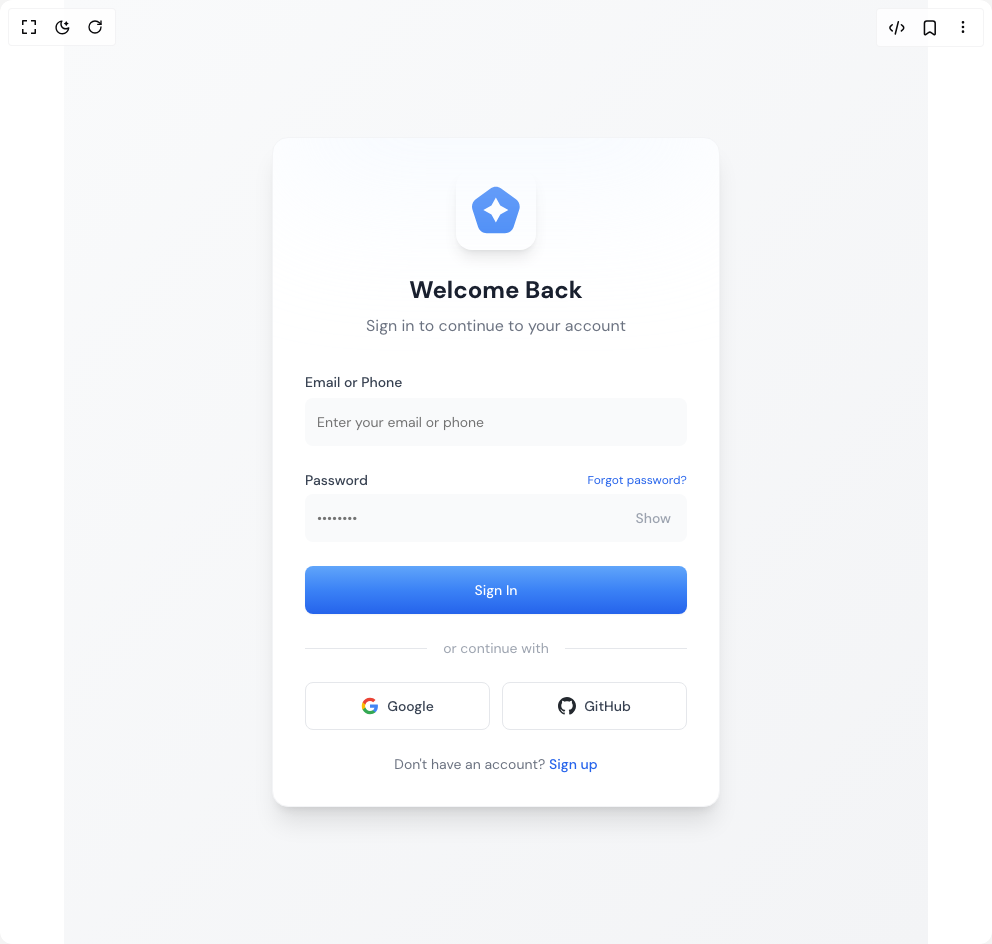

# Build Sign In in BuilderStudio

> Build this component in our Agentic IDE: [BuilderStudio](https://builderstudio.dev).
>
> Join the BuilderStudio community on [Discord](https://discord.gg/QdWeSGCqfe) and [Reddit](https://reddit.com/r/builderstudio).



## Component

- Author group: `rafa-porto`
- Component: `sign-in`
- Variant: `default`
- Rendered HTML snapshot: [`rendered.html`](rendered.html)

## BuilderStudio prompt

You are implementing a React component based on a component reference.

## Component identity

- Author: rafa-porto
- Component slug: sign-in
- Demo slug: default
- Title: sign-in
- Description: 

## Goal

Recreate this component in a React + TypeScript + Tailwind CSS project. Preserve the visual layout, spacing, colors, border radius, shadows, interaction behavior, animation behavior, responsive behavior, and dark mode behavior shown in the rendered demo.

## Implementation requirements

- Use React and TypeScript.
- Use Tailwind CSS classes whenever possible.
- Keep the component self-contained unless the source files require helper components.
- If the source uses CSS variables, custom CSS, animations, or keyframes, include them.
- If the source uses external packages, list and use the required packages.
- Preserve accessibility attributes, button semantics, links, keyboard behavior, and ARIA attributes when visible in the source.
- Do not replace the component with a simplified placeholder.
- Return complete production-ready code.

## Dependencies

No reference metadata available.

## Rendered DOM snapshot

This is the rendered demo HTML extracted from the live preview. Use it to verify structure, class names, visible content, and layout.

```html
<div id="root"><div class="relative flex items-center justify-center h-screen w-full m-auto p-16 bg-background text-foreground"><div class="absolute lab-bg inset-0 size-full"><div class="absolute inset-0 bg-[radial-gradient(#00000021_1px,transparent_1px)] dark:bg-[radial-gradient(#ffffff22_1px,transparent_1px)]"></div></div><div class="flex w-full justify-center relative"><div class="w-screen"><div class="min-h-screen flex items-center justify-center bg-gradient-to-br from-gray-50 to-gray-100 p-4"><div class="w-full max-w-md bg-white rounded-2xl shadow-xl overflow-hidden border border-gray-100 relative"><div class="absolute top-0 left-0 right-0 h-48 bg-gradient-to-b from-blue-100 via-blue-50 to-transparent opacity-40 blur-3xl -mt-20"></div><div class="p-8"><div class="flex flex-col items-center mb-8"><div class="bg-white p-4 rounded-2xl shadow-lg mb-6"><svg width="48" height="48" viewBox="0 0 110 106" fill="none" xmlns="http://www.w3.org/2000/svg"><path d="M100.83 28.63L66.86 3.95c-7.25-5.26-17.07-5.26-24.35 0L8.54 28.63C1.29 33.89-1.76 43.23 1.01 51.77l12.98 39.93c2.77 8.53 10.72 14.3 19.7 14.3h41.97c8.98 0 16.93-5.76 19.7-14.3l12.98-39.93c2.77-8.53-.28-17.88-7.53-23.14ZM64.81 63.13l-10.13 18.55-10.13-18.55-18.55-10.13 18.55-10.13 10.13-18.55 10.13 18.55 18.55 10.13-18.55 10.13Z" fill="#3B82F6"></path></svg></div><div class="p-0"><h2 class="text-2xl font-bold text-gray-900 text-center">Welcome Back</h2><p class="text-center text-gray-500 mt-2">Sign in to continue to your account</p></div></div><div class="space-y-6 p-0"><div class="space-y-1"><label class="text-sm font-medium text-gray-700">Email or Phone</label><input class="bg-gray-50 border-gray-200 text-gray-900 placeholder:text-gray-400 h-12 rounded-lg focus-visible:ring-2 focus-visible:ring-blue-500/50 focus:border-blue-500 w-full px-3 py-2 text-sm ring-offset-background file:border-0 file:bg-transparent file:text-sm file:font-medium placeholder:text-muted-foreground focus-visible:outline-none focus-visible:ring-ring disabled:cursor-not-allowed disabled:opacity-50" placeholder="Enter your email or phone"></div><div class="space-y-1"><div class="flex justify-between items-center"><label class="text-sm font-medium text-gray-700">Password</label><a href="#" class="text-xs text-blue-600 hover:underline">Forgot password?</a></div><div class="relative"><input class="bg-gray-50 border-gray-200 text-gray-900 pr-12 h-12 rounded-lg focus-visible:ring-2 focus-visible:ring-blue-500/50 focus:border-blue-500 w-full px-3 py-2 text-sm ring-offset-background file:border-0 file:bg-transparent file:text-sm file:font-medium placeholder:text-muted-foreground focus-visible:outline-none focus-visible:ring-ring disabled:cursor-not-allowed disabled:opacity-50" placeholder="••••••••" type="password"><button type="button" class="absolute right-1 top-1/2 -translate-y-1/2 text-gray-400 hover:text-blue-600 hover:bg-gray-100 inline-flex items-center justify-center whitespace-nowrap rounded-md text-sm font-medium ring-offset-background transition-colors focus-visible:outline-none focus-visible:ring-2 focus-visible:ring-ring focus-visible:ring-offset-2 disabled:pointer-events-none disabled:opacity-50 h-9 px-3">Show</button></div></div><button class="w-full h-12 bg-gradient-to-t from-blue-600 via-blue-500 to-blue-400 hover:from-blue-700 hover:via-blue-600 hover:to-blue-500 text-white font-medium rounded-lg transition-all duration-200 shadow-sm hover:shadow-md hover:shadow-blue-100 active:scale-[0.98] inline-flex items-center justify-center whitespace-nowrap text-sm ring-offset-background focus-visible:outline-none focus-visible:ring-2 focus-visible:ring-ring focus-visible:ring-offset-2 disabled:pointer-events-none disabled:opacity-50">Sign In</button><div class="flex items-center my-4"><div class="flex-1 h-px bg-gray-200"></div><span class="px-4 text-sm text-gray-400">or continue with</span><div class="flex-1 h-px bg-gray-200"></div></div><div class="grid grid-cols-2 gap-3"><button class="h-12 bg-white border-gray-200 text-gray-700 hover:bg-gray-50 hover:text-blue-600 rounded-lg flex items-center justify-center gap-2 border bg-background inline-flex whitespace-nowrap text-sm font-medium ring-offset-background transition-colors focus-visible:outline-none focus-visible:ring-2 focus-visible:ring-ring focus-visible:ring-offset-2 disabled:pointer-events-none disabled:opacity-50"><svg width="18" height="18" viewBox="0 0 24 24" fill="none" class="text-gray-700"><path d="M22.56 12.25c0-.78-.07-1.53-.2-2.25H12v4.26h5.92c-.26 1.37-1.04 2.53-2.21 3.31v2.77h3.57c2.08-1.92 3.28-4.74 3.28-8.09z" fill="#4285F4"></path><path d="M12 23c2.97 0 5.46-.98 7.28-2.66l-3.57-2.77c-.98.66-2.23 1.06-3.71 1.06-2.86 0-5.29-1.93-6.16-4.53H2.18v2.84C3.99 20.53 7.7 23 12 23z" fill="#34A853"></path><path d="M5.84 14.09c-.22-.66-.35-1.36-.35-2.09s.13-1.43.35-2.09V7.07H2.18C1.43 8.55 1 10.22 1 12s.43 3.45 1.18 4.93l3.66-2.84z" fill="#FBBC05"></path><path d="M12 5.38c1.62 0 3.06.56 4.21 1.64l3.15-3.15C17.45 2.09 14.97 1 12 1 7.7 1 3.99 3.47 2.18 7.07l3.66 2.84c.87-2.6 3.3-4.53 6.16-4.53z" fill="#EA4335"></path></svg><span class="whitespace-nowrap">Google</span></button><button class="h-12 bg-white border-gray-200 text-gray-700 hover:bg-gray-50 hover:text-black rounded-lg flex items-center justify-center gap-2 border bg-background inline-flex whitespace-nowrap text-sm font-medium ring-offset-background transition-colors focus-visible:outline-none focus-visible:ring-2 focus-visible:ring-ring focus-visible:ring-offset-2 disabled:pointer-events-none disabled:opacity-50"><svg width="18" height="18" viewBox="0 0 24 24" fill="none" class="text-gray-700"><path d="M12 0C5.374 0 0 5.373 0 12c0 5.302 3.438 9.8 8.207 11.387.6.113.82-.26.82-.577 0-.285-.01-1.04-.015-2.04-3.338.724-4.042-1.61-4.042-1.61-.546-1.386-1.332-1.755-1.332-1.755-1.087-.744.084-.729.084-.729 1.205.085 1.84 1.236 1.84 1.236 1.07 1.835 2.809 1.305 3.493.997.108-.776.42-1.305.763-1.605-2.665-.3-5.466-1.332-5.466-5.93 0-1.31.465-2.38 1.235-3.22-.135-.303-.54-1.523.105-3.176 0 0 1.005-.322 3.3 1.23.96-.267 1.98-.399 3-.405 1.02.006 2.04.138 3 .405 2.28-1.552 3.285-1.23 3.285-1.23.645 1.653.24 2.873.12 3.176.765.84 1.23 1.91 1.23 3.22 0 4.61-2.805 5.625-5.475 5.92.42.36.81 1.096.81 2.22 0 1.606-.015 2.896-.015 3.286 0 .315.21.69.825.57C20.565 21.795 24 17.295 24 12c0-6.627-5.373-12-12-12z" fill="#24292F"></path></svg><span class="whitespace-nowrap">GitHub</span></button></div></div><div class="p-0 mt-6"><p class="text-sm text-center text-gray-500 w-full">Don't have an account? <a href="#" class="text-blue-600 hover:underline font-medium">Sign up</a></p></div></div></div></div></div></div></div></div>
```

## Reference source files

No reference source files were available.
