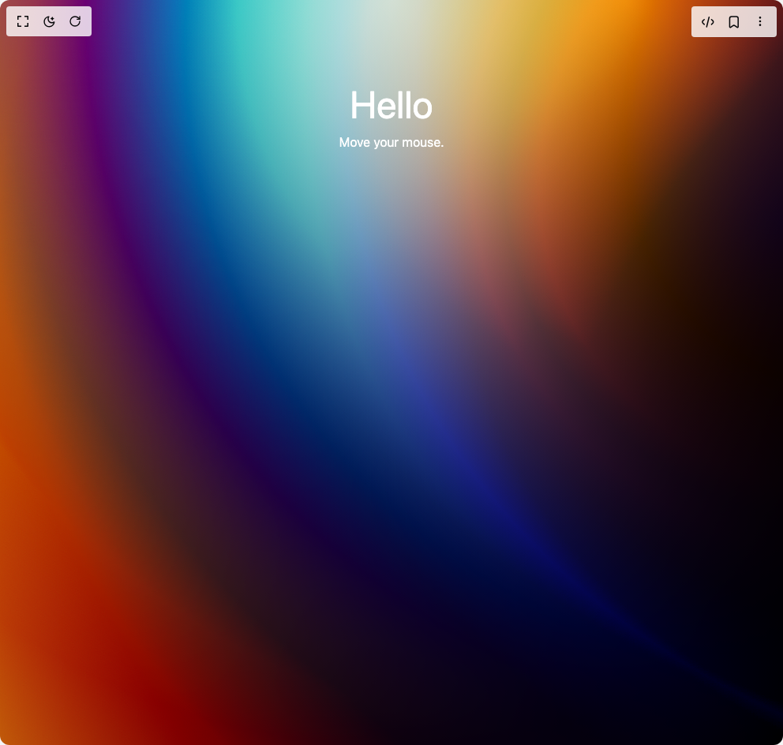

# Build Interactive Gradient Background in BuilderStudio

> Build this component in our Agentic IDE: [BuilderStudio](https://builderstudio.dev).
>
> Join the BuilderStudio community on [Discord](https://discord.gg/QdWeSGCqfe) and [Reddit](https://reddit.com/r/builderstudio).



## Component

- Author group: `rahil1202`
- Component: `interactive-gradient-background`
- Variant: `default`
- Rendered HTML snapshot: [`rendered.html`](rendered.html)

## BuilderStudio prompt

You are implementing a React component based on a component reference.

## Component identity

- Author: rahil1202
- Component slug: interactive-gradient-background
- Demo slug: default
- Title: interactive-gradient-background
- Description: 

## Goal

Recreate this component in a React + TypeScript + Tailwind CSS project. Preserve the visual layout, spacing, colors, border radius, shadows, interaction behavior, animation behavior, responsive behavior, and dark mode behavior shown in the rendered demo.

## Implementation requirements

- Use React and TypeScript.
- Use Tailwind CSS classes whenever possible.
- Keep the component self-contained unless the source files require helper components.
- If the source uses CSS variables, custom CSS, animations, or keyframes, include them.
- If the source uses external packages, list and use the required packages.
- Preserve accessibility attributes, button semantics, links, keyboard behavior, and ARIA attributes when visible in the source.
- Do not replace the component with a simplified placeholder.
- Return complete production-ready code.

## Dependencies

No reference metadata available.

## Rendered DOM snapshot

This is the rendered demo HTML extracted from the live preview. Use it to verify structure, class names, visible content, and layout.

```html
<div id="root"><div class="w-screen min-h-screen flex justify-center items-center"><div class="w-screen min-h-screen flex justify-center items-center"><div aria-label="Interactive gradient background" role="img" class="" style="position: relative; width: 100%; min-height: 100vh; overflow: hidden; --posX: 0; --posY: 0;"><div aria-hidden="true" style="position: absolute; inset: 0px; opacity: 1; transition: opacity 0.5s; background: linear-gradient(115deg, rgb(211 255 215), rgb(0 0 0)),
            radial-gradient(90% 100% at calc(50% + var(--posX)*1px) calc(0% + var(--posY)*1px), rgb(200 200 200), rgb(22 0 45)),
            radial-gradient(100% 100% at calc(80% - var(--posX)*1px) calc(0% - var(--posY)*1px), rgb(250 255 0), rgb(36 0 0)),
            radial-gradient(150% 210% at calc(100% + var(--posX)*1px) calc(0% + var(--posY)*1px), rgb(20 175 125), rgb(0 10 255)),
            radial-gradient(100% 100% at calc(100% - var(--posX)*1px) calc(30% - var(--posY)*1px), rgb(255 77 0), rgb(0 200 255)),
            linear-gradient(60deg, rgb(255 0 0), rgb(120 86 255)); background-blend-mode: overlay, overlay, difference, difference, difference, normal;"></div><div aria-hidden="true" style="position: absolute; inset: 0px; opacity: 0; transition: opacity 0.5s; background: linear-gradient(115deg, rgb(15 30 20), rgb(0 0 0)),
            radial-gradient(90% 100% at calc(50% + var(--posX)*1px) calc(0% + var(--posY)*1px), rgb(80 80 100), rgb(10 0 25)),
            radial-gradient(100% 100% at calc(80% - var(--posX)*1px) calc(0% - var(--posY)*1px), rgb(100 120 0), rgb(15 0 0)),
            radial-gradient(150% 210% at calc(100% + var(--posX)*1px) calc(0% + var(--posY)*1px), rgb(10 80 60), rgb(0 5 120)),
            radial-gradient(100% 100% at calc(100% - var(--posX)*1px) calc(30% - var(--posY)*1px), rgb(120 35 0), rgb(0 100 140)),
            linear-gradient(60deg, rgb(100 0 0), rgb(60 40 150)); background-blend-mode: overlay, overlay, difference, difference, difference, normal;"></div><div style="position: relative; z-index: 1;"><div style="padding: 6rem 2rem; color: white; text-align: center;"><h1 style="font-size: 3rem; margin: 0px;">Hello</h1><p>Move your mouse.</p></div></div></div></div></div></div>
```

## Reference source files

No reference source files were available.
