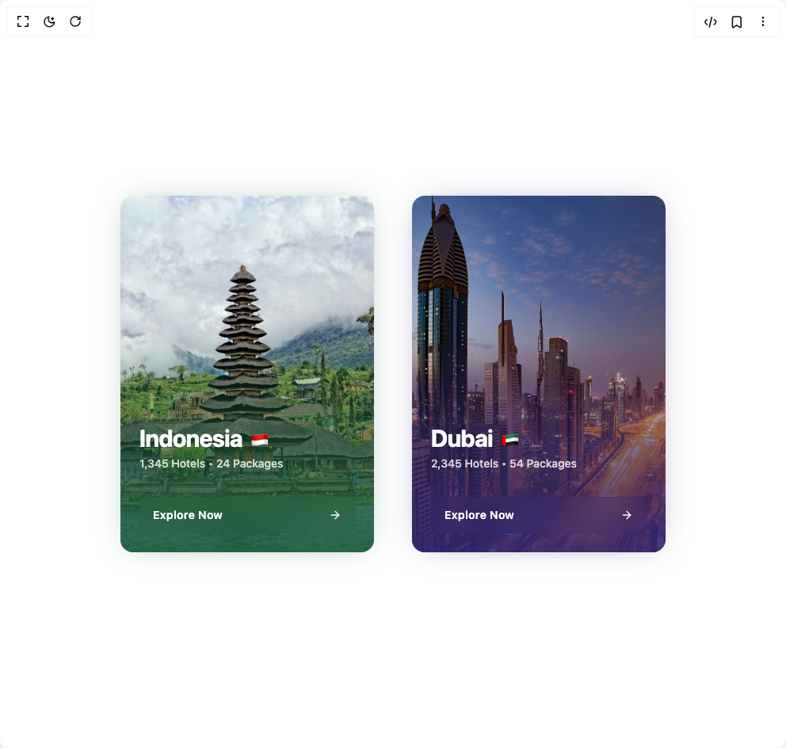

# Build Card 21 in BuilderStudio

> Build this component in our Agentic IDE: [BuilderStudio](https://builderstudio.dev).
>
> Join the BuilderStudio community on [Discord](https://discord.gg/QdWeSGCqfe) and [Reddit](https://reddit.com/r/builderstudio).



## Component

- Author group: `ravikatiyar`
- Component: `card-21`
- Variant: `default`
- Rendered HTML snapshot: [`rendered.html`](rendered.html)

## BuilderStudio prompt

You are implementing a React component based on a component reference.

## Component identity

- Author: ravikatiyar
- Component slug: card-21
- Demo slug: default
- Title: card-21
- Description: 

## Goal

Recreate this component in a React + TypeScript + Tailwind CSS project. Preserve the visual layout, spacing, colors, border radius, shadows, interaction behavior, animation behavior, responsive behavior, and dark mode behavior shown in the rendered demo.

## Implementation requirements

- Use React and TypeScript.
- Use Tailwind CSS classes whenever possible.
- Keep the component self-contained unless the source files require helper components.
- If the source uses CSS variables, custom CSS, animations, or keyframes, include them.
- If the source uses external packages, list and use the required packages.
- Preserve accessibility attributes, button semantics, links, keyboard behavior, and ARIA attributes when visible in the source.
- Do not replace the component with a simplified placeholder.
- Return complete production-ready code.

## Dependencies

No reference metadata available.

## Rendered DOM snapshot

This is the rendered demo HTML extracted from the live preview. Use it to verify structure, class names, visible content, and layout.

```html
<div id="root"><div class="w-screen min-h-screen flex justify-center items-center"><div class="w-screen min-h-screen flex justify-center items-center"><div class="flex min-h-screen w-full flex-col md:flex-row items-center justify-center gap-8 md:gap-12 p-8 bg-background"><div class="w-full max-w-[320px] h-[450px]"><div class="group w-full h-full" style="--theme-color: 150 50% 25%;"><a href="#" class="relative block w-full h-full rounded-2xl overflow-hidden shadow-lg 
                     transition-all duration-500 ease-in-out 
                     group-hover:scale-105 group-hover:shadow-[0_0_60px_-15px_hsl(var(--theme-color)/0.6)]" aria-label="Explore details for Indonesia" style="box-shadow: 0 0 40px -15px hsl(var(--theme-color) / 0.5);"><div class="absolute inset-0 bg-cover bg-center 
                       transition-transform duration-500 ease-in-out group-hover:scale-110" style="background-image: url(&quot;https://images.unsplash.com/photo-1524675053444-52c3ca294ad2?w=900&amp;auto=format&amp;fit=crop&amp;q=60&amp;ixlib=rb-4.1.0&amp;ixid=M3wxMjA3fDB8MHxzZWFyY2h8MTV8fGluZG9uZXNpYXxlbnwwfHwwfHx8MA%3D%3D?q=80&amp;w=1887&quot;);"></div><div class="absolute inset-0" style="background: linear-gradient(to top, hsl(var(--theme-color) / 0.9), hsl(var(--theme-color) / 0.6) 30%, transparent 60%);"></div><div class="relative flex flex-col justify-end h-full p-6 text-white"><h3 class="text-3xl font-bold tracking-tight">Indonesia <span class="text-2xl ml-1">🇮🇩</span></h3><p class="text-sm text-white/80 mt-1 font-medium">1,345 Hotels • 24 Packages</p><div class="mt-8 flex items-center justify-between bg-[hsl(var(--theme-color)/0.2)] backdrop-blur-md border border-[hsl(var(--theme-color)/0.3)] 
                           rounded-lg px-4 py-3 
                           transition-all duration-300 
                           group-hover:bg-[hsl(var(--theme-color)/0.4)] group-hover:border-[hsl(var(--theme-color)/0.5)]"><span class="text-sm font-semibold tracking-wide">Explore Now</span><svg xmlns="http://www.w3.org/2000/svg" width="24" height="24" viewBox="0 0 24 24" fill="none" stroke="currentColor" stroke-width="2" stroke-linecap="round" stroke-linejoin="round" class="lucide lucide-arrow-right h-4 w-4 transform transition-transform duration-300 group-hover:translate-x-1" aria-hidden="true"><path d="M5 12h14"></path><path d="m12 5 7 7-7 7"></path></svg></div></div></a></div></div><div class="w-full max-w-[320px] h-[450px]"><div class="group w-full h-full" style="--theme-color: 250 50% 30%;"><a href="#" class="relative block w-full h-full rounded-2xl overflow-hidden shadow-lg 
                     transition-all duration-500 ease-in-out 
                     group-hover:scale-105 group-hover:shadow-[0_0_60px_-15px_hsl(var(--theme-color)/0.6)]" aria-label="Explore details for Dubai" style="box-shadow: 0 0 40px -15px hsl(var(--theme-color) / 0.5);"><div class="absolute inset-0 bg-cover bg-center 
                       transition-transform duration-500 ease-in-out group-hover:scale-110" style="background-image: url(&quot;https://images.unsplash.com/photo-1526495124232-a04e1849168c?q=80&amp;w=1887&quot;);"></div><div class="absolute inset-0" style="background: linear-gradient(to top, hsl(var(--theme-color) / 0.9), hsl(var(--theme-color) / 0.6) 30%, transparent 60%);"></div><div class="relative flex flex-col justify-end h-full p-6 text-white"><h3 class="text-3xl font-bold tracking-tight">Dubai <span class="text-2xl ml-1">🇦🇪</span></h3><p class="text-sm text-white/80 mt-1 font-medium">2,345 Hotels • 54 Packages</p><div class="mt-8 flex items-center justify-between bg-[hsl(var(--theme-color)/0.2)] backdrop-blur-md border border-[hsl(var(--theme-color)/0.3)] 
                           rounded-lg px-4 py-3 
                           transition-all duration-300 
                           group-hover:bg-[hsl(var(--theme-color)/0.4)] group-hover:border-[hsl(var(--theme-color)/0.5)]"><span class="text-sm font-semibold tracking-wide">Explore Now</span><svg xmlns="http://www.w3.org/2000/svg" width="24" height="24" viewBox="0 0 24 24" fill="none" stroke="currentColor" stroke-width="2" stroke-linecap="round" stroke-linejoin="round" class="lucide lucide-arrow-right h-4 w-4 transform transition-transform duration-300 group-hover:translate-x-1" aria-hidden="true"><path d="M5 12h14"></path><path d="m12 5 7 7-7 7"></path></svg></div></div></a></div></div></div></div></div></div>
```

## Reference source files

No reference source files were available.
