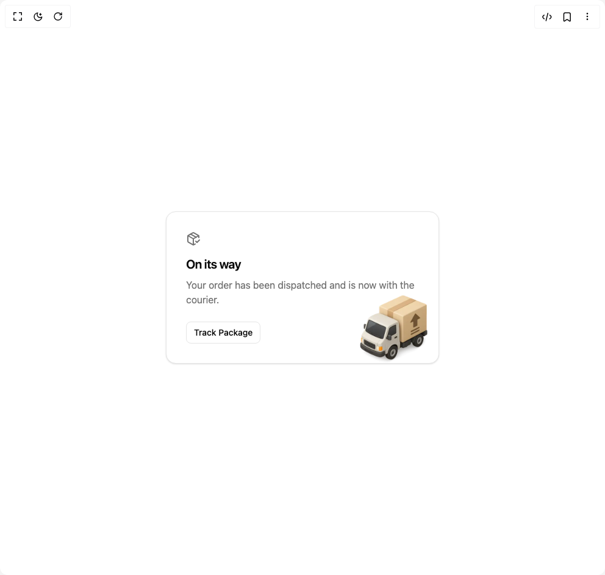

# Build Card 24 in BuilderStudio

> Build this component in our Agentic IDE: [BuilderStudio](https://builderstudio.dev).
>
> Join the BuilderStudio community on [Discord](https://discord.gg/QdWeSGCqfe) and [Reddit](https://reddit.com/r/builderstudio).



## Component

- Author group: `ravikatiyar`
- Component: `card-24`
- Variant: `default`
- Rendered HTML snapshot: [`rendered.html`](rendered.html)

## BuilderStudio prompt

You are implementing a React component based on a component reference.

## Component identity

- Author: ravikatiyar
- Component slug: card-24
- Demo slug: default
- Title: card-24
- Description: 

## Goal

Recreate this component in a React + TypeScript + Tailwind CSS project. Preserve the visual layout, spacing, colors, border radius, shadows, interaction behavior, animation behavior, responsive behavior, and dark mode behavior shown in the rendered demo.

## Implementation requirements

- Use React and TypeScript.
- Use Tailwind CSS classes whenever possible.
- Keep the component self-contained unless the source files require helper components.
- If the source uses CSS variables, custom CSS, animations, or keyframes, include them.
- If the source uses external packages, list and use the required packages.
- Preserve accessibility attributes, button semantics, links, keyboard behavior, and ARIA attributes when visible in the source.
- Do not replace the component with a simplified placeholder.
- Return complete production-ready code.

## Dependencies

No reference metadata available.

## Rendered DOM snapshot

This is the rendered demo HTML extracted from the live preview. Use it to verify structure, class names, visible content, and layout.

```html
<div id="root"><div class="w-screen min-h-screen flex justify-center items-center"><div class="w-screen min-h-screen flex justify-center items-center"><div class="flex h-full w-full items-center justify-center bg-background p-4"><div class="relative w-full max-w-md overflow-hidden rounded-2xl border bg-card p-8 text-card-foreground shadow-sm" style="opacity: 1; transform: none;"><div class="flex flex-col h-full"><div class="mb-4 text-muted-foreground"><svg xmlns="http://www.w3.org/2000/svg" width="24" height="24" viewBox="0 0 24 24" fill="none" stroke="currentColor" stroke-width="2" stroke-linecap="round" stroke-linejoin="round" class="lucide lucide-package-check h-6 w-6" aria-hidden="true"><path d="m16 16 2 2 4-4"></path><path d="M21 10V8a2 2 0 0 0-1-1.73l-7-4a2 2 0 0 0-2 0l-7 4A2 2 0 0 0 3 8v8a2 2 0 0 0 1 1.73l7 4a2 2 0 0 0 2 0l2-1.14"></path><path d="m7.5 4.27 9 5.15"></path><polyline points="3.29 7 12 12 20.71 7"></polyline><line x1="12" x2="12" y1="22" y2="12"></line></svg></div><div class="flex-grow"><h3 class="text-xl font-semibold tracking-tight">On its way</h3><p class="mt-2 text-muted-foreground">Your order has been dispatched and is now with the courier.</p></div><div class="mt-6"><button class="inline-flex items-center justify-center whitespace-nowrap text-sm font-medium ring-offset-background transition-colors focus-visible:outline-none focus-visible:ring-2 focus-visible:ring-ring focus-visible:ring-offset-2 disabled:pointer-events-none disabled:opacity-50 border border-input bg-background hover:bg-accent hover:text-accent-foreground h-9 rounded-md px-3">Track Package</button></div></div><div class="pointer-events-none absolute -bottom-2 -right-2 w-40 h-32 -z-0"></div></div></div></div></div></div>
```

## Reference source files

No reference source files were available.
