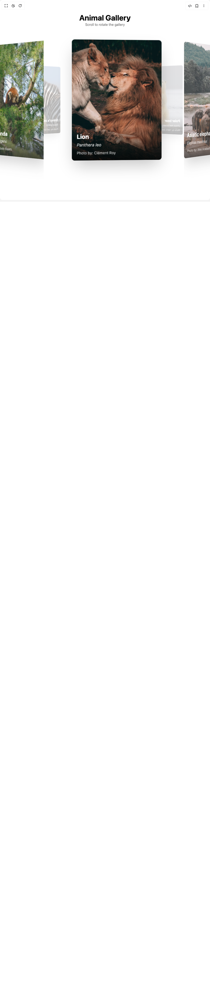

# Build Circular Gallery in BuilderStudio

> Build this component in our Agentic IDE: [BuilderStudio](https://builderstudio.dev).
>
> Join the BuilderStudio community on [Discord](https://discord.gg/QdWeSGCqfe) and [Reddit](https://reddit.com/r/builderstudio).



## Component

- Author group: `ravikatiyar`
- Component: `circular-gallery`
- Variant: `default`
- Rendered HTML snapshot: [`rendered.html`](rendered.html)

## BuilderStudio prompt

You are implementing a React component based on a component reference.

## Component identity

- Author: ravikatiyar
- Component slug: circular-gallery
- Demo slug: default
- Title: circular-gallery
- Description: 

## Goal

Recreate this component in a React + TypeScript + Tailwind CSS project. Preserve the visual layout, spacing, colors, border radius, shadows, interaction behavior, animation behavior, responsive behavior, and dark mode behavior shown in the rendered demo.

## Implementation requirements

- Use React and TypeScript.
- Use Tailwind CSS classes whenever possible.
- Keep the component self-contained unless the source files require helper components.
- If the source uses CSS variables, custom CSS, animations, or keyframes, include them.
- If the source uses external packages, list and use the required packages.
- Preserve accessibility attributes, button semantics, links, keyboard behavior, and ARIA attributes when visible in the source.
- Do not replace the component with a simplified placeholder.
- Return complete production-ready code.

## Dependencies

No reference metadata available.

## Rendered DOM snapshot

This is the rendered demo HTML extracted from the live preview. Use it to verify structure, class names, visible content, and layout.

```html
<div id="root"><div class="w-screen min-h-screen flex justify-center items-center"><div class="w-screen min-h-screen flex justify-center items-center"><div class="w-full bg-background text-foreground" style="height: 500vh;"><div class="w-full h-screen sticky top-0 flex flex-col items-center justify-center overflow-hidden"><div class="text-center mb-8 absolute top-16 z-10"><h1 class="text-4xl font-bold">Animal Gallery</h1><p class="text-muted-foreground">Scroll to rotate the gallery</p></div><div class="w-full h-full"><div role="region" aria-label="Circular 3D Gallery" class="relative w-full h-full flex items-center justify-center" style="perspective: 2000px;"><div class="relative w-full h-full" style="transform: rotateY(3.72deg); transform-style: preserve-3d;"><div role="group" aria-label="Lion" class="absolute w-[300px] h-[400px]" style="transform: rotateY(0deg) translateZ(600px); left: 50%; top: 50%; margin-left: -150px; margin-top: -200px; opacity: 0.979333; transition: opacity 0.3s linear;"><div class="relative w-full h-full rounded-lg shadow-2xl overflow-hidden group border border-border bg-card/70 dark:bg-card/30 backdrop-blur-lg"><div class="absolute bottom-0 left-0 w-full p-4 bg-gradient-to-t from-black/80 to-transparent text-white"><h2 class="text-xl font-bold">Lion</h2><em class="text-sm italic opacity-80">Panthera leo</em><p class="text-xs mt-2 opacity-70">Photo by: Clément Roy</p></div></div></div><div role="group" aria-label="Asiatic elephant" class="absolute w-[300px] h-[400px]" style="transform: rotateY(36deg) translateZ(600px); left: 50%; top: 50%; margin-left: -150px; margin-top: -200px; opacity: 0.779333; transition: opacity 0.3s linear;"><div class="relative w-full h-full rounded-lg shadow-2xl overflow-hidden group border border-border bg-card/70 dark:bg-card/30 backdrop-blur-lg"><div class="absolute bottom-0 left-0 w-full p-4 bg-gradient-to-t from-black/80 to-transparent text-white"><h2 class="text-xl font-bold">Asiatic elephant</h2><em class="text-sm italic opacity-80">Elephas maximus</em><p class="text-xs mt-2 opacity-70">Photo by: Alex Azabache</p></div></div></div><div role="group" aria-label="Red-tailed black cockatoo" class="absolute w-[300px] h-[400px]" style="transform: rotateY(72deg) translateZ(600px); left: 50%; top: 50%; margin-left: -150px; margin-top: -200px; opacity: 0.579333; transition: opacity 0.3s linear;"><div class="relative w-full h-full rounded-lg shadow-2xl overflow-hidden group border border-border bg-card/70 dark:bg-card/30 backdrop-blur-lg"><div class="absolute bottom-0 left-0 w-full p-4 bg-gradient-to-t from-black/80 to-transparent text-white"><h2 class="text-xl font-bold">Red-tailed black cockatoo</h2><em class="text-sm italic opacity-80">Calyptorhynchus banksii</em><p class="text-xs mt-2 opacity-70">Photo by: David Clode</p></div></div></div><div role="group" aria-label="Dromedary" class="absolute w-[300px] h-[400px]" style="transform: rotateY(108deg) translateZ(600px); left: 50%; top: 50%; margin-left: -150px; margin-top: -200px; opacity: 0.379333; transition: opacity 0.3s linear;"><div class="relative w-full h-full rounded-lg shadow-2xl overflow-hidden group border border-border bg-card/70 dark:bg-card/30 backdrop-blur-lg"><div class="absolute bottom-0 left-0 w-full p-4 bg-gradient-to-t from-black/80 to-transparent text-white"><h2 class="text-xl font-bold">Dromedary</h2><em class="text-sm italic opacity-80">Camelus dromedarius</em><p class="text-xs mt-2 opacity-70">Photo by: Moaz Tobok</p></div></div></div><div role="group" aria-label="Polar bear" class="absolute w-[300px] h-[400px]" style="transform: rotateY(144deg) translateZ(600px); left: 50%; top: 50%; margin-left: -150px; margin-top: -200px; opacity: 0.3; transition: opacity 0.3s linear;"><div class="relative w-full h-full rounded-lg shadow-2xl overflow-hidden group border border-border bg-card/70 dark:bg-card/30 backdrop-blur-lg"><div class="absolute bottom-0 left-0 w-full p-4 bg-gradient-to-t from-black/80 to-transparent text-white"><h2 class="text-xl font-bold">Polar bear</h2><em class="text-sm italic opacity-80">Ursus maritimus</em><p class="text-xs mt-2 opacity-70">Photo by: Hans-Jurgen Mager</p></div></div></div><div role="group" aria-label="Giant panda" class="absolute w-[300px] h-[400px]" style="transform: rotateY(180deg) translateZ(600px); left: 50%; top: 50%; margin-left: -150px; margin-top: -200px; opacity: 0.3; transition: opacity 0.3s linear;"><div class="relative w-full h-full rounded-lg shadow-2xl overflow-hidden group border border-border bg-card/70 dark:bg-card/30 backdrop-blur-lg"><div class="absolute bottom-0 left-0 w-full p-4 bg-gradient-to-t from-black/80 to-transparent text-white"><h2 class="text-xl font-bold">Giant panda</h2><em class="text-sm italic opacity-80">Ailuropoda melanoleuca</em><p class="text-xs mt-2 opacity-70">Photo by: Jiachen Lin</p></div></div></div><div role="group" aria-label="Grévy's zebra" class="absolute w-[300px] h-[400px]" style="transform: rotateY(216deg) translateZ(600px); left: 50%; top: 50%; margin-left: -150px; margin-top: -200px; opacity: 0.3; transition: opacity 0.3s linear;"><div class="relative w-full h-full rounded-lg shadow-2xl overflow-hidden group border border-border bg-card/70 dark:bg-card/30 backdrop-blur-lg"><div class="absolute bottom-0 left-0 w-full p-4 bg-gradient-to-t from-black/80 to-transparent text-white"><h2 class="text-xl font-bold">Grévy's zebra</h2><em class="text-sm italic opacity-80">Equus grevyi</em><p class="text-xs mt-2 opacity-70">Photo by: Jeff Griffith</p></div></div></div><div role="group" aria-label="Cheetah" class="absolute w-[300px] h-[400px]" style="transform: rotateY(252deg) translateZ(600px); left: 50%; top: 50%; margin-left: -150px; margin-top: -200px; opacity: 0.420667; transition: opacity 0.3s linear;"><div class="relative w-full h-full rounded-lg shadow-2xl overflow-hidden group border border-border bg-card/70 dark:bg-card/30 backdrop-blur-lg"><div class="absolute bottom-0 left-0 w-full p-4 bg-gradient-to-t from-black/80 to-transparent text-white"><h2 class="text-xl font-bold">Cheetah</h2><em class="text-sm italic opacity-80">Acinonyx jubatus</em><p class="text-xs mt-2 opacity-70">Photo by: Mike Bird</p></div></div></div><div role="group" aria-label="King penguin" class="absolute w-[300px] h-[400px]" style="transform: rotateY(288deg) translateZ(600px); left: 50%; top: 50%; margin-left: -150px; margin-top: -200px; opacity: 0.620667; transition: opacity 0.3s linear;"><div class="relative w-full h-full rounded-lg shadow-2xl overflow-hidden group border border-border bg-card/70 dark:bg-card/30 backdrop-blur-lg"><div class="absolute bottom-0 left-0 w-full p-4 bg-gradient-to-t from-black/80 to-transparent text-white"><h2 class="text-xl font-bold">King penguin</h2><em class="text-sm italic opacity-80">Aptenodytes patagonicus</em><p class="text-xs mt-2 opacity-70">Photo by: Martin Wettstein</p></div></div></div><div role="group" aria-label="Red panda" class="absolute w-[300px] h-[400px]" style="transform: rotateY(324deg) translateZ(600px); left: 50%; top: 50%; margin-left: -150px; margin-top: -200px; opacity: 0.820667; transition: opacity 0.3s linear;"><div class="relative w-full h-full rounded-lg shadow-2xl overflow-hidden group border border-border bg-card/70 dark:bg-card/30 backdrop-blur-lg"><div class="absolute bottom-0 left-0 w-full p-4 bg-gradient-to-t from-black/80 to-transparent text-white"><h2 class="text-xl font-bold">Red panda</h2><em class="text-sm italic opacity-80">Ailurus fulgens</em><p class="text-xs mt-2 opacity-70">Photo by: Niels Baars</p></div></div></div></div></div></div></div></div></div></div></div>
```

## Reference source files

No reference source files were available.
