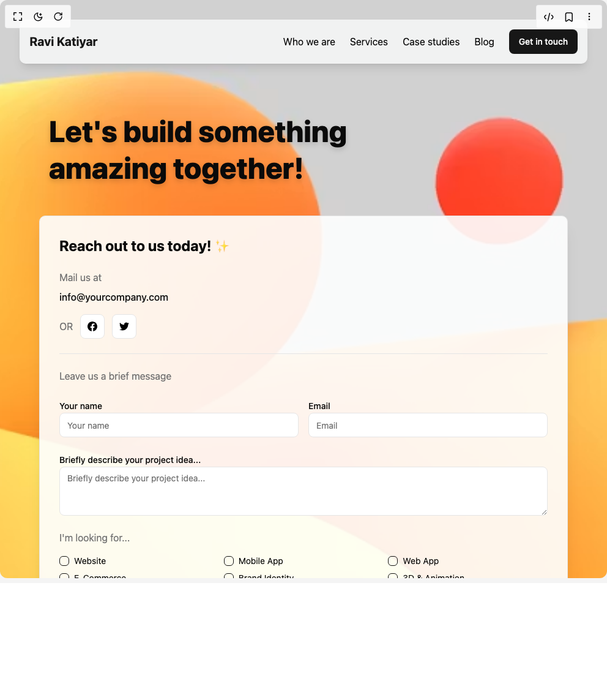

# Build Contact in BuilderStudio

> Build this component in our Agentic IDE: [BuilderStudio](https://builderstudio.dev).
>
> Join the BuilderStudio community on [Discord](https://discord.gg/QdWeSGCqfe) and [Reddit](https://reddit.com/r/builderstudio).



## Component

- Author group: `ravikatiyar`
- Component: `contact`
- Variant: `default`
- Rendered HTML snapshot: [`rendered.html`](rendered.html)

## BuilderStudio prompt

You are implementing a React component based on a component reference.

## Component identity

- Author: ravikatiyar
- Component slug: contact
- Demo slug: default
- Title: contact
- Description: 

## Goal

Recreate this component in a React + TypeScript + Tailwind CSS project. Preserve the visual layout, spacing, colors, border radius, shadows, interaction behavior, animation behavior, responsive behavior, and dark mode behavior shown in the rendered demo.

## Implementation requirements

- Use React and TypeScript.
- Use Tailwind CSS classes whenever possible.
- Keep the component self-contained unless the source files require helper components.
- If the source uses CSS variables, custom CSS, animations, or keyframes, include them.
- If the source uses external packages, list and use the required packages.
- Preserve accessibility attributes, button semantics, links, keyboard behavior, and ARIA attributes when visible in the source.
- Do not replace the component with a simplified placeholder.
- Return complete production-ready code.

## Dependencies

No reference metadata available.

## Rendered DOM snapshot

This is the rendered demo HTML extracted from the live preview. Use it to verify structure, class names, visible content, and layout.

```html
<div id="root"><div class="w-screen min-h-screen flex justify-center items-center"><div class="w-screen min-h-screen flex justify-center items-center"><div class="min-h-screen bg-gradient-to-br from-gray-100 to-gray-300 dark:from-gray-900 dark:to-black"><section class="relative min-h-screen w-screen overflow-hidden bg-background"><div class="absolute inset-0 bg-cover bg-center transition-all duration-500 ease-in-out" style="background-image: url(&quot;https://images.unsplash.com/photo-1742273330004-ef9c9d228530?ixlib=rb-4.1.0&amp;ixid=M3wxMjA3fDB8MHx0b3BpYy1mZWVkfDY0fENEd3V3WEpBYkV3fHxlbnwwfHx8fHw%3D&amp;auto=format&amp;fit=crop&amp;q=60&amp;w=900&quot;);"><div class="absolute inset-0 z-0 overflow-hidden"><div class="absolute bg-white/20 rounded-full animate-bubble opacity-0" style="width: 14.8466px; height: 25.9067px; left: 48.2968%; animation-delay: 4.09468s; animation-duration: 15.2937s; top: 87.2135%;"></div><div class="absolute bg-white/20 rounded-full animate-bubble opacity-0" style="width: 21.6564px; height: 27.0757px; left: 56.8163%; animation-delay: 5.61002s; animation-duration: 10.1387s; top: 82.9467%;"></div><div class="absolute bg-white/20 rounded-full animate-bubble opacity-0" style="width: 14.4247px; height: 28.9733px; left: 53.4425%; animation-delay: 9.72687s; animation-duration: 13.6488s; top: 11.0872%;"></div><div class="absolute bg-white/20 rounded-full animate-bubble opacity-0" style="width: 10.279px; height: 24.8321px; left: 13.7708%; animation-delay: 3.99228s; animation-duration: 16.7711s; top: 13.518%;"></div><div class="absolute bg-white/20 rounded-full animate-bubble opacity-0" style="width: 26.8736px; height: 10.9745px; left: 21.8086%; animation-delay: 2.86953s; animation-duration: 25.0699s; top: 28.9437%;"></div><div class="absolute bg-white/20 rounded-full animate-bubble opacity-0" style="width: 24.0664px; height: 25.6442px; left: 73.8889%; animation-delay: 0.0967645s; animation-duration: 21.1776s; top: 8.86296%;"></div><div class="absolute bg-white/20 rounded-full animate-bubble opacity-0" style="width: 29.9185px; height: 21.7065px; left: 47.0013%; animation-delay: 8.60572s; animation-duration: 13.3997s; top: 71.5235%;"></div><div class="absolute bg-white/20 rounded-full animate-bubble opacity-0" style="width: 24.9414px; height: 29.0138px; left: 20.3501%; animation-delay: 5.87467s; animation-duration: 27.5208s; top: 45.7377%;"></div><div class="absolute bg-white/20 rounded-full animate-bubble opacity-0" style="width: 22.1315px; height: 24.5214px; left: 12.147%; animation-delay: 7.37688s; animation-duration: 13.0135s; top: 21.865%;"></div><div class="absolute bg-white/20 rounded-full animate-bubble opacity-0" style="width: 23.7336px; height: 18.5207px; left: 15.5484%; animation-delay: 5.90419s; animation-duration: 23.9345s; top: 14.3263%;"></div><div class="absolute bg-white/20 rounded-full animate-bubble opacity-0" style="width: 24.9243px; height: 23.488px; left: 58.2127%; animation-delay: 3.68368s; animation-duration: 24.1517s; top: 77.4227%;"></div><div class="absolute bg-white/20 rounded-full animate-bubble opacity-0" style="width: 11.4814px; height: 29.2363px; left: 59.4476%; animation-delay: 7.84148s; animation-duration: 10.2784s; top: 67.9358%;"></div><div class="absolute bg-white/20 rounded-full animate-bubble opacity-0" style="width: 11.982px; height: 26.132px; left: 21.1583%; animation-delay: 8.59916s; animation-duration: 17.0724s; top: 93.5943%;"></div><div class="absolute bg-white/20 rounded-full animate-bubble opacity-0" style="width: 27.9573px; height: 25.1696px; left: 8.68931%; animation-delay: 5.86811s; animation-duration: 15.6456s; top: 1.85821%;"></div><div class="absolute bg-white/20 rounded-full animate-bubble opacity-0" style="width: 20.6682px; height: 16.8387px; left: 65.675%; animation-delay: 7.76932s; animation-duration: 15.9042s; top: 46.0156%;"></div></div></div><div class="relative z-10 flex flex-col items-center justify-between w-full h-full p-4 md:p-8 lg:p-12"><nav class="w-full max-w-7xl flex items-center justify-between p-4 bg-card/70 backdrop-blur-sm rounded-lg shadow-lg mb-8"><div class="flex items-center space-x-2"><span class="font-bold text-xl text-primary">Ravi Katiyar</span></div><div class="hidden md:flex items-center space-x-6"><a href="#who-we are" class="text-foreground hover:text-primary transition-colors">Who we are</a><a href="#services" class="text-foreground hover:text-primary transition-colors">Services</a><a href="#case-studies" class="text-foreground hover:text-primary transition-colors">Case studies</a><a href="#blog" class="text-foreground hover:text-primary transition-colors">Blog</a><button class="inline-flex items-center justify-center whitespace-nowrap rounded-md text-sm font-medium ring-offset-background transition-colors focus-visible:outline-none focus-visible:ring-2 focus-visible:ring-ring focus-visible:ring-offset-2 disabled:pointer-events-none disabled:opacity-50 bg-primary text-primary-foreground hover:bg-primary/90 h-10 px-4 py-2">Get in touch</button></div><button class="inline-flex items-center justify-center whitespace-nowrap rounded-md text-sm font-medium ring-offset-background transition-colors focus-visible:outline-none focus-visible:ring-2 focus-visible:ring-ring focus-visible:ring-offset-2 disabled:pointer-events-none disabled:opacity-50 bg-primary text-primary-foreground hover:bg-primary/90 h-10 px-4 py-2 md:hidden">Menu</button></nav><div class="grid grid-cols-1 lg:grid-cols-2 gap-8 w-full max-w-7xl p-4 md:p-8 rounded-xl flex-grow"><div class="flex flex-col justify-end p-4 lg:p-8"><h1 class="text-4xl md:text-5xl lg:text-6xl font-extrabold text-foreground leading-tight drop-shadow-lg max-w-lg">Let's build something amazing together!</h1></div><div class="bg-background/90 p-6 md:p-8 rounded-lg shadow-xl border border-border"><h2 class="text-2xl font-bold text-foreground mb-6">Reach out to us today! ✨</h2><div class="mb-6"><p class="text-muted-foreground mb-2">Mail us at</p><a href="mailto:info@yourcompany.com" class="text-primary hover:underline font-medium">info@yourcompany.com</a><div class="flex items-center space-x-3 mt-4"><span class="text-muted-foreground">OR</span><a href="https://facebook.com/yourprofile" aria-label="Facebook" class="inline-flex items-center justify-center whitespace-nowrap rounded-md text-sm font-medium ring-offset-background transition-colors focus-visible:outline-none focus-visible:ring-2 focus-visible:ring-ring focus-visible:ring-offset-2 disabled:pointer-events-none disabled:opacity-50 border border-input bg-background hover:bg-accent hover:text-accent-foreground h-10 w-10"></a><a href="https://twitter.com/yourprofile" aria-label="Twitter" class="inline-flex items-center justify-center whitespace-nowrap rounded-md text-sm font-medium ring-offset-background transition-colors focus-visible:outline-none focus-visible:ring-2 focus-visible:ring-ring focus-visible:ring-offset-2 disabled:pointer-events-none disabled:opacity-50 border border-input bg-background hover:bg-accent hover:text-accent-foreground h-10 w-10"></a></div></div><hr class="my-6 border-border"><form class="space-y-6"><p class="text-muted-foreground">Leave us a brief message</p><div class="grid grid-cols-1 md:grid-cols-2 gap-4"><div class="space-y-2"><label class="text-sm font-medium leading-none peer-disabled:cursor-not-allowed peer-disabled:opacity-70" for="name">Your name</label><input class="flex h-10 w-full rounded-md border border-input bg-background px-3 py-2 text-sm ring-offset-background file:border-0 file:bg-transparent file:text-sm file:font-medium file:text-foreground placeholder:text-muted-foreground focus-visible:outline-none focus-visible:ring-2 focus-visible:ring-ring focus-visible:ring-offset-2 disabled:cursor-not-allowed disabled:opacity-50" id="name" placeholder="Your name" required="" value="" name="name"></div><div class="space-y-2"><label class="text-sm font-medium leading-none peer-disabled:cursor-not-allowed peer-disabled:opacity-70" for="email">Email</label><input class="flex h-10 w-full rounded-md border border-input bg-background px-3 py-2 text-sm ring-offset-background file:border-0 file:bg-transparent file:text-sm file:font-medium file:text-foreground placeholder:text-muted-foreground focus-visible:outline-none focus-visible:ring-2 focus-visible:ring-ring focus-visible:ring-offset-2 disabled:cursor-not-allowed disabled:opacity-50" id="email" placeholder="Email" required="" type="email" value="" name="email"></div></div><div class="space-y-2"><label class="text-sm font-medium leading-none peer-disabled:cursor-not-allowed peer-disabled:opacity-70" for="message">Briefly describe your project idea...</label><textarea class="flex w-full rounded-md border border-input bg-background px-3 py-2 text-sm ring-offset-background placeholder:text-muted-foreground focus-visible:outline-none focus-visible:ring-2 focus-visible:ring-ring focus-visible:ring-offset-2 disabled:cursor-not-allowed disabled:opacity-50 min-h-[80px]" id="message" name="message" placeholder="Briefly describe your project idea..." required=""></textarea></div><div class="space-y-4"><p class="text-muted-foreground">I'm looking for...</p><div class="grid grid-cols-2 sm:grid-cols-3 gap-2"><div class="flex items-center space-x-2"><button type="button" role="checkbox" aria-checked="false" data-state="unchecked" value="on" class="peer h-4 w-4 shrink-0 rounded-sm border border-primary ring-offset-background focus-visible:outline-none focus-visible:ring-2 focus-visible:ring-ring focus-visible:ring-offset-2 disabled:cursor-not-allowed disabled:opacity-50 data-[state=checked]:bg-primary data-[state=checked]:text-primary-foreground" id="website"></button><input aria-hidden="true" tabindex="-1" type="checkbox" value="on" style="position: absolute; pointer-events: none; opacity: 0; margin: 0px; transform: translateX(-100%); width: 16px; height: 16px;"><label class="peer-disabled:cursor-not-allowed peer-disabled:opacity-70 text-sm font-normal" for="website">Website</label></div><div class="flex items-center space-x-2"><button type="button" role="checkbox" aria-checked="false" data-state="unchecked" value="on" class="peer h-4 w-4 shrink-0 rounded-sm border border-primary ring-offset-background focus-visible:outline-none focus-visible:ring-2 focus-visible:ring-ring focus-visible:ring-offset-2 disabled:cursor-not-allowed disabled:opacity-50 data-[state=checked]:bg-primary data-[state=checked]:text-primary-foreground" id="mobile-app"></button><input aria-hidden="true" tabindex="-1" type="checkbox" value="on" style="position: absolute; pointer-events: none; opacity: 0; margin: 0px; transform: translateX(-100%); width: 16px; height: 16px;"><label class="peer-disabled:cursor-not-allowed peer-disabled:opacity-70 text-sm font-normal" for="mobile-app">Mobile App</label></div><div class="flex items-center space-x-2"><button type="button" role="checkbox" aria-checked="false" data-state="unchecked" value="on" class="peer h-4 w-4 shrink-0 rounded-sm border border-primary ring-offset-background focus-visible:outline-none focus-visible:ring-2 focus-visible:ring-ring focus-visible:ring-offset-2 disabled:cursor-not-allowed disabled:opacity-50 data-[state=checked]:bg-primary data-[state=checked]:text-primary-foreground" id="web-app"></button><input aria-hidden="true" tabindex="-1" type="checkbox" value="on" style="position: absolute; pointer-events: none; opacity: 0; margin: 0px; transform: translateX(-100%); width: 16px; height: 16px;"><label class="peer-disabled:cursor-not-allowed peer-disabled:opacity-70 text-sm font-normal" for="web-app">Web App</label></div><div class="flex items-center space-x-2"><button type="button" role="checkbox" aria-checked="false" data-state="unchecked" value="on" class="peer h-4 w-4 shrink-0 rounded-sm border border-primary ring-offset-background focus-visible:outline-none focus-visible:ring-2 focus-visible:ring-ring focus-visible:ring-offset-2 disabled:cursor-not-allowed disabled:opacity-50 data-[state=checked]:bg-primary data-[state=checked]:text-primary-foreground" id="e-commerce"></button><input aria-hidden="true" tabindex="-1" type="checkbox" value="on" style="position: absolute; pointer-events: none; opacity: 0; margin: 0px; transform: translateX(-100%); width: 16px; height: 16px;"><label class="peer-disabled:cursor-not-allowed peer-disabled:opacity-70 text-sm font-normal" for="e-commerce">E-Commerce</label></div><div class="flex items-center space-x-2"><button type="button" role="checkbox" aria-checked="false" data-state="unchecked" value="on" class="peer h-4 w-4 shrink-0 rounded-sm border border-primary ring-offset-background focus-visible:outline-none focus-visible:ring-2 focus-visible:ring-ring focus-visible:ring-offset-2 disabled:cursor-not-allowed disabled:opacity-50 data-[state=checked]:bg-primary data-[state=checked]:text-primary-foreground" id="brand-identity"></button><input aria-hidden="true" tabindex="-1" type="checkbox" value="on" style="position: absolute; pointer-events: none; opacity: 0; margin: 0px; transform: translateX(-100%); width: 16px; height: 16px;"><label class="peer-disabled:cursor-not-allowed peer-disabled:opacity-70 text-sm font-normal" for="brand-identity">Brand Identity</label></div><div class="flex items-center space-x-2"><button type="button" role="checkbox" aria-checked="false" data-state="unchecked" value="on" class="peer h-4 w-4 shrink-0 rounded-sm border border-primary ring-offset-background focus-visible:outline-none focus-visible:ring-2 focus-visible:ring-ring focus-visible:ring-offset-2 disabled:cursor-not-allowed disabled:opacity-50 data-[state=checked]:bg-primary data-[state=checked]:text-primary-foreground" id="3d-&amp;-animation"></button><input aria-hidden="true" tabindex="-1" type="checkbox" value="on" style="position: absolute; pointer-events: none; opacity: 0; margin: 0px; transform: translateX(-100%); width: 16px; height: 16px;"><label class="peer-disabled:cursor-not-allowed peer-disabled:opacity-70 text-sm font-normal" for="3d-&amp;-animation">3D &amp; Animation</label></div><div class="flex items-center space-x-2"><button type="button" role="checkbox" aria-checked="false" data-state="unchecked" value="on" class="peer h-4 w-4 shrink-0 rounded-sm border border-primary ring-offset-background focus-visible:outline-none focus-visible:ring-2 focus-visible:ring-ring focus-visible:ring-offset-2 disabled:cursor-not-allowed disabled:opacity-50 data-[state=checked]:bg-primary data-[state=checked]:text-primary-foreground" id="social-media-marketing"></button><input aria-hidden="true" tabindex="-1" type="checkbox" value="on" style="position: absolute; pointer-events: none; opacity: 0; margin: 0px; transform: translateX(-100%); width: 16px; height: 16px;"><label class="peer-disabled:cursor-not-allowed peer-disabled:opacity-70 text-sm font-normal" for="social-media-marketing">Social Media Marketing</label></div><div class="flex items-center space-x-2"><button type="button" role="checkbox" aria-checked="false" data-state="unchecked" value="on" class="peer h-4 w-4 shrink-0 rounded-sm border border-primary ring-offset-background focus-visible:outline-none focus-visible:ring-2 focus-visible:ring-ring focus-visible:ring-offset-2 disabled:cursor-not-allowed disabled:opacity-50 data-[state=checked]:bg-primary data-[state=checked]:text-primary-foreground" id="brand-strategy-&amp;-consulting"></button><input aria-hidden="true" tabindex="-1" type="checkbox" value="on" style="position: absolute; pointer-events: none; opacity: 0; margin: 0px; transform: translateX(-100%); width: 16px; height: 16px;"><label class="peer-disabled:cursor-not-allowed peer-disabled:opacity-70 text-sm font-normal" for="brand-strategy-&amp;-consulting">Brand Strategy &amp; Consulting</label></div><div class="flex items-center space-x-2"><button type="button" role="checkbox" aria-checked="false" data-state="unchecked" value="on" class="peer h-4 w-4 shrink-0 rounded-sm border border-primary ring-offset-background focus-visible:outline-none focus-visible:ring-2 focus-visible:ring-ring focus-visible:ring-offset-2 disabled:cursor-not-allowed disabled:opacity-50 data-[state=checked]:bg-primary data-[state=checked]:text-primary-foreground" id="other"></button><input aria-hidden="true" tabindex="-1" type="checkbox" value="on" style="position: absolute; pointer-events: none; opacity: 0; margin: 0px; transform: translateX(-100%); width: 16px; height: 16px;"><label class="peer-disabled:cursor-not-allowed peer-disabled:opacity-70 text-sm font-normal" for="other">Other</label></div></div></div><button class="inline-flex items-center justify-center whitespace-nowrap rounded-md text-sm font-medium ring-offset-background transition-colors focus-visible:outline-none focus-visible:ring-2 focus-visible:ring-ring focus-visible:ring-offset-2 disabled:pointer-events-none disabled:opacity-50 bg-primary text-primary-foreground hover:bg-primary/90 h-10 px-4 py-2 w-full" type="submit">Send a message</button></form></div></div></div><style>
        @keyframes bubble {
          0% {
            transform: translateY(0) translateX(0) scale(0.5);
            opacity: 0;
          }
          50% {
            opacity: 1;
          }
          100% {
            transform: translateY(-100vh) translateX(calc(var(--rand-x-offset) * 10vw)) scale(1.2);
            opacity: 0;
          }
        }
        .animate-bubble {
          animation: bubble var(--animation-duration, 15s) ease-in-out infinite;
          animation-fill-mode: forwards;
          --rand-x-offset: -1;
        }
      </style></section></div></div></div></div>
```

## Reference source files

No reference source files were available.
