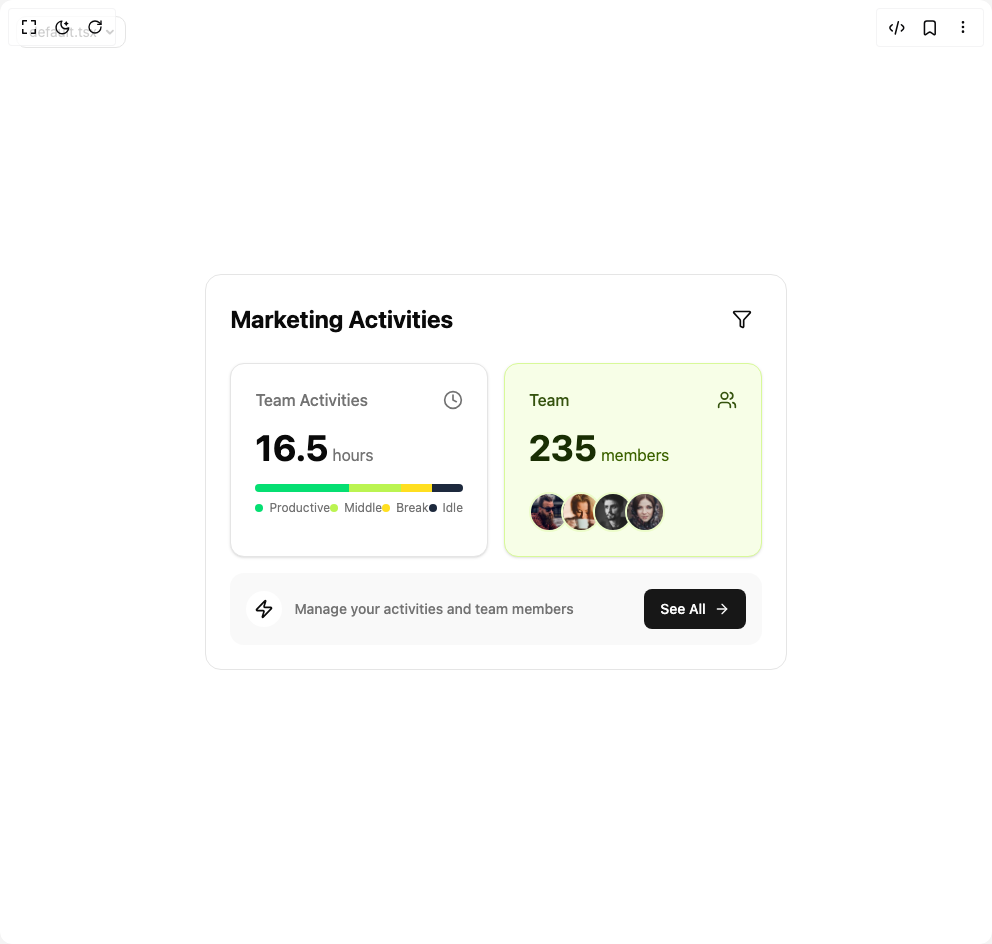

# Build Dashboard 1 in BuilderStudio

> Build this component in our Agentic IDE: [BuilderStudio](https://builderstudio.dev).
>
> Join the BuilderStudio community on [Discord](https://discord.gg/QdWeSGCqfe) and [Reddit](https://reddit.com/r/builderstudio).



## Component

- Author group: `ravikatiyar`
- Component: `dashboard-1`
- Variant: `default`
- Rendered HTML snapshot: [`rendered.html`](rendered.html)

## BuilderStudio prompt

You are implementing a React component based on a component reference.

## Component identity

- Author: ravikatiyar
- Component slug: dashboard-1
- Demo slug: default
- Title: dashboard-1
- Description: 

## Goal

Recreate this component in a React + TypeScript + Tailwind CSS project. Preserve the visual layout, spacing, colors, border radius, shadows, interaction behavior, animation behavior, responsive behavior, and dark mode behavior shown in the rendered demo.

## Implementation requirements

- Use React and TypeScript.
- Use Tailwind CSS classes whenever possible.
- Keep the component self-contained unless the source files require helper components.
- If the source uses CSS variables, custom CSS, animations, or keyframes, include them.
- If the source uses external packages, list and use the required packages.
- Preserve accessibility attributes, button semantics, links, keyboard behavior, and ARIA attributes when visible in the source.
- Do not replace the component with a simplified placeholder.
- Return complete production-ready code.

## Dependencies

No reference metadata available.

## Rendered DOM snapshot

This is the rendered demo HTML extracted from the live preview. Use it to verify structure, class names, visible content, and layout.

```html
<div id="root"><div class="w-screen min-h-screen flex justify-center items-center"><div class="fixed top-4 left-4 z-10"><select class="appearance-none h-8 max-w-[200px] text-sm leading-tight rounded-lg pl-3 pr-7 py-0 border bg-background focus:outline-none focus:ring-0"><option value="default.tsx_MarketingDashboardDemo">default.tsx</option></select><div class="absolute top-1/2 transform -translate-y-1/2 right-2 pointer-events-none"><svg class="w-4 h-4 fill-current" viewBox="0 0 20 20"><path d="M5.516 7.548c.436-.446 1.043-.48 1.576 0L10 10.405l2.908-2.857c.533-.48 1.14-.446 1.576 0 .436.445.408 1.197 0 1.615l-3.734 3.705c-.533.534-1.39.534-1.923 0l-3.734-3.705c-.408-.418-.436-1.17 0-1.615z"></path></svg></div></div><div class="w-screen min-h-screen flex justify-center items-center"><div class="flex items-center justify-center min-h-screen p-4 bg-background"><div class="w-full max-w-2xl p-6 bg-card text-card-foreground rounded-2xl border" style="opacity: 1; transform: none;"><div class="flex items-center justify-between mb-6" style="opacity: 1; transform: none;"><h2 class="text-2xl font-bold">Marketing Activities</h2><button class="inline-flex items-center justify-center whitespace-nowrap rounded-md text-sm font-medium ring-offset-background transition-colors focus-visible:outline-none focus-visible:ring-2 focus-visible:ring-ring focus-visible:ring-offset-2 disabled:pointer-events-none disabled:opacity-50 hover:bg-accent hover:text-accent-foreground h-10 w-10" aria-label="Filter activities"><svg xmlns="http://www.w3.org/2000/svg" width="24" height="24" viewBox="0 0 24 24" fill="none" stroke="currentColor" stroke-width="2" stroke-linecap="round" stroke-linejoin="round" class="lucide lucide-funnel w-5 h-5" aria-hidden="true"><path d="M10 20a1 1 0 0 0 .553.895l2 1A1 1 0 0 0 14 21v-7a2 2 0 0 1 .517-1.341L21.74 4.67A1 1 0 0 0 21 3H3a1 1 0 0 0-.742 1.67l7.225 7.989A2 2 0 0 1 10 14z"></path></svg></button></div><div class="grid grid-cols-1 gap-4 md:grid-cols-2"><div style="opacity: 1; transform: none;"><div class="border bg-card text-card-foreground shadow-sm h-full p-4 overflow-hidden rounded-xl"><div class="p-2"><div class="flex items-center justify-between mb-4"><p class="font-medium text-muted-foreground">Team Activities</p><svg xmlns="http://www.w3.org/2000/svg" width="24" height="24" viewBox="0 0 24 24" fill="none" stroke="currentColor" stroke-width="2" stroke-linecap="round" stroke-linejoin="round" class="lucide lucide-clock w-5 h-5 text-muted-foreground" aria-hidden="true"><circle cx="12" cy="12" r="10"></circle><polyline points="12 6 12 12 16 14"></polyline></svg></div><div class="mb-4"><span class="text-4xl font-bold"><span>16.5</span></span><span class="ml-1 text-muted-foreground">hours</span></div><div class="w-full h-2 mb-2 overflow-hidden rounded-full bg-muted flex"><div class="h-full bg-green-400" style="width: 45%;"></div><div class="h-full bg-lime-300" style="width: 25%;"></div><div class="h-full bg-yellow-300" style="width: 15%;"></div><div class="h-full bg-slate-800 dark:bg-slate-700" style="width: 15%;"></div></div><div class="flex items-center justify-between text-xs text-muted-foreground"><div class="flex items-center gap-1.5"><span class="w-2 h-2 rounded-full bg-green-400"></span><span>Productive</span></div><div class="flex items-center gap-1.5"><span class="w-2 h-2 rounded-full bg-lime-300"></span><span>Middle</span></div><div class="flex items-center gap-1.5"><span class="w-2 h-2 rounded-full bg-yellow-300"></span><span>Break</span></div><div class="flex items-center gap-1.5"><span class="w-2 h-2 rounded-full bg-slate-800 dark:bg-slate-700"></span><span>Idle</span></div></div></div></div></div><div style="opacity: 1; transform: none;"><div class="border text-card-foreground shadow-sm h-full p-4 overflow-hidden rounded-xl bg-lime-50 dark:bg-lime-900/30 border-lime-200 dark:border-lime-800"><div class="p-2"><div class="flex items-center justify-between mb-4"><p class="font-medium text-lime-900 dark:text-lime-200">Team</p><svg xmlns="http://www.w3.org/2000/svg" width="24" height="24" viewBox="0 0 24 24" fill="none" stroke="currentColor" stroke-width="2" stroke-linecap="round" stroke-linejoin="round" class="lucide lucide-users w-5 h-5 text-lime-900 dark:text-lime-200" aria-hidden="true"><path d="M16 21v-2a4 4 0 0 0-4-4H6a4 4 0 0 0-4 4v2"></path><circle cx="9" cy="7" r="4"></circle><path d="M22 21v-2a4 4 0 0 0-3-3.87"></path><path d="M16 3.13a4 4 0 0 1 0 7.75"></path></svg></div><div class="mb-6"><span class="text-4xl font-bold text-lime-950 dark:text-lime-50"><span>235</span></span><span class="ml-1 text-lime-800 dark:text-lime-300">members</span></div><div class="flex -space-x-2"><div style="opacity: 1; transform: none;"><span class="relative flex h-10 w-10 shrink-0 overflow-hidden rounded-full border-2 border-lime-100 dark:border-lime-900"></span></div><div style="opacity: 1; transform: none;"><span class="relative flex h-10 w-10 shrink-0 overflow-hidden rounded-full border-2 border-lime-100 dark:border-lime-900"></span></div><div style="opacity: 1; transform: none;"><span class="relative flex h-10 w-10 shrink-0 overflow-hidden rounded-full border-2 border-lime-100 dark:border-lime-900"></span></div><div style="opacity: 1; transform: none;"><span class="relative flex h-10 w-10 shrink-0 overflow-hidden rounded-full border-2 border-lime-100 dark:border-lime-900"></span></div></div></div></div></div></div><div class="mt-4" style="opacity: 1; transform: none;"><div class="flex items-center justify-between p-4 rounded-xl bg-muted/60"><div class="flex items-center gap-3"><div class="p-2 rounded-full bg-background"><svg xmlns="http://www.w3.org/2000/svg" width="24" height="24" viewBox="0 0 24 24" fill="none" stroke="currentColor" stroke-width="2" stroke-linecap="round" stroke-linejoin="round" class="lucide lucide-zap w-5 h-5 text-foreground" aria-hidden="true"><path d="M4 14a1 1 0 0 1-.78-1.63l9.9-10.2a.5.5 0 0 1 .86.46l-1.92 6.02A1 1 0 0 0 13 10h7a1 1 0 0 1 .78 1.63l-9.9 10.2a.5.5 0 0 1-.86-.46l1.92-6.02A1 1 0 0 0 11 14z"></path></svg></div><p class="text-sm font-medium text-muted-foreground">Manage your activities and team members</p></div><button class="inline-flex items-center justify-center whitespace-nowrap rounded-md text-sm font-medium ring-offset-background transition-colors focus-visible:outline-none focus-visible:ring-2 focus-visible:ring-ring focus-visible:ring-offset-2 disabled:pointer-events-none disabled:opacity-50 bg-primary text-primary-foreground hover:bg-primary/90 h-10 px-4 py-2 shrink-0">See All<svg xmlns="http://www.w3.org/2000/svg" width="24" height="24" viewBox="0 0 24 24" fill="none" stroke="currentColor" stroke-width="2" stroke-linecap="round" stroke-linejoin="round" class="lucide lucide-arrow-right w-4 h-4 ml-2" aria-hidden="true"><path d="M5 12h14"></path><path d="m12 5 7 7-7 7"></path></svg></button></div></div></div></div></div></div></div>
```

## Reference source files

No reference source files were available.
