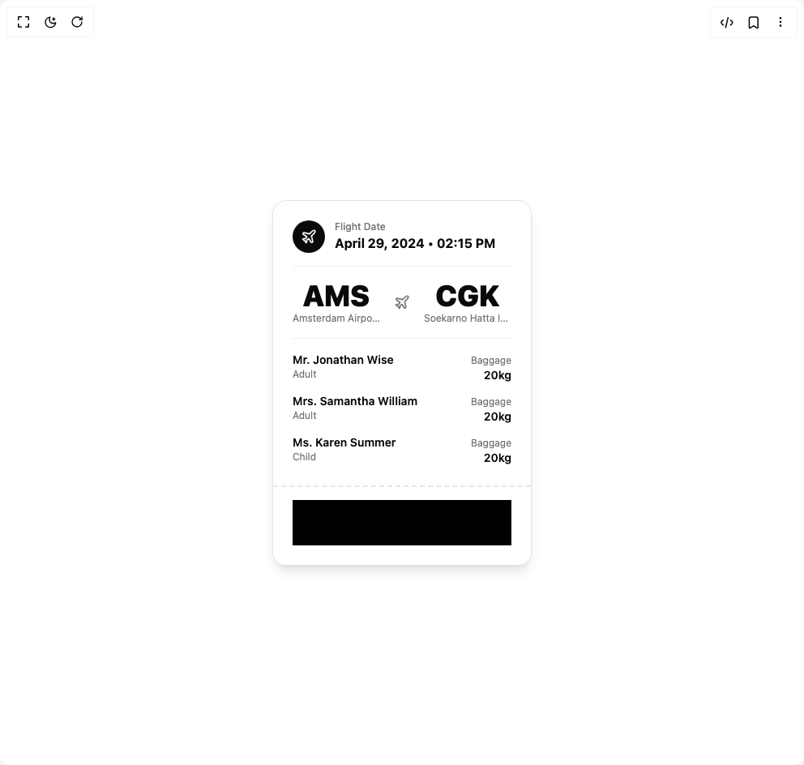

# Build Flight Ticket in BuilderStudio

> Build this component in our Agentic IDE: [BuilderStudio](https://builderstudio.dev).
>
> Join the BuilderStudio community on [Discord](https://discord.gg/QdWeSGCqfe) and [Reddit](https://reddit.com/r/builderstudio).



## Component

- Author group: `ravikatiyar`
- Component: `flight-ticket`
- Variant: `default`
- Rendered HTML snapshot: [`rendered.html`](rendered.html)

## BuilderStudio prompt

You are implementing a React component based on a component reference.

## Component identity

- Author: ravikatiyar
- Component slug: flight-ticket
- Demo slug: default
- Title: flight-ticket
- Description: 

## Goal

Recreate this component in a React + TypeScript + Tailwind CSS project. Preserve the visual layout, spacing, colors, border radius, shadows, interaction behavior, animation behavior, responsive behavior, and dark mode behavior shown in the rendered demo.

## Implementation requirements

- Use React and TypeScript.
- Use Tailwind CSS classes whenever possible.
- Keep the component self-contained unless the source files require helper components.
- If the source uses CSS variables, custom CSS, animations, or keyframes, include them.
- If the source uses external packages, list and use the required packages.
- Preserve accessibility attributes, button semantics, links, keyboard behavior, and ARIA attributes when visible in the source.
- Do not replace the component with a simplified placeholder.
- Return complete production-ready code.

## Dependencies

No reference metadata available.

## Rendered DOM snapshot

This is the rendered demo HTML extracted from the live preview. Use it to verify structure, class names, visible content, and layout.

```html
<div id="root"><div class="w-screen min-h-screen flex justify-center items-center"><div class="w-screen min-h-screen flex justify-center items-center"><div class="flex min-h-screen w-full items-center justify-center bg-background p-4"><div class="w-full max-w-xs font-sans bg-card text-card-foreground border rounded-2xl shadow-lg overflow-hidden" aria-label="Flight ticket from AMS to CGK" style="opacity: 1; transform: none;"><div class="p-6 space-y-4"><div class="flex items-center gap-3"><div class="flex items-center justify-center w-10 h-10 bg-card-foreground text-background rounded-full"><svg xmlns="http://www.w3.org/2000/svg" width="24" height="24" viewBox="0 0 24 24" fill="none" stroke="currentColor" stroke-width="2" stroke-linecap="round" stroke-linejoin="round" class="lucide lucide-plane w-5 h-5" aria-hidden="true"><path d="M17.8 19.2 16 11l3.5-3.5C21 6 21.5 4 21 3c-1-.5-3 0-4.5 1.5L13 8 4.8 6.2c-.5-.1-.9.1-1.1.5l-.3.5c-.2.5-.1 1 .3 1.3L9 12l-2 3H4l-1 1 3 2 2 3 1-1v-3l3-2 3.5 5.3c.3.4.8.5 1.3.3l.5-.2c.4-.3.6-.7.5-1.2z"></path></svg></div><div><p class="text-xs text-muted-foreground font-medium">Flight Date</p><p class="text-base font-bold">April 29, 2024 • 02:15 PM</p></div></div><hr class="border-border/60"><div class="flex items-center justify-between text-center"><div class="w-2/5"><h2 class="text-4xl font-black">AMS</h2><p class="text-xs text-muted-foreground truncate">Amsterdam Airport Schiphol</p></div><svg xmlns="http://www.w3.org/2000/svg" width="24" height="24" viewBox="0 0 24 24" fill="none" stroke="currentColor" stroke-width="2" stroke-linecap="round" stroke-linejoin="round" class="lucide lucide-plane w-5 h-5 text-muted-foreground" aria-hidden="true"><path d="M17.8 19.2 16 11l3.5-3.5C21 6 21.5 4 21 3c-1-.5-3 0-4.5 1.5L13 8 4.8 6.2c-.5-.1-.9.1-1.1.5l-.3.5c-.2.5-.1 1 .3 1.3L9 12l-2 3H4l-1 1 3 2 2 3 1-1v-3l3-2 3.5 5.3c.3.4.8.5 1.3.3l.5-.2c.4-.3.6-.7.5-1.2z"></path></svg><div class="w-2/5"><h2 class="text-4xl font-black">CGK</h2><p class="text-xs text-muted-foreground truncate">Soekarno Hatta International Airport</p></div></div><hr class="border-border/60"><div class="space-y-3"><div class="flex justify-between items-baseline"><div><p class="font-semibold text-sm">Mr. Jonathan Wise</p><p class="text-xs text-muted-foreground">Adult</p></div><div class="text-right"><p class="text-xs text-muted-foreground">Baggage</p><p class="font-semibold text-sm">20kg</p></div></div><div class="flex justify-between items-baseline"><div><p class="font-semibold text-sm">Mrs. Samantha William</p><p class="text-xs text-muted-foreground">Adult</p></div><div class="text-right"><p class="text-xs text-muted-foreground">Baggage</p><p class="font-semibold text-sm">20kg</p></div></div><div class="flex justify-between items-baseline"><div><p class="font-semibold text-sm">Ms. Karen Summer</p><p class="text-xs text-muted-foreground">Child</p></div><div class="text-right"><p class="text-xs text-muted-foreground">Baggage</p><p class="font-semibold text-sm">20kg</p></div></div></div></div><div class="bg-card p-6 pt-4 border-t-2 border-dashed border-border"><svg aria-hidden="true" class="w-full h-14" preserveAspectRatio="none"><rect x="0" y="0" width="100%" height="100%" fill="hsl(var(--card))"></rect><rect x="0%" y="0" width="0.6px" height="100%" fill="hsl(var(--card-foreground))"></rect><rect x="1.25%" y="0" width="1.2px" height="100%" fill="hsl(var(--card-foreground))"></rect><rect x="2.5%" y="0" width="0.6px" height="100%" fill="hsl(var(--card-foreground))"></rect><rect x="3.75%" y="0" width="0.6px" height="100%" fill="hsl(var(--card-foreground))"></rect><rect x="5%" y="0" width="0.6px" height="100%" fill="hsl(var(--card-foreground))"></rect><rect x="6.25%" y="0" width="1.2px" height="100%" fill="hsl(var(--card-foreground))"></rect><rect x="7.5%" y="0" width="1.2px" height="100%" fill="hsl(var(--card-foreground))"></rect><rect x="8.75%" y="0" width="0.6px" height="100%" fill="hsl(var(--card-foreground))"></rect><rect x="10%" y="0" width="1.2px" height="100%" fill="hsl(var(--card-foreground))"></rect><rect x="11.25%" y="0" width="1.2px" height="100%" fill="hsl(var(--card-foreground))"></rect><rect x="12.5%" y="0" width="0.6px" height="100%" fill="hsl(var(--card-foreground))"></rect><rect x="13.75%" y="0" width="1.2px" height="100%" fill="hsl(var(--card-foreground))"></rect><rect x="15%" y="0" width="1.2px" height="100%" fill="hsl(var(--card-foreground))"></rect><rect x="16.25%" y="0" width="1.2px" height="100%" fill="hsl(var(--card-foreground))"></rect><rect x="17.5%" y="0" width="1.2px" height="100%" fill="hsl(var(--card-foreground))"></rect><rect x="18.75%" y="0" width="0.6px" height="100%" fill="hsl(var(--card-foreground))"></rect><rect x="20%" y="0" width="0.6px" height="100%" fill="hsl(var(--card-foreground))"></rect><rect x="21.25%" y="0" width="1.2px" height="100%" fill="hsl(var(--card-foreground))"></rect><rect x="22.5%" y="0" width="0.6px" height="100%" fill="hsl(var(--card-foreground))"></rect><rect x="23.75%" y="0" width="0.6px" height="100%" fill="hsl(var(--card-foreground))"></rect><rect x="25%" y="0" width="1.2px" height="100%" fill="hsl(var(--card-foreground))"></rect><rect x="26.25%" y="0" width="0.6px" height="100%" fill="hsl(var(--card-foreground))"></rect><rect x="27.5%" y="0" width="0.6px" height="100%" fill="hsl(var(--card-foreground))"></rect><rect x="28.75%" y="0" width="0.6px" height="100%" fill="hsl(var(--card-foreground))"></rect><rect x="30%" y="0" width="0.6px" height="100%" fill="hsl(var(--card-foreground))"></rect><rect x="31.25%" y="0" width="1.2px" height="100%" fill="hsl(var(--card-foreground))"></rect><rect x="32.5%" y="0" width="0.6px" height="100%" fill="hsl(var(--card-foreground))"></rect><rect x="33.75%" y="0" width="0.6px" height="100%" fill="hsl(var(--card-foreground))"></rect><rect x="35%" y="0" width="1.2px" height="100%" fill="hsl(var(--card-foreground))"></rect><rect x="36.25%" y="0" width="1.2px" height="100%" fill="hsl(var(--card-foreground))"></rect><rect x="37.5%" y="0" width="1.2px" height="100%" fill="hsl(var(--card-foreground))"></rect><rect x="38.75%" y="0" width="1.2px" height="100%" fill="hsl(var(--card-foreground))"></rect><rect x="40%" y="0" width="1.2px" height="100%" fill="hsl(var(--card-foreground))"></rect><rect x="41.25%" y="0" width="1.2px" height="100%" fill="hsl(var(--card-foreground))"></rect><rect x="42.5%" y="0" width="0.6px" height="100%" fill="hsl(var(--card-foreground))"></rect><rect x="43.75%" y="0" width="1.2px" height="100%" fill="hsl(var(--card-foreground))"></rect><rect x="45%" y="0" width="1.2px" height="100%" fill="hsl(var(--card-foreground))"></rect><rect x="46.25%" y="0" width="0.6px" height="100%" fill="hsl(var(--card-foreground))"></rect><rect x="47.5%" y="0" width="1.2px" height="100%" fill="hsl(var(--card-foreground))"></rect><rect x="48.75%" y="0" width="1.2px" height="100%" fill="hsl(var(--card-foreground))"></rect><rect x="50%" y="0" width="0.6px" height="100%" fill="hsl(var(--card-foreground))"></rect><rect x="51.25%" y="0" width="1.2px" height="100%" fill="hsl(var(--card-foreground))"></rect><rect x="52.5%" y="0" width="0.6px" height="100%" fill="hsl(var(--card-foreground))"></rect><rect x="53.75%" y="0" width="0.6px" height="100%" fill="hsl(var(--card-foreground))"></rect><rect x="55%" y="0" width="0.6px" height="100%" fill="hsl(var(--card-foreground))"></rect><rect x="56.25%" y="0" width="1.2px" height="100%" fill="hsl(var(--card-foreground))"></rect><rect x="57.5%" y="0" width="0.6px" height="100%" fill="hsl(var(--card-foreground))"></rect><rect x="58.75%" y="0" width="0.6px" height="100%" fill="hsl(var(--card-foreground))"></rect><rect x="60%" y="0" width="1.2px" height="100%" fill="hsl(var(--card-foreground))"></rect><rect x="61.25%" y="0" width="0.6px" height="100%" fill="hsl(var(--card-foreground))"></rect><rect x="62.5%" y="0" width="0.6px" height="100%" fill="hsl(var(--card-foreground))"></rect><rect x="63.75%" y="0" width="1.2px" height="100%" fill="hsl(var(--card-foreground))"></rect><rect x="65%" y="0" width="0.6px" height="100%" fill="hsl(var(--card-foreground))"></rect><rect x="66.25%" y="0" width="0.6px" height="100%" fill="hsl(var(--card-foreground))"></rect><rect x="67.5%" y="0" width="0.6px" height="100%" fill="hsl(var(--card-foreground))"></rect><rect x="68.75%" y="0" width="1.2px" height="100%" fill="hsl(var(--card-foreground))"></rect><rect x="70%" y="0" width="1.2px" height="100%" fill="hsl(var(--card-foreground))"></rect><rect x="71.25%" y="0" width="1.2px" height="100%" fill="hsl(var(--card-foreground))"></rect><rect x="72.5%" y="0" width="1.2px" height="100%" fill="hsl(var(--card-foreground))"></rect><rect x="73.75%" y="0" width="1.2px" height="100%" fill="hsl(var(--card-foreground))"></rect><rect x="75%" y="0" width="1.2px" height="100%" fill="hsl(var(--card-foreground))"></rect><rect x="76.25%" y="0" width="1.2px" height="100%" fill="hsl(var(--card-foreground))"></rect><rect x="77.5%" y="0" width="1.2px" height="100%" fill="hsl(var(--card-foreground))"></rect><rect x="78.75%" y="0" width="1.2px" height="100%" fill="hsl(var(--card-foreground))"></rect><rect x="80%" y="0" width="0.6px" height="100%" fill="hsl(var(--card-foreground))"></rect><rect x="81.25%" y="0" width="0.6px" height="100%" fill="hsl(var(--card-foreground))"></rect><rect x="82.5%" y="0" width="0.6px" height="100%" fill="hsl(var(--card-foreground))"></rect><rect x="83.75%" y="0" width="1.2px" height="100%" fill="hsl(var(--card-foreground))"></rect><rect x="85%" y="0" width="0.6px" height="100%" fill="hsl(var(--card-foreground))"></rect><rect x="86.25%" y="0" width="1.2px" height="100%" fill="hsl(var(--card-foreground))"></rect><rect x="87.5%" y="0" width="0.6px" height="100%" fill="hsl(var(--card-foreground))"></rect><rect x="88.75%" y="0" width="1.2px" height="100%" fill="hsl(var(--card-foreground))"></rect><rect x="90%" y="0" width="1.2px" height="100%" fill="hsl(var(--card-foreground))"></rect><rect x="91.25%" y="0" width="1.2px" height="100%" fill="hsl(var(--card-foreground))"></rect><rect x="92.5%" y="0" width="1.2px" height="100%" fill="hsl(var(--card-foreground))"></rect><rect x="93.75%" y="0" width="1.2px" height="100%" fill="hsl(var(--card-foreground))"></rect><rect x="95%" y="0" width="1.2px" height="100%" fill="hsl(var(--card-foreground))"></rect><rect x="96.25%" y="0" width="1.2px" height="100%" fill="hsl(var(--card-foreground))"></rect><rect x="97.5%" y="0" width="1.2px" height="100%" fill="hsl(var(--card-foreground))"></rect><rect x="98.75%" y="0" width="1.2px" height="100%" fill="hsl(var(--card-foreground))"></rect></svg></div></div></div></div></div></div>
```

## Reference source files

No reference source files were available.
