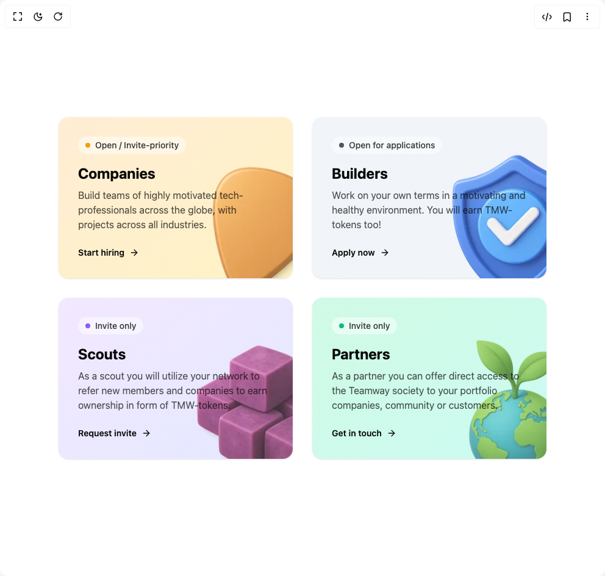

# Build Gradient Card in BuilderStudio

> Build this component in our Agentic IDE: [BuilderStudio](https://builderstudio.dev).
>
> Join the BuilderStudio community on [Discord](https://discord.gg/QdWeSGCqfe) and [Reddit](https://reddit.com/r/builderstudio).



## Component

- Author group: `ravikatiyar`
- Component: `gradient-card`
- Variant: `default`
- Rendered HTML snapshot: [`rendered.html`](rendered.html)

## BuilderStudio prompt

You are implementing a React component based on a component reference.

## Component identity

- Author: ravikatiyar
- Component slug: gradient-card
- Demo slug: default
- Title: gradient-card
- Description: 

## Goal

Recreate this component in a React + TypeScript + Tailwind CSS project. Preserve the visual layout, spacing, colors, border radius, shadows, interaction behavior, animation behavior, responsive behavior, and dark mode behavior shown in the rendered demo.

## Implementation requirements

- Use React and TypeScript.
- Use Tailwind CSS classes whenever possible.
- Keep the component self-contained unless the source files require helper components.
- If the source uses CSS variables, custom CSS, animations, or keyframes, include them.
- If the source uses external packages, list and use the required packages.
- Preserve accessibility attributes, button semantics, links, keyboard behavior, and ARIA attributes when visible in the source.
- Do not replace the component with a simplified placeholder.
- Return complete production-ready code.

## Dependencies

No reference metadata available.

## Rendered DOM snapshot

This is the rendered demo HTML extracted from the live preview. Use it to verify structure, class names, visible content, and layout.

```html
<div id="root"><div class="w-screen min-h-screen flex justify-center items-center"><div class="w-screen min-h-screen flex justify-center items-center"><div class="p-4 sm:p-8"><div class="grid grid-cols-1 gap-8 md:grid-cols-2 lg:gap-10"><div class="h-full" style="transform: none;"><div class="relative flex flex-col justify-between h-full w-full overflow-hidden rounded-2xl p-8 shadow-sm transition-shadow duration-300 hover:shadow-lg bg-gradient-to-br from-orange-100 to-amber-200/50"><div class="z-10 flex flex-col h-full"><div class="mb-4 inline-flex items-center gap-2 rounded-full bg-background/50 px-3 py-1 text-sm font-medium text-foreground/80 backdrop-blur-sm w-fit"><span class="h-2 w-2 rounded-full" style="background-color: rgb(245, 158, 11);"></span>Open / Invite-priority</div><div class="flex-grow"><h3 class="text-2xl font-bold text-foreground mb-2">Companies</h3><p class="text-foreground/70 max-w-xs">Build teams of highly motivated tech-professionals across the globe, with projects across all industries.</p></div><a href="#" class="group mt-6 inline-flex items-center gap-2 text-sm font-semibold text-foreground">Start hiring<svg xmlns="http://www.w3.org/2000/svg" width="24" height="24" viewBox="0 0 24 24" fill="none" stroke="currentColor" stroke-width="2" stroke-linecap="round" stroke-linejoin="round" class="lucide lucide-arrow-right h-4 w-4 transition-transform duration-300 group-hover:translate-x-1" aria-hidden="true"><path d="M5 12h14"></path><path d="m12 5 7 7-7 7"></path></svg></a></div></div></div><div class="h-full" style="transform: none;"><div class="relative flex flex-col justify-between h-full w-full overflow-hidden rounded-2xl p-8 shadow-sm transition-shadow duration-300 hover:shadow-lg bg-gradient-to-br from-slate-100 to-slate-200/50"><div class="z-10 flex flex-col h-full"><div class="mb-4 inline-flex items-center gap-2 rounded-full bg-background/50 px-3 py-1 text-sm font-medium text-foreground/80 backdrop-blur-sm w-fit"><span class="h-2 w-2 rounded-full" style="background-color: rgb(75, 85, 99);"></span>Open for applications</div><div class="flex-grow"><h3 class="text-2xl font-bold text-foreground mb-2">Builders</h3><p class="text-foreground/70 max-w-xs">Work on your own terms in a motivating and healthy environment. You will earn TMW-tokens too!</p></div><a href="#" class="group mt-6 inline-flex items-center gap-2 text-sm font-semibold text-foreground">Apply now<svg xmlns="http://www.w3.org/2000/svg" width="24" height="24" viewBox="0 0 24 24" fill="none" stroke="currentColor" stroke-width="2" stroke-linecap="round" stroke-linejoin="round" class="lucide lucide-arrow-right h-4 w-4 transition-transform duration-300 group-hover:translate-x-1" aria-hidden="true"><path d="M5 12h14"></path><path d="m12 5 7 7-7 7"></path></svg></a></div></div></div><div class="h-full" style="transform: none;"><div class="relative flex flex-col justify-between h-full w-full overflow-hidden rounded-2xl p-8 shadow-sm transition-shadow duration-300 hover:shadow-lg bg-gradient-to-br from-purple-100 to-indigo-200/50"><div class="z-10 flex flex-col h-full"><div class="mb-4 inline-flex items-center gap-2 rounded-full bg-background/50 px-3 py-1 text-sm font-medium text-foreground/80 backdrop-blur-sm w-fit"><span class="h-2 w-2 rounded-full" style="background-color: rgb(139, 92, 246);"></span>Invite only</div><div class="flex-grow"><h3 class="text-2xl font-bold text-foreground mb-2">Scouts</h3><p class="text-foreground/70 max-w-xs">As a scout you will utilize your network to refer new members and companies to earn ownership in form of TMW-tokens.</p></div><a href="#" class="group mt-6 inline-flex items-center gap-2 text-sm font-semibold text-foreground">Request invite<svg xmlns="http://www.w3.org/2000/svg" width="24" height="24" viewBox="0 0 24 24" fill="none" stroke="currentColor" stroke-width="2" stroke-linecap="round" stroke-linejoin="round" class="lucide lucide-arrow-right h-4 w-4 transition-transform duration-300 group-hover:translate-x-1" aria-hidden="true"><path d="M5 12h14"></path><path d="m12 5 7 7-7 7"></path></svg></a></div></div></div><div class="h-full" style="transform: none;"><div class="relative flex flex-col justify-between h-full w-full overflow-hidden rounded-2xl p-8 shadow-sm transition-shadow duration-300 hover:shadow-lg bg-gradient-to-br from-emerald-100 to-teal-200/50"><div class="z-10 flex flex-col h-full"><div class="mb-4 inline-flex items-center gap-2 rounded-full bg-background/50 px-3 py-1 text-sm font-medium text-foreground/80 backdrop-blur-sm w-fit"><span class="h-2 w-2 rounded-full" style="background-color: rgb(16, 185, 129);"></span>Invite only</div><div class="flex-grow"><h3 class="text-2xl font-bold text-foreground mb-2">Partners</h3><p class="text-foreground/70 max-w-xs">As a partner you can offer direct access to the Teamway society to your portfolio companies, community or customers.</p></div><a href="#" class="group mt-6 inline-flex items-center gap-2 text-sm font-semibold text-foreground">Get in touch<svg xmlns="http://www.w3.org/2000/svg" width="24" height="24" viewBox="0 0 24 24" fill="none" stroke="currentColor" stroke-width="2" stroke-linecap="round" stroke-linejoin="round" class="lucide lucide-arrow-right h-4 w-4 transition-transform duration-300 group-hover:translate-x-1" aria-hidden="true"><path d="M5 12h14"></path><path d="m12 5 7 7-7 7"></path></svg></a></div></div></div></div></div></div></div></div>
```

## Reference source files

No reference source files were available.
