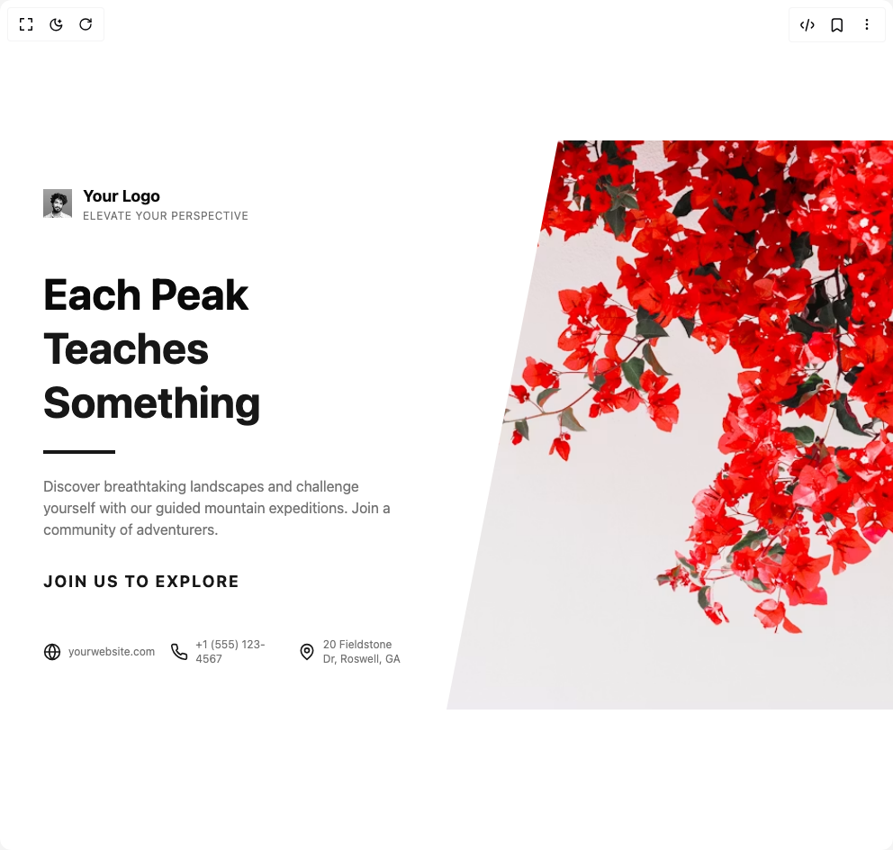

# Build Hero Section 2 in BuilderStudio

> Build this component in our Agentic IDE: [BuilderStudio](https://builderstudio.dev).
>
> Join the BuilderStudio community on [Discord](https://discord.gg/QdWeSGCqfe) and [Reddit](https://reddit.com/r/builderstudio).



## Component

- Author group: `ravikatiyar`
- Component: `hero-section-2`
- Variant: `default`
- Rendered HTML snapshot: [`rendered.html`](rendered.html)

## BuilderStudio prompt

You are implementing a React component based on a component reference.

## Component identity

- Author: ravikatiyar
- Component slug: hero-section-2
- Demo slug: default
- Title: hero-section-2
- Description: 

## Goal

Recreate this component in a React + TypeScript + Tailwind CSS project. Preserve the visual layout, spacing, colors, border radius, shadows, interaction behavior, animation behavior, responsive behavior, and dark mode behavior shown in the rendered demo.

## Implementation requirements

- Use React and TypeScript.
- Use Tailwind CSS classes whenever possible.
- Keep the component self-contained unless the source files require helper components.
- If the source uses CSS variables, custom CSS, animations, or keyframes, include them.
- If the source uses external packages, list and use the required packages.
- Preserve accessibility attributes, button semantics, links, keyboard behavior, and ARIA attributes when visible in the source.
- Do not replace the component with a simplified placeholder.
- Return complete production-ready code.

## Dependencies

No reference metadata available.

## Rendered DOM snapshot

This is the rendered demo HTML extracted from the live preview. Use it to verify structure, class names, visible content, and layout.

```html
<div id="root"><div class="w-screen min-h-screen flex justify-center items-center"><div class="w-screen min-h-screen flex justify-center items-center"><div class="w-full"><section class="relative flex w-full flex-col overflow-hidden bg-background text-foreground md:flex-row" style="opacity: 1;"><div class="flex w-full flex-col justify-between p-8 md:w-1/2 md:p-12 lg:w-3/5 lg:p-16"><div><header class="mb-12" style="opacity: 1; transform: none;"><div class="flex items-center"><div><p class="text-lg font-bold text-foreground">Your Logo</p><p class="text-xs tracking-wider text-muted-foreground">ELEVATE YOUR PERSPECTIVE</p></div></div></header><main style="opacity: 1;"><h1 class="text-4xl font-bold leading-tight text-foreground md:text-5xl" style="opacity: 1; transform: none;">Each Peak <br><span class="text-primary">Teaches Something</span></h1><div class="my-6 h-1 w-20 bg-primary" style="opacity: 1; transform: none;"></div><p class="mb-8 max-w-md text-base text-muted-foreground" style="opacity: 1; transform: none;">Discover breathtaking landscapes and challenge yourself with our guided mountain expeditions. Join a community of adventurers.</p><a href="#explore" class="text-lg font-bold tracking-widest text-primary transition-colors hover:text-primary/80" style="opacity: 1; transform: none;">JOIN US TO EXPLORE</a></main></div><footer class="mt-12 w-full" style="opacity: 1; transform: none;"><div class="grid grid-cols-1 gap-6 text-xs text-muted-foreground sm:grid-cols-3"><div class="flex items-center"><div class="mr-2 flex-shrink-0"><svg xmlns="http://www.w3.org/2000/svg" width="24" height="24" viewBox="0 0 24 24" fill="none" stroke="currentColor" stroke-width="2" stroke-linecap="round" stroke-linejoin="round" class="h-5 w-5 text-primary"><circle cx="12" cy="12" r="10"></circle><line x1="2" x2="22" y1="12" y2="12"></line><path d="M12 2a15.3 15.3 0 0 1 4 10 15.3 15.3 0 0 1-4 10 15.3 15.3 0 0 1-4-10 15.3 15.3 0 0 1 4-10z"></path></svg></div><span>yourwebsite.com</span></div><div class="flex items-center"><div class="mr-2 flex-shrink-0"><svg xmlns="http://www.w3.org/2000/svg" width="24" height="24" viewBox="0 0 24 24" fill="none" stroke="currentColor" stroke-width="2" stroke-linecap="round" stroke-linejoin="round" class="h-5 w-5 text-primary"><path d="M22 16.92v3a2 2 0 0 1-2.18 2 19.79 19.79 0 0 1-8.63-3.07 19.5 19.5 0 0 1-6-6 19.79 19.79 0 0 1-3.07-8.67A2 2 0 0 1 4.11 2h3a2 2 0 0 1 2 1.72 12.84 12.84 0 0 0 .7 2.81 2 2 0 0 1-.45 2.11L8.09 9.91a16 16 0 0 0 6 6l1.27-1.27a2 2 0 0 1 2.11-.45 12.84 12.84 0 0 0 2.81.7A2 2 0 0 1 22 16.92z"></path></svg></div><span>+1 (555) 123-4567</span></div><div class="flex items-center"><div class="mr-2 flex-shrink-0"><svg xmlns="http://www.w3.org/2000/svg" width="24" height="24" viewBox="0 0 24 24" fill="none" stroke="currentColor" stroke-width="2" stroke-linecap="round" stroke-linejoin="round" class="h-5 w-5 text-primary"><path d="M20 10c0 6-8 12-8 12s-8-6-8-12a8 8 0 0 1 16 0Z"></path><circle cx="12" cy="10" r="3"></circle></svg></div><span>20 Fieldstone Dr, Roswell, GA</span></div></div></footer></div><div class="w-full min-h-[300px] bg-cover bg-center md:w-1/2 md:min-h-full lg:w-2/5" style="background-image: url(&quot;https://plus.unsplash.com/premium_photo-1754738812660-11ca16e5b8bd?w=900&amp;auto=format&amp;fit=crop&amp;q=60&amp;ixlib=rb-4.1.0&amp;ixid=M3wxMjA3fDB8MHxmZWF0dXJlZC1waG90b3MtZmVlZHwxN3x8fGVufDB8fHx8fA%3D%3D&quot;); clip-path: polygon(25% 0px, 100% 0px, 100% 100%, 0% 100%);"></div></section></div></div></div></div>
```

## Reference source files

No reference source files were available.
