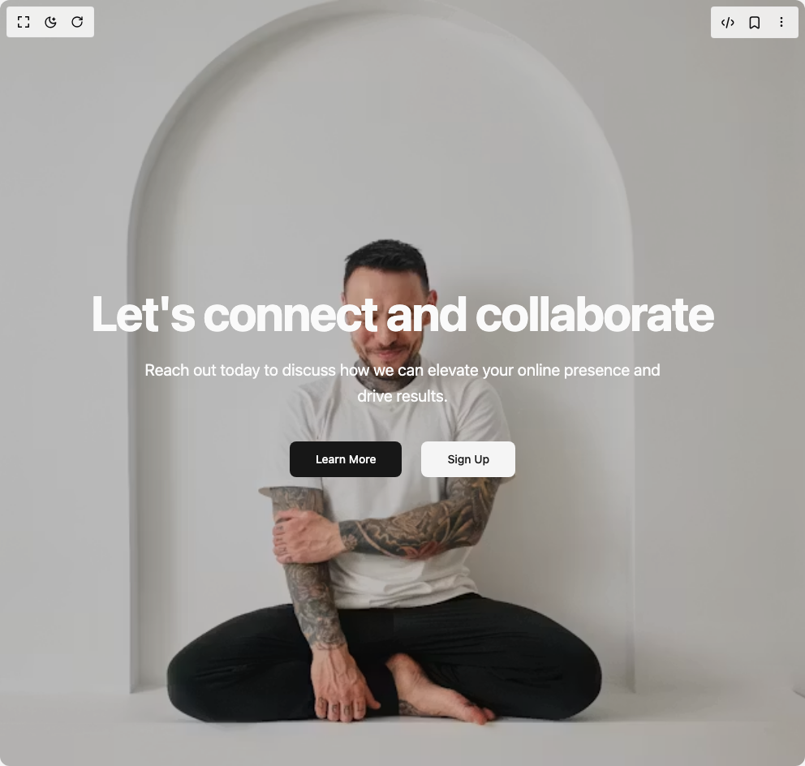

# Build Hero Section 4 in BuilderStudio

> Build this component in our Agentic IDE: [BuilderStudio](https://builderstudio.dev).
>
> Join the BuilderStudio community on [Discord](https://discord.gg/QdWeSGCqfe) and [Reddit](https://reddit.com/r/builderstudio).



## Component

- Author group: `ravikatiyar`
- Component: `hero-section-4`
- Variant: `default`
- Rendered HTML snapshot: [`rendered.html`](rendered.html)

## BuilderStudio prompt

You are implementing a React component based on a component reference.

## Component identity

- Author: ravikatiyar
- Component slug: hero-section-4
- Demo slug: default
- Title: hero-section-4
- Description: 

## Goal

Recreate this component in a React + TypeScript + Tailwind CSS project. Preserve the visual layout, spacing, colors, border radius, shadows, interaction behavior, animation behavior, responsive behavior, and dark mode behavior shown in the rendered demo.

## Implementation requirements

- Use React and TypeScript.
- Use Tailwind CSS classes whenever possible.
- Keep the component self-contained unless the source files require helper components.
- If the source uses CSS variables, custom CSS, animations, or keyframes, include them.
- If the source uses external packages, list and use the required packages.
- Preserve accessibility attributes, button semantics, links, keyboard behavior, and ARIA attributes when visible in the source.
- Do not replace the component with a simplified placeholder.
- Return complete production-ready code.

## Dependencies

No reference metadata available.

## Rendered DOM snapshot

This is the rendered demo HTML extracted from the live preview. Use it to verify structure, class names, visible content, and layout.

```html
<div id="root"><div class="w-screen min-h-screen flex justify-center items-center"><div class="w-screen min-h-screen flex justify-center items-center"><section class="relative flex h-screen min-h-[700px] w-full items-center justify-center overflow-hidden"><div class="absolute inset-0 z-[-1] bg-cover bg-center bg-no-repeat" aria-hidden="true" style="background-image: url(&quot;https://plus.unsplash.com/premium_photo-1707761862412-defd8b0b6d12?w=900&amp;auto=format&amp;fit=crop&amp;q=60&amp;ixlib=rb-4.1.0&amp;ixid=M3wxMjA3fDB8MHx2aXN1YWwtc2VhcmNofDgzfHx8ZW58MHx8fHx8?q=80&amp;w=2574&amp;auto=format&amp;fit=crop&quot;);"></div><div class="absolute inset-0 z-0 bg-black/20" aria-hidden="true"></div><div class="z-10 flex max-w-4xl flex-col items-center justify-center text-center text-primary-foreground" style="opacity: 1;"><h1 class="text-4xl font-bold tracking-tight sm:text-5xl md:text-6xl lg:text-7xl" style="opacity: 1; transform: none;">Let's connect and collaborate</h1><p class="mt-6 max-w-2xl text-lg leading-8 md:text-xl" style="opacity: 1; transform: none;">Reach out today to discuss how we can elevate your online presence and drive results.</p><div class="mt-10 flex items-center gap-x-6" style="opacity: 1; transform: none;"><a href="#learn-more" class="inline-flex items-center justify-center whitespace-nowrap text-sm font-medium ring-offset-background transition-colors focus-visible:outline-none focus-visible:ring-2 focus-visible:ring-ring focus-visible:ring-offset-2 disabled:pointer-events-none disabled:opacity-50 bg-primary text-primary-foreground hover:bg-primary/90 h-11 rounded-md px-8">Learn More</a><a href="#signup" class="inline-flex items-center justify-center whitespace-nowrap text-sm font-medium ring-offset-background transition-colors focus-visible:outline-none focus-visible:ring-2 focus-visible:ring-ring focus-visible:ring-offset-2 disabled:pointer-events-none disabled:opacity-50 bg-secondary text-secondary-foreground hover:bg-secondary/80 h-11 rounded-md px-8">Sign Up</a></div></div></section></div></div></div>
```

## Reference source files

No reference source files were available.
