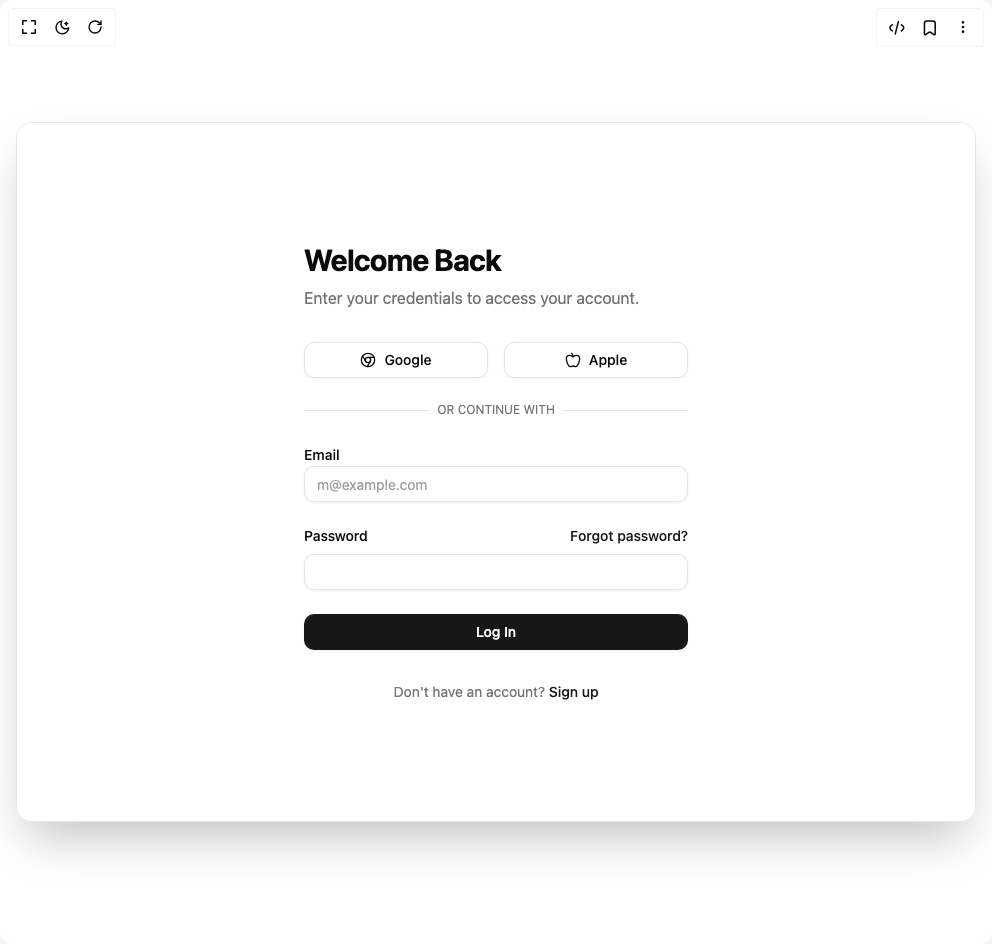

# Build Image Slider in BuilderStudio

> Build this component in our Agentic IDE: [BuilderStudio](https://builderstudio.dev).
>
> Join the BuilderStudio community on [Discord](https://discord.gg/QdWeSGCqfe) and [Reddit](https://reddit.com/r/builderstudio).



## Component

- Author group: `ravikatiyar`
- Component: `image-slider`
- Variant: `default`
- Rendered HTML snapshot: [`rendered.html`](rendered.html)

## BuilderStudio prompt

You are implementing a React component based on a component reference.

## Component identity

- Author: ravikatiyar
- Component slug: image-slider
- Demo slug: default
- Title: image-slider
- Description: 

## Goal

Recreate this component in a React + TypeScript + Tailwind CSS project. Preserve the visual layout, spacing, colors, border radius, shadows, interaction behavior, animation behavior, responsive behavior, and dark mode behavior shown in the rendered demo.

## Implementation requirements

- Use React and TypeScript.
- Use Tailwind CSS classes whenever possible.
- Keep the component self-contained unless the source files require helper components.
- If the source uses CSS variables, custom CSS, animations, or keyframes, include them.
- If the source uses external packages, list and use the required packages.
- Preserve accessibility attributes, button semantics, links, keyboard behavior, and ARIA attributes when visible in the source.
- Do not replace the component with a simplified placeholder.
- Return complete production-ready code.

## Dependencies

No reference metadata available.

## Rendered DOM snapshot

This is the rendered demo HTML extracted from the live preview. Use it to verify structure, class names, visible content, and layout.

```html
<div id="root"><div class="w-screen min-h-screen flex justify-center items-center"><div class="w-screen min-h-screen flex justify-center items-center"><div class="w-full h-screen min-h-[700px] flex items-center justify-center bg-background p-4"><div class="w-full max-w-5xl h-[700px] grid grid-cols-1 lg:grid-cols-2 rounded-2xl overflow-hidden shadow-2xl border" style="opacity: 1; transform: none;"><div class="hidden lg:block"><div class="relative w-full h-full overflow-hidden bg-background"><div class="absolute bottom-4 left-1/2 -translate-x-1/2 flex gap-2"><button class="w-2 h-2 rounded-full transition-colors duration-300 bg-white" aria-label="Go to slide 1"></button><button class="w-2 h-2 rounded-full transition-colors duration-300 bg-white/50 hover:bg-white" aria-label="Go to slide 2"></button><button class="w-2 h-2 rounded-full transition-colors duration-300 bg-white/50 hover:bg-white" aria-label="Go to slide 3"></button><button class="w-2 h-2 rounded-full transition-colors duration-300 bg-white/50 hover:bg-white" aria-label="Go to slide 4"></button></div></div></div><div class="w-full h-full bg-card text-card-foreground flex flex-col items-center justify-center p-8 md:p-12"><div class="w-full max-w-sm" style="opacity: 1;"><h1 class="text-3xl font-bold tracking-tight mb-2" style="opacity: 1; transform: none;">Welcome Back</h1><p class="text-muted-foreground mb-8" style="opacity: 1; transform: none;">Enter your credentials to access your account.</p><div class="grid grid-cols-1 md:grid-cols-2 gap-4 mb-6" style="opacity: 1; transform: none;"><button class="inline-flex items-center justify-center whitespace-nowrap rounded-lg text-sm font-medium transition-colors outline-offset-2 focus-visible:outline-2 focus-visible:outline-ring/70 disabled:pointer-events-none disabled:opacity-50 [&amp;_svg]:pointer-events-none [&amp;_svg]:shrink-0 border border-input bg-background shadow-sm shadow-black/5 hover:bg-accent hover:text-accent-foreground h-9 px-4 py-2"><svg xmlns="http://www.w3.org/2000/svg" width="24" height="24" viewBox="0 0 24 24" fill="none" stroke="currentColor" stroke-width="2" stroke-linecap="round" stroke-linejoin="round" class="lucide lucide-chrome mr-2 h-4 w-4" aria-hidden="true"><circle cx="12" cy="12" r="10"></circle><circle cx="12" cy="12" r="4"></circle><line x1="21.17" x2="12" y1="8" y2="8"></line><line x1="3.95" x2="8.54" y1="6.06" y2="14"></line><line x1="10.88" x2="15.46" y1="21.94" y2="14"></line></svg>Google</button><button class="inline-flex items-center justify-center whitespace-nowrap rounded-lg text-sm font-medium transition-colors outline-offset-2 focus-visible:outline-2 focus-visible:outline-ring/70 disabled:pointer-events-none disabled:opacity-50 [&amp;_svg]:pointer-events-none [&amp;_svg]:shrink-0 border border-input bg-background shadow-sm shadow-black/5 hover:bg-accent hover:text-accent-foreground h-9 px-4 py-2"><svg xmlns="http://www.w3.org/2000/svg" width="24" height="24" viewBox="0 0 24 24" fill="none" stroke="currentColor" stroke-width="2" stroke-linecap="round" stroke-linejoin="round" class="lucide lucide-apple mr-2 h-4 w-4" aria-hidden="true"><path d="M12 20.94c1.5 0 2.75 1.06 4 1.06 3 0 6-8 6-12.22A4.91 4.91 0 0 0 17 5c-2.22 0-4 1.44-5 2-1-.56-2.78-2-5-2a4.9 4.9 0 0 0-5 4.78C2 14 5 22 8 22c1.25 0 2.5-1.06 4-1.06Z"></path><path d="M10 2c1 .5 2 2 2 5"></path></svg>Apple</button></div><div class="relative mb-6" style="opacity: 1; transform: none;"><div class="absolute inset-0 flex items-center"><span class="w-full border-t"></span></div><div class="relative flex justify-center text-xs uppercase"><span class="bg-card px-2 text-muted-foreground">Or continue with</span></div></div><form class="space-y-6" style="opacity: 1; transform: none;"><div class="space-y-2"><label class="text-sm font-medium leading-none peer-disabled:cursor-not-allowed peer-disabled:opacity-70" for="email">Email</label><input class="flex h-9 w-full rounded-lg border border-input bg-background px-3 py-2 text-sm text-foreground shadow-sm shadow-black/5 transition-shadow placeholder:text-muted-foreground/70 focus-visible:border-ring focus-visible:outline-none focus-visible:ring-[3px] focus-visible:ring-ring/20 disabled:cursor-not-allowed disabled:opacity-50" id="email" placeholder="m@example.com" required="" type="email"></div><div class="space-y-2"><div class="flex items-center justify-between"><label class="text-sm font-medium leading-none peer-disabled:cursor-not-allowed peer-disabled:opacity-70" for="password">Password</label><a href="#" class="text-sm font-medium text-primary hover:underline">Forgot password?</a></div><input class="flex h-9 w-full rounded-lg border border-input bg-background px-3 py-2 text-sm text-foreground shadow-sm shadow-black/5 transition-shadow placeholder:text-muted-foreground/70 focus-visible:border-ring focus-visible:outline-none focus-visible:ring-[3px] focus-visible:ring-ring/20 disabled:cursor-not-allowed disabled:opacity-50" id="password" required="" type="password"></div><button class="inline-flex items-center justify-center whitespace-nowrap rounded-lg text-sm font-medium transition-colors outline-offset-2 focus-visible:outline-2 focus-visible:outline-ring/70 disabled:pointer-events-none disabled:opacity-50 [&amp;_svg]:pointer-events-none [&amp;_svg]:shrink-0 bg-primary text-primary-foreground shadow-sm shadow-black/5 hover:bg-primary/90 h-9 px-4 py-2 w-full" type="submit">Log In</button></form><p class="text-center text-sm text-muted-foreground mt-8" style="opacity: 1; transform: none;">Don't have an account? <a href="#" class="font-medium text-primary hover:underline">Sign up</a></p></div></div></div></div></div></div></div>
```

## Reference source files

No reference source files were available.
