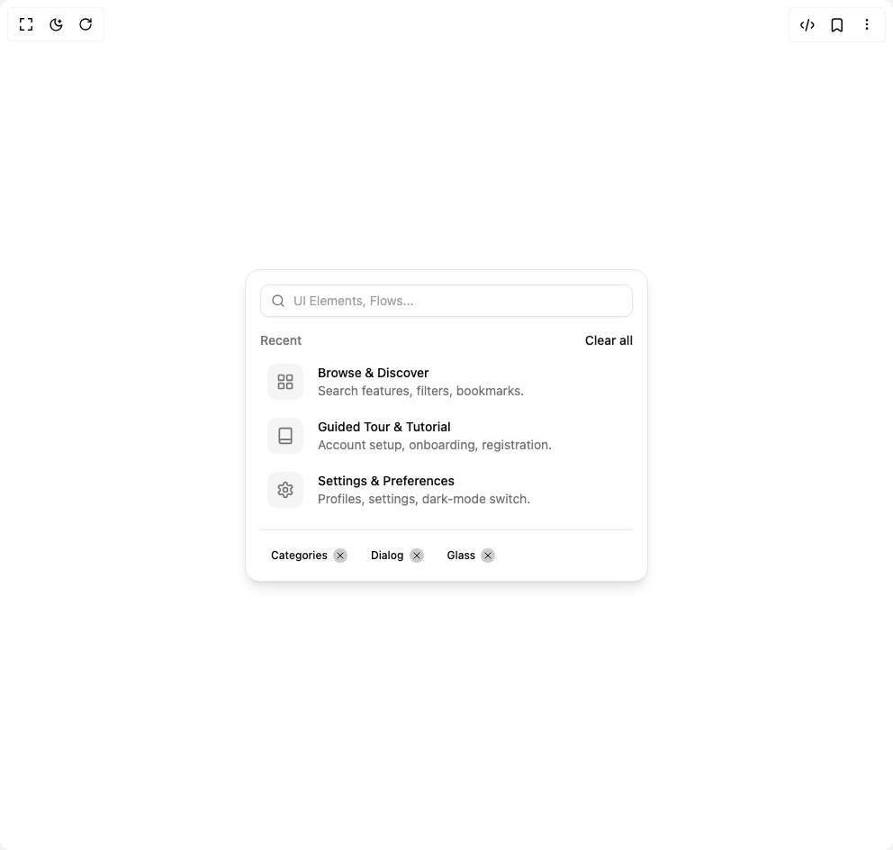

# Build Interactive List in BuilderStudio

> Build this component in our Agentic IDE: [BuilderStudio](https://builderstudio.dev).
>
> Join the BuilderStudio community on [Discord](https://discord.gg/QdWeSGCqfe) and [Reddit](https://reddit.com/r/builderstudio).



## Component

- Author group: `ravikatiyar`
- Component: `interactive-list`
- Variant: `default`
- Rendered HTML snapshot: [`rendered.html`](rendered.html)

## BuilderStudio prompt

You are implementing a React component based on a component reference.

## Component identity

- Author: ravikatiyar
- Component slug: interactive-list
- Demo slug: default
- Title: interactive-list
- Description: 

## Goal

Recreate this component in a React + TypeScript + Tailwind CSS project. Preserve the visual layout, spacing, colors, border radius, shadows, interaction behavior, animation behavior, responsive behavior, and dark mode behavior shown in the rendered demo.

## Implementation requirements

- Use React and TypeScript.
- Use Tailwind CSS classes whenever possible.
- Keep the component self-contained unless the source files require helper components.
- If the source uses CSS variables, custom CSS, animations, or keyframes, include them.
- If the source uses external packages, list and use the required packages.
- Preserve accessibility attributes, button semantics, links, keyboard behavior, and ARIA attributes when visible in the source.
- Do not replace the component with a simplified placeholder.
- Return complete production-ready code.

## Dependencies

No reference metadata available.

## Rendered DOM snapshot

This is the rendered demo HTML extracted from the live preview. Use it to verify structure, class names, visible content, and layout.

```html
<div id="root"><div class="w-screen min-h-screen flex justify-center items-center"><div class="w-screen min-h-screen flex justify-center items-center"><div class="flex min-h-[450px] w-full items-center justify-center bg-background p-4"><div class="border bg-card text-card-foreground w-full max-w-md rounded-2xl shadow-lg"><div class="flex flex-col space-y-1.5 p-4"><div class="relative"><svg xmlns="http://www.w3.org/2000/svg" width="24" height="24" viewBox="0 0 24 24" fill="none" stroke="currentColor" stroke-width="2" stroke-linecap="round" stroke-linejoin="round" class="lucide lucide-search absolute left-3 top-1/2 h-4 w-4 -translate-y-1/2 text-muted-foreground" aria-hidden="true"><circle cx="11" cy="11" r="8"></circle><path d="m21 21-4.3-4.3"></path></svg><input class="flex h-9 border border-input bg-background px-3 py-2 text-sm text-foreground shadow-sm shadow-black/5 transition-shadow placeholder:text-muted-foreground/70 focus-visible:border-ring focus-visible:outline-none focus-visible:ring-[3px] focus-visible:ring-ring/20 disabled:cursor-not-allowed disabled:opacity-50 w-full rounded-lg pl-9" placeholder="UI Elements, Flows..." aria-label="Search"></div></div><div class="p-4 pt-0"><div class="w-full"><div class="flex justify-between items-center mb-2"><p class="text-sm font-medium text-muted-foreground">Recent</p><button class="inline-flex items-center justify-center whitespace-nowrap rounded-md font-medium ring-offset-background transition-colors focus-visible:outline-none focus-visible:ring-2 focus-visible:ring-ring focus-visible:ring-offset-2 disabled:pointer-events-none disabled:opacity-50 underline-offset-4 hover:underline h-auto p-0 text-sm text-primary" aria-label="Clear all">Clear all</button></div><div class="relative flex flex-col gap-1"><div class="group relative flex items-center gap-4 p-2 rounded-lg hover:bg-accent" role="listitem" style="opacity: 1; transform: none;"><div class="flex h-10 w-10 flex-shrink-0 items-center justify-center rounded-lg bg-muted text-muted-foreground"><svg xmlns="http://www.w3.org/2000/svg" width="24" height="24" viewBox="0 0 24 24" fill="none" stroke="currentColor" stroke-width="2" stroke-linecap="round" stroke-linejoin="round" class="lucide lucide-layout-grid h-5 w-5" aria-hidden="true"><rect width="7" height="7" x="3" y="3" rx="1"></rect><rect width="7" height="7" x="14" y="3" rx="1"></rect><rect width="7" height="7" x="14" y="14" rx="1"></rect><rect width="7" height="7" x="3" y="14" rx="1"></rect></svg></div><div class="flex-grow"><p class="text-sm font-medium text-card-foreground">Browse &amp; Discover</p><p class="text-sm text-muted-foreground line-clamp-1">Search features, filters, bookmarks.</p></div><button class="inline-flex items-center justify-center whitespace-nowrap text-sm font-medium ring-offset-background focus-visible:outline-none focus-visible:ring-2 focus-visible:ring-ring focus-visible:ring-offset-2 disabled:pointer-events-none disabled:opacity-50 hover:bg-accent hover:text-accent-foreground h-8 w-8 shrink-0 rounded-full opacity-0 group-hover:opacity-100 group-focus-within:opacity-100 transition-opacity" aria-label="Remove Browse &amp; Discover"><svg xmlns="http://www.w3.org/2000/svg" width="24" height="24" viewBox="0 0 24 24" fill="none" stroke="currentColor" stroke-width="2" stroke-linecap="round" stroke-linejoin="round" class="lucide lucide-trash2 lucide-trash-2 h-4 w-4" aria-hidden="true"><path d="M3 6h18"></path><path d="M19 6v14c0 1-1 2-2 2H7c-1 0-2-1-2-2V6"></path><path d="M8 6V4c0-1 1-2 2-2h4c1 0 2 1 2 2v2"></path><line x1="10" x2="10" y1="11" y2="17"></line><line x1="14" x2="14" y1="11" y2="17"></line></svg></button></div><div class="group relative flex items-center gap-4 p-2 rounded-lg hover:bg-accent" role="listitem" style="opacity: 1; transform: none;"><div class="flex h-10 w-10 flex-shrink-0 items-center justify-center rounded-lg bg-muted text-muted-foreground"><svg xmlns="http://www.w3.org/2000/svg" width="24" height="24" viewBox="0 0 24 24" fill="none" stroke="currentColor" stroke-width="2" stroke-linecap="round" stroke-linejoin="round" class="lucide lucide-book h-5 w-5" aria-hidden="true"><path d="M4 19.5v-15A2.5 2.5 0 0 1 6.5 2H19a1 1 0 0 1 1 1v18a1 1 0 0 1-1 1H6.5a1 1 0 0 1 0-5H20"></path></svg></div><div class="flex-grow"><p class="text-sm font-medium text-card-foreground">Guided Tour &amp; Tutorial</p><p class="text-sm text-muted-foreground line-clamp-1">Account setup, onboarding, registration.</p></div><button class="inline-flex items-center justify-center whitespace-nowrap text-sm font-medium ring-offset-background focus-visible:outline-none focus-visible:ring-2 focus-visible:ring-ring focus-visible:ring-offset-2 disabled:pointer-events-none disabled:opacity-50 hover:bg-accent hover:text-accent-foreground h-8 w-8 shrink-0 rounded-full opacity-0 group-hover:opacity-100 group-focus-within:opacity-100 transition-opacity" aria-label="Remove Guided Tour &amp; Tutorial"><svg xmlns="http://www.w3.org/2000/svg" width="24" height="24" viewBox="0 0 24 24" fill="none" stroke="currentColor" stroke-width="2" stroke-linecap="round" stroke-linejoin="round" class="lucide lucide-trash2 lucide-trash-2 h-4 w-4" aria-hidden="true"><path d="M3 6h18"></path><path d="M19 6v14c0 1-1 2-2 2H7c-1 0-2-1-2-2V6"></path><path d="M8 6V4c0-1 1-2 2-2h4c1 0 2 1 2 2v2"></path><line x1="10" x2="10" y1="11" y2="17"></line><line x1="14" x2="14" y1="11" y2="17"></line></svg></button></div><div class="group relative flex items-center gap-4 p-2 rounded-lg hover:bg-accent" role="listitem" style="opacity: 1; transform: none;"><div class="flex h-10 w-10 flex-shrink-0 items-center justify-center rounded-lg bg-muted text-muted-foreground"><svg xmlns="http://www.w3.org/2000/svg" width="24" height="24" viewBox="0 0 24 24" fill="none" stroke="currentColor" stroke-width="2" stroke-linecap="round" stroke-linejoin="round" class="lucide lucide-settings h-5 w-5" aria-hidden="true"><path d="M12.22 2h-.44a2 2 0 0 0-2 2v.18a2 2 0 0 1-1 1.73l-.43.25a2 2 0 0 1-2 0l-.15-.08a2 2 0 0 0-2.73.73l-.22.38a2 2 0 0 0 .73 2.73l.15.1a2 2 0 0 1 1 1.72v.51a2 2 0 0 1-1 1.74l-.15.09a2 2 0 0 0-.73 2.73l.22.38a2 2 0 0 0 2.73.73l.15-.08a2 2 0 0 1 2 0l.43.25a2 2 0 0 1 1 1.73V20a2 2 0 0 0 2 2h.44a2 2 0 0 0 2-2v-.18a2 2 0 0 1 1-1.73l.43-.25a2 2 0 0 1 2 0l.15.08a2 2 0 0 0 2.73-.73l.22-.39a2 2 0 0 0-.73-2.73l-.15-.08a2 2 0 0 1-1-1.74v-.5a2 2 0 0 1 1-1.74l.15-.09a2 2 0 0 0 .73-2.73l-.22-.38a2 2 0 0 0-2.73-.73l-.15.08a2 2 0 0 1-2 0l-.43-.25a2 2 0 0 1-1-1.73V4a2 2 0 0 0-2-2z"></path><circle cx="12" cy="12" r="3"></circle></svg></div><div class="flex-grow"><p class="text-sm font-medium text-card-foreground">Settings &amp; Preferences</p><p class="text-sm text-muted-foreground line-clamp-1">Profiles, settings, dark-mode switch.</p></div><button class="inline-flex items-center justify-center whitespace-nowrap text-sm font-medium ring-offset-background focus-visible:outline-none focus-visible:ring-2 focus-visible:ring-ring focus-visible:ring-offset-2 disabled:pointer-events-none disabled:opacity-50 hover:bg-accent hover:text-accent-foreground h-8 w-8 shrink-0 rounded-full opacity-0 group-hover:opacity-100 group-focus-within:opacity-100 transition-opacity" aria-label="Remove Settings &amp; Preferences"><svg xmlns="http://www.w3.org/2000/svg" width="24" height="24" viewBox="0 0 24 24" fill="none" stroke="currentColor" stroke-width="2" stroke-linecap="round" stroke-linejoin="round" class="lucide lucide-trash2 lucide-trash-2 h-4 w-4" aria-hidden="true"><path d="M3 6h18"></path><path d="M19 6v14c0 1-1 2-2 2H7c-1 0-2-1-2-2V6"></path><path d="M8 6V4c0-1 1-2 2-2h4c1 0 2 1 2 2v2"></path><line x1="10" x2="10" y1="11" y2="17"></line><line x1="14" x2="14" y1="11" y2="17"></line></svg></button></div></div><div class="mt-4 flex flex-wrap items-center gap-2 border-t border-border pt-4"><div class="flex items-center gap-1.5 pl-3 pr-1.5 py-1 text-xs font-medium rounded-full" style="background-color: hsl(var(--orange-9)); color: hsl(var(--primary-foreground)); opacity: 1; transform: none;">Categories<button class="flex items-center justify-center h-4 w-4 rounded-full bg-black/20 hover:bg-black/40 transition-colors" aria-label="Remove tag Categories"><svg xmlns="http://www.w3.org/2000/svg" width="24" height="24" viewBox="0 0 24 24" fill="none" stroke="currentColor" stroke-width="2" stroke-linecap="round" stroke-linejoin="round" class="lucide lucide-x h-3 w-3" aria-hidden="true"><path d="M18 6 6 18"></path><path d="m6 6 12 12"></path></svg></button></div><div class="flex items-center gap-1.5 pl-3 pr-1.5 py-1 text-xs font-medium rounded-full" style="background-color: hsl(var(--sand-9)); color: hsl(var(--primary-foreground)); opacity: 1; transform: none;">Dialog<button class="flex items-center justify-center h-4 w-4 rounded-full bg-black/20 hover:bg-black/40 transition-colors" aria-label="Remove tag Dialog"><svg xmlns="http://www.w3.org/2000/svg" width="24" height="24" viewBox="0 0 24 24" fill="none" stroke="currentColor" stroke-width="2" stroke-linecap="round" stroke-linejoin="round" class="lucide lucide-x h-3 w-3" aria-hidden="true"><path d="M18 6 6 18"></path><path d="m6 6 12 12"></path></svg></button></div><div class="flex items-center gap-1.5 pl-3 pr-1.5 py-1 text-xs font-medium rounded-full" style="background-color: hsl(var(--violet-9)); color: hsl(var(--primary-foreground)); opacity: 1; transform: none;">Glass<button class="flex items-center justify-center h-4 w-4 rounded-full bg-black/20 hover:bg-black/40 transition-colors" aria-label="Remove tag Glass"><svg xmlns="http://www.w3.org/2000/svg" width="24" height="24" viewBox="0 0 24 24" fill="none" stroke="currentColor" stroke-width="2" stroke-linecap="round" stroke-linejoin="round" class="lucide lucide-x h-3 w-3" aria-hidden="true"><path d="M18 6 6 18"></path><path d="m6 6 12 12"></path></svg></button></div></div></div></div></div></div></div></div></div>
```

## Reference source files

No reference source files were available.
