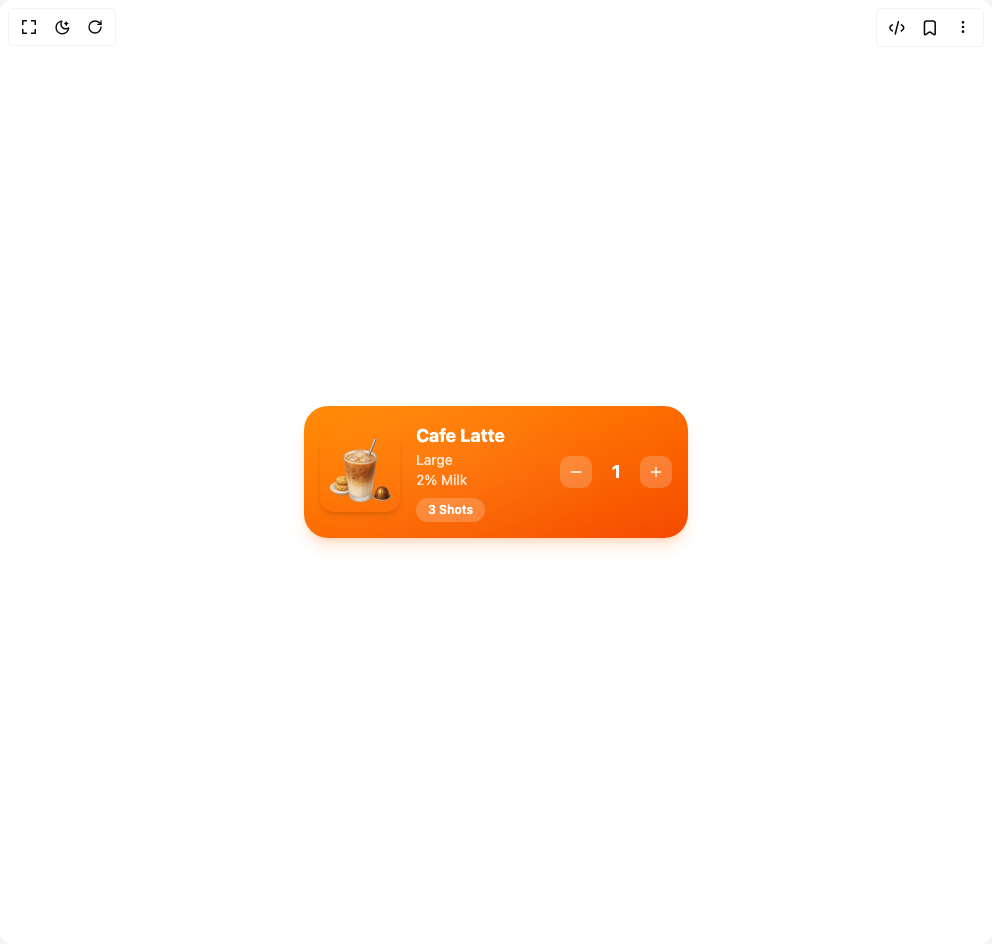

# Build Item Card in BuilderStudio

> Build this component in our Agentic IDE: [BuilderStudio](https://builderstudio.dev).
>
> Join the BuilderStudio community on [Discord](https://discord.gg/QdWeSGCqfe) and [Reddit](https://reddit.com/r/builderstudio).



## Component

- Author group: `ravikatiyar`
- Component: `item-card`
- Variant: `default`
- Rendered HTML snapshot: [`rendered.html`](rendered.html)

## BuilderStudio prompt

You are implementing a React component based on a component reference.

## Component identity

- Author: ravikatiyar
- Component slug: item-card
- Demo slug: default
- Title: item-card
- Description: 

## Goal

Recreate this component in a React + TypeScript + Tailwind CSS project. Preserve the visual layout, spacing, colors, border radius, shadows, interaction behavior, animation behavior, responsive behavior, and dark mode behavior shown in the rendered demo.

## Implementation requirements

- Use React and TypeScript.
- Use Tailwind CSS classes whenever possible.
- Keep the component self-contained unless the source files require helper components.
- If the source uses CSS variables, custom CSS, animations, or keyframes, include them.
- If the source uses external packages, list and use the required packages.
- Preserve accessibility attributes, button semantics, links, keyboard behavior, and ARIA attributes when visible in the source.
- Do not replace the component with a simplified placeholder.
- Return complete production-ready code.

## Dependencies

No reference metadata available.

## Rendered DOM snapshot

This is the rendered demo HTML extracted from the live preview. Use it to verify structure, class names, visible content, and layout.

```html
<div id="root"><div class="w-screen min-h-screen flex justify-center items-center"><div class="w-screen min-h-screen flex justify-center items-center"><div class="flex h-screen w-full items-center justify-center bg-background p-4"><div class="relative flex items-center gap-4 p-4 w-full max-w-sm rounded-3xl text-white overflow-hidden bg-gradient-to-br from-orange-400 to-orange-600 dark:from-orange-500 dark:to-orange-700 shadow-lg shadow-orange-500/20" style="opacity: 1; transform: none;"><div class="absolute top-0 left-0 w-2/3 h-2/3 bg-white/10 rounded-full blur-3xl"></div><div class="flex-grow z-10"><h3 class="font-bold text-lg">Cafe Latte</h3><p class="text-sm opacity-80">Large</p><p class="text-sm opacity-80">2% Milk</p><button class="mt-2 px-3 py-1 text-xs font-semibold bg-white/20 rounded-full focus:outline-none focus-visible:ring-2 focus-visible:ring-white/50" tabindex="0">3 Shots</button></div><div class="flex items-center gap-2 z-10"><button class="p-2 bg-white/20 rounded-lg disabled:opacity-50 disabled:cursor-not-allowed focus:outline-none focus-visible:ring-2 focus-visible:ring-white/50" aria-label="Decrease quantity" tabindex="0"><svg xmlns="http://www.w3.org/2000/svg" width="24" height="24" viewBox="0 0 24 24" fill="none" stroke="currentColor" stroke-width="2" stroke-linecap="round" stroke-linejoin="round" class="lucide lucide-minus w-4 h-4" aria-hidden="true"><path d="M5 12h14"></path></svg></button><div class="relative w-8 h-8 flex items-center justify-center font-bold text-lg"><span class="absolute" style="opacity: 1; transform: none;">1</span></div><button class="p-2 bg-white/20 rounded-lg focus:outline-none focus-visible:ring-2 focus-visible:ring-white/50" aria-label="Increase quantity" tabindex="0"><svg xmlns="http://www.w3.org/2000/svg" width="24" height="24" viewBox="0 0 24 24" fill="none" stroke="currentColor" stroke-width="2" stroke-linecap="round" stroke-linejoin="round" class="lucide lucide-plus w-4 h-4" aria-hidden="true"><path d="M5 12h14"></path><path d="M12 5v14"></path></svg></button></div></div></div></div></div></div>
```

## Reference source files

No reference source files were available.
